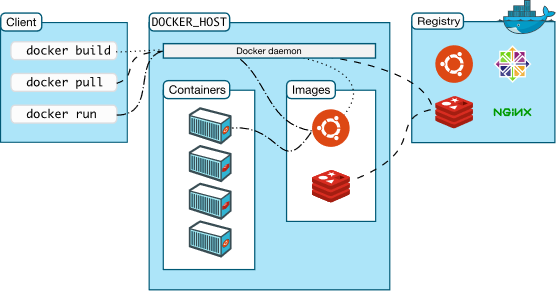

# 1.1 说透 Docker：基础

既然要学习 K8S，相信各位读者都已经使用过 Docker 了，Docker 的入门是比较容易的，但 Docker 的网络和存储、虚拟化是相当复杂的，Docker 的技术点比较多，在本章中将会深入介绍 Docker 的各方面，期待能够帮助读者加深对 Docker 的理解。


## 容器化应用

### 什么是容器化应用

containerized applications 指容器化的应用，我们常常说使用镜像打包应用程序，使用 Docker 发布、部署应用程序，那么当你的应用成功在 Docker 上运行时，称这个应用是 containerized applications。


### 应用怎么打包

容器化应用的最主要特征是使用镜像打包应用的运行环境以及应用程序，可以通过 Docker 启动这个镜像，进而将 应用程序启动起来。


将一个应用程序打包为镜像，大约分为以下过程：

* 编写 Dockerfile 文件	   				      -- 定义构建镜像的流程
* 选择一个基础镜像（操作系统）           -- 操作系统
* 安装应用的需要的环境						   -- 运行环境
* 复制程序文件								  		 -- 应用程序
* 启动 Dockerfile   									-- 生成镜像


### Docker 镜像组成

以 .NET Core(C#) 程序为例，一个 Docker 镜像的层次如下图所示：


在 Docker 镜像中，操作系统是高度精简的，可能只有一个精简的 Shell，甚至没有 Shell。而且镜像中的操作系统还不包含内核，**容器都是共享所在的宿主机的内核**。所以有时会说容器仅包含必要的操作系统（通常只有操作系统文件和文件系统对象），容器中查看到的 Linux 内核版本与宿主机一致。

Docker 镜像的是由一系统文件组成的。


### 联合文件系统

Linux 有名为 Unionfs 的文件系统服务，可以将不同文件夹中的文件联合到一个文件夹中。Unionfs 有称为分支的概念，一个分支包含了多个目录和文件，多个分支可以挂载在一起，在挂载时，可以指定一个分支优先级大于另一个分支，这样当两个分支都包含相同的文件名时，一个分支会优先于另一个分支，在合并的目录中，会看到高优先级分支的文件。


Docker 中，层层组成镜像的技术也是联合文件系统，Union File System。Docker 镜像中的操作系统是根文件系统，在上一小节的图片中，可以看到有 bin、boot 等目录。我们都知道，Docker 镜像是由多层文件组成的，在上面的示例图片中有三层组成：根文件系统、环境依赖包、应用程序文件。当镜像层生成后，便不能被修改，如果再进行操作，则会在原来的基础上生成新的镜像层，层层联合，最终生成镜像。当然生成的镜像可能会因为层数太多或者操作过多，导致出现大量冗余，镜像臃肿。

Docker 的镜像分层是受 Linux Unionfs 启发而开发的，Docker 支持多种文件联合系统，如 AUFS、OverlayFS、VFS 等。

Docker 在不同系统中可以选择的联合文件系统：

| Linux发行版 | 推荐的存储驱动程序 | 替代驱动程序                                  |
| :---------- | :----------------- | :-------------------------------------------- |
| Ubuntu      | `overlay2`         | `overlay` `devicemapper`, `aufs`, `zfs`,`vfs` |
| Debian      | `overlay2`         | `overlay`, `devicemapper`, `aufs`,`vfs`       |
| CentOS      | `overlay2`         | `overlay`, `devicemapper`, `zfs`,`vfs`        |

> **[info] 提示**
>
> Docker Desktop for Mac 和 Docker Desktop for Windows 不支持修改存储驱动程序，只能使用默认存储驱动程序。


### Linux 内核

既然 Docker 容器需要与 Linux 内核结合才能使用，那么我们看一下 Linux 内核的功能，稍微了解一下 Linux 内核在支撑 Docker 容器运作中起到什么作用。

Linux 内核主要包含以下功能：

* 内存管理：追踪记录有多少内存存储了什么以及存储在哪里；

* 进程管理：确定哪些进程可以使用中央处理器（CPU）、何时使用以及持续多长时间；

* 设备驱动程序：充当硬件与进程之间的调解程序/解释程序；

* 系统调用和安全防护：接受程序请求调用系统服务；
* 文件系统：操作系统中负责管理持久数据的子系统，在 Linux 中，一切皆文件。

Linux 层次结构如下：


Docker 容器中包含了一个操作系统，包含简单的 shell 或者不包含，其层次结构如图所示：


## Docker 结构

本节将了解 Docker 的组成部件和结构。


### Docker 服务与客户端

Docker 由 Service 和 Client 两部分组成，在服务器上可以不安装 Docker Client，可以通过 Http Api 等方式与 Docker Servie 通讯。

在安装了 Docker 的主机上执行命令 `docker  version` 查看版本号。

```shell
Client: Docker Engine - Community
 Version:           20.10.7
 API version:       1.41
 Go version:        go1.13.15
 Git commit:        f0df350
 Built:             Wed Jun  2 11:58:10 2021
 OS/Arch:           linux/amd64
 Context:           default
 Experimental:      true

Server: Docker Engine - Community
 Engine:
  Version:          20.10.7
  API version:      1.41 (minimum version 1.12)
  Go version:       go1.13.15
  Git commit:       b0f5bc3
  Built:            Wed Jun  2 11:56:35 2021
  OS/Arch:          linux/amd64
  Experimental:     false
 containerd:
  Version:          1.4.6
  GitCommit:        d71fcd7d8303cbf684402823e425e9dd2e99285d
 runc:
  Version:          1.0.0-rc95
  GitCommit:        b9ee9c6314599f1b4a7f497e1f1f856fe433d3b7
 docker-init:
  Version:          0.19.0
  GitCommit:        de40ad0
```


### Docker 客户端

要想跟 Docker Server 通讯，可以使用 Restful API、UNIX 套接字或网络接口(Socket)。Docker 官方的客户端是一个二进制命令行程序，使用 Go 语言编写，我们也可以使用 C#、Java 等语言写一个类似的程序，Docker 客户端不需要安装到 Docker Server  所在的主机，Client 跟 Server 可以远程通讯。

Docker 的客户端是许多 Docker 用户与 Docker 交互的主要方式，当我们使用 `docker run` 之类的命令时，客户端会将这些命令发送到 Docker Server，由 Docker Server 解析并执行命令。


Docker for Linux 中最为常见的同主机通讯方式是 Unix 域套接字。很多软件都支持使用域套接字与 Docker 通讯，例如 CI/CD 软件 Jenkins，使用域套接字连接 Docker，能够利用 Docker 启动容器构建应用程序以及使用 Docker 来做一些不可描述的事情。




### 容器运行时

容器运行时是提供运行环境并启动容器的软件，我们最常听说的是 Docker，此外还有 [containerd](https://containerd.io/docs/)、[CRI-O](https://cri-o.io/#what-is-cri-o) 等。可以毫不夸张的说，整个 Kubernetes 建立在容器之上。

默认情况下，Kubernetes 使用 容器运行时接口(Container Runtime Interface，CRI) 来与服务器中容器运行时交互。所以 Kubernetes 支持多种容器软件，但只能使用一种容器运行时进行工作，在有多个容器运行时的情况下，我们需要指定使用何种运行时，如果你不指定运行时，则 kubeadm 会自动尝试检测到系统上已经安装的运行时， 方法是扫描一组众所周知的 Unix 域套接字。

Linux 是多进程操作系统，为了让多个系统中的多个进程能够进行高效的通讯，出现和很多方法，其中一种是域套接字(Unix domain socket)，只能用于在同一计算机中的进程间通讯，但是其效率高于网络套接字(socket)，域套接字不需要经过网络协议处理，通过系统调用将数据从一个进程复制到另一个进程中。

域套接字使用一个 .sock 文件进行通讯，常见的容器软件其对应域套接字如下：

| 运行时     | 域套接字                        |
| ---------- | ------------------------------- |
| Docker     | /var/run/dockershim.sock        |
| containerd | /run/containerd/containerd.sock |
| CRI-O      | /var/run/crio/crio.sock         |

> **[info]**
>
> 同一主机下常见进程通讯方式有 共享内存、消息队列、管道通讯(共享文件)。
>
> Unux 域套接字是套接字和管道之间的混合物。
> 在 Linux 中，有很多进程，为了让多个进程能够进行通讯，出现和很多方法，其中一种是套接字(socket)。一般的 socket 都是基于 TCP/IP 的，称为网络套接字，可以实现跨主机进程通讯。在 Linux 中有一种套接字，名为**域套接字**，只能用于在同一计算机中的进程间通讯，但是其效率高于网络套接字。域套接字使用一个 .sock 文件进行通讯。

当计算机中有多种容器运行时，Kubernetes 默认优先使用 Docker。

如果你想了解 CRI ，请点击：

[https://github.com/kubernetes/community/blob/master/contributors/devel/sig-node/container-runtime-interface.md](https://github.com/kubernetes/community/blob/master/contributors/devel/sig-node/container-runtime-interface.md)


### Docker 引擎

Docker 引擎也可以说是 Docker Server，它由 Docker 守护进程（Docker daemon）、containerd 以及 runc 组成。

当使用 Docker client 输入命令时，命令会被发送到 Docker daemon ，daemon 会侦听请求并管理 Docker 对象，daemon 可以管理 镜像、容器、网络和存储卷等。

下面这个图是新 Docker 版本的结构组成。


### Docker 引擎变化

Docker 首次发布时，Docker 引擎由两个核心组件构成：LXC 和 Docker daemon，这也是很多文章中称 Docker 是基于 LXC 的原因，旧版本的 Docker 利用了 LXC、cgroups、Linux 内核编写。接下来我们了解一下 LXC 。


LXC (Linux Container)是 Linux 提供的一种内核虚拟化技术，可以提供轻量级的虚拟化，以便隔离进程和资源，它是操作系统层面上的虚拟化技术。LXC 提供了对诸如命名空间(namespace) 和控制组(cgroups) 等基础工具的操作能力，它们是基于 Linux 内核的容器虚拟化技术。我们不需要深入了解这个东西。


Docker 一开始是使用 LXC 做的，LXC 是一个很牛逼的开源项目，但是随着 Docker 的成熟，Docker 开始抛弃 LXC，自己动手手撕容器引擎。


为什么 Docker 要抛弃 LXC 呢？首先，LXC 是基于 Linux 的。这对于一个立志于跨平台的 Docker 来说是个问题，离开 LXC，怎么在 MAC、Windows 下运行？其次，如此核心的组件依赖于外部工具，这会给项目带来巨大风险，甚至影响其发展。

> **[info]**
>
> 哈哈哈。。。其实笔者觉得不支持 Windows 也罢。。。


### Docker 引擎的架构

下面是一张 Docker 的架构图。


Docker client 和 Docker daemon 在前面已经介绍过了，接下来介绍其他组件。

#### containerd

containerd 是一个开源容器引擎，是从 Docker 开源出去的。之前有新闻说 Kubernetes 不再支持 Docker，只支持 containerd，很多人以为 Docker 不行了。

一开始 Docker 是一个 “大单体”，随着 Docker 的成长，Docker 开始进行模块化，Docker 中的许多模块都是可替换的，如 Docker 网络。支持容器运行的核心代码自然也抽出来，单独做一个模块，便是 containerd。Kubernetes 不再支持 Docker，只不过是降低依赖程度，减少对其他模块的依赖，只集中在 containerd 上。当我们安装 Docker 时，自然会包含 containerd。如果我们不需要 Docker 太多组件，那么我们可以仅仅安装 containerd，由 Kubernetes 调度，只不过我们不能使用 Docker client 了。因此可以说，Kubernetes 不再支持 Docker，并不代表会排斥 Docker。


containerd 的主要任务是容器的生命周期管理，如启动容器、暂停容器、停止容器等。containerd 位于 daemon 和 runc 所在的 OCI 层之间。


#### shim

shim 它的作用非常单一，那就是实现 CRI 规定的每个接口，然后把具体的 CRI 请求“翻译”成对后端容器项目的请求或者操作。

这里要区别一下，dockershim 和 containerd-shim，dockershim 是一个临时性的方案，dockershim 会在 Kubernetes v1.24中 删除，这也是 Kubernetes 不再支持 Docker 的另一组件。

> **[info] 提示**
>
> CRI 即 Container Runtime Interface，容器运行时接口，容器引擎要支持 Kubernetes ，需要实现 CRI 接口，例如 runc 、crun 两种是常见的 Container Runtime。


shim 是容器进程的父进程，shim 的生命周期跟容器一样长，shim 是一个轻量级的守护进程，它与容器进程紧密相关，但是 shim 与容器中的进程完全分离。shim 可以将容器的 stdin、stdout、srderr 流重定向到日志中，我们使用 `docker logs` 即可看到容器输出到控制台的流。

关于 shim，我们就先了解到这里，后面会继续讲解一个示例。


#### runc

runc 实质上是一个轻量级的、针对 Libcontainer 进行了包装的命令行交互工具，runc 生来只有一个作用——创建容器，即 runc 是一个由于运行容器的命令行工具。

> **[info] 提示**
>
> Libcontainer 取代了早期 Docker 架构中的 LXC。

如果主机安装了 Docker，我们可以使用 `runc --help` 来查看使用说明。我们可以这样来理解 runc，runc 是在隔离环境生成新的进程的工具，在这个隔离环境中有一个专用的根文件系统(ubuntu、centos等)和新的进程树，这个进程树的根进程 `PID=1`。


> **[success] 博客推荐**
>
> 笔者在查阅资料时，发现了这个大佬的博客，在这个大佬的博客中学会了很多东西。
>
> 博客推荐：[https://iximiuz.com/en/](https://iximiuz.com/en/)


在后面的节中，我们将继续了解 Docker 中的网络和存储，并开始探究与 Kubernetes 相关的知识点。


