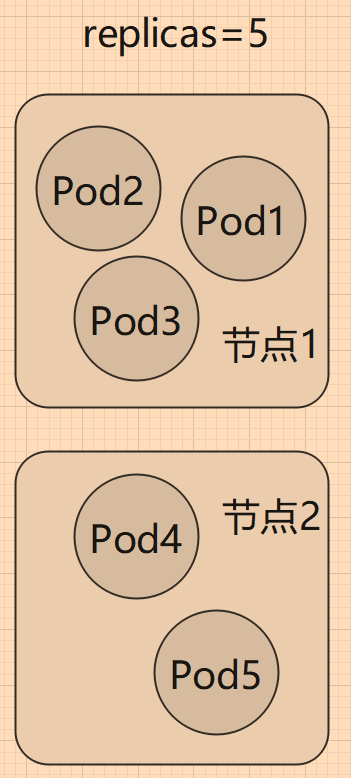
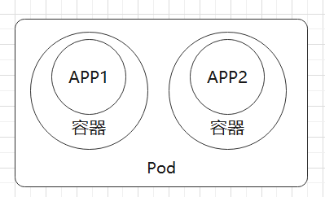
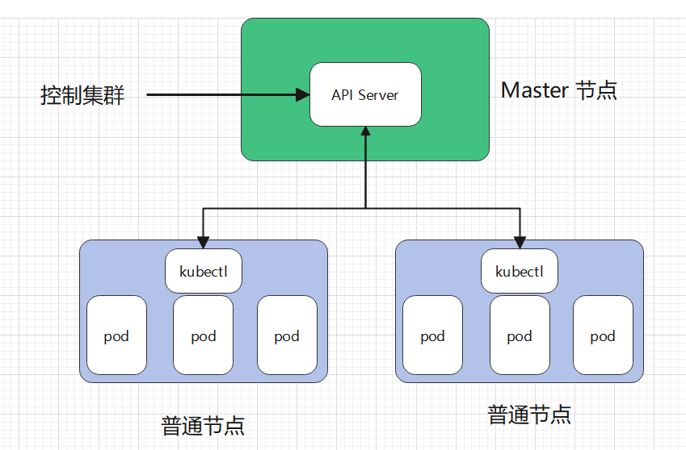
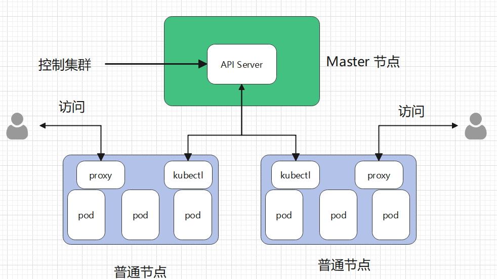

# 1.2 容器与 Pod

现在 Docker 的流行程度越来越高，越来越多的公司使用 Docker 打包和部署项目。但是也有很多公司只是追求新技术，将以前的单体应用直接打包为镜像，代码、配置方式等各方面保持不变，使用 Docker 后，并没有带来多大的便利，反而使得配置、启动过程变得更加繁杂，更难调试。

本章将讨论容器与 Pod 的关系，了解如何更好地将应用容器化。

## 什么是容器化应用

containerized applications 指容器化的应用，我们常常说使用镜像打包应用程序，使用 Docker 发布、部署应用程序，那么当你的应用成功在 Docker 上运行时，称这个应用是 containerized applications。

定义：

_Containerized applications are bundled with their required libraries, binaries, and configuration files into a container._

_容器化的应用程序与它们所需的库、二进制文件和配置文件绑定到一个容器中。_

通常，容器都包含一个应用程序，以及正确执行二进制程序所需的依赖库、文件等，例如 Linux 文件系统+应用程序组成一个简单的容器。通过将容器限制为单个进程，问题诊断和更新应用程序都变得更加容易。与 VM(虚拟机)不同，容器不包含底层操作系统，因此容器被认为是轻量级的。Kubernentes 容器属于开发领域。

容器在操作系统之上，提供了 CPU、内存、网络、存储等资源的虚拟化，为应用在不同服务器里提供了一致的运行时环境。开发者可以通过容器创建一个可预测的环境，能够保证在开发、调试、生产时的环境都是一致的，减少开发团队和运维团队可以减少调试和诊断问题时，因环境差异带来的麻烦。同时，应用运行在一个沙盒中，对应用和系统进行了隔离，提高了安全性，还能限制应用程序使用的计算资源。

当然，并不是说能够将一个应用程序打包到容器中运行，就可以鼓吹产品；并不是每个应用程序都是容器化的优秀对象，例如在 DDD 设计中被称为大泥球的应用程序，具有设计复杂、依赖程度高、程序不稳定等确定，这种难以迁移、难以配置的应用程序明显是失败的产品。

在多年经验中，许多开发者对容器化技术进行了总结，这些强有力的经验、理论形成十二个云计算应用程序因素指导原则：

**1. Codebase:** One codebase tracked in revision control, many deploys

 代码库： 一个代码库可以在版本控制和多份部署中被跟踪。一般使用 github 等对代码进行管理。

**2. Dependencies:** Explicitly declare and isolate dependencies

依赖项： 显式声明和隔离依赖项。

**3. Config:** Store config in the environment

配置：在环境中存储配置。

**4. Backing services:** Treat backing services as attached resources

支持服务：将支持服务视为附加资源(可拓展，而不是做成大泥球)。

**5. Build, release, run:** Strictly separate build and run stages

构建、发布、运行： 严格区分构建和运行阶段(连 Debug、Release 都没有区分的产品是真的垃圾)。

**6. Processes:** Execute the app as one or more stateless processes

过程：应用程序作为一个或多个无状态过程执行。

**7. Port binding:** Export services via port binding

端口绑定：可通过端口绑定服务对外提供服务。

**8. Concurrency**: Scale out via the process model

并发性：通过 process 模型进行扩展。

**9. Disposability:** Maximize robustness with fast startup and graceful shutdown

可处理性： 快速启动和完美关机，最大限度地增强健壮性。

**10. Dev/prod parity**: Keep development, staging, and production as similar as possible

开发/生产一致：尽可能保持开发中、演示时和生产时的相似性。

**11. Logs:** Treat logs as event streams

Logs：将日志视为事件流。

**12. Admin processes:** Run admin/management tasks as one-off processes

管理流程：将管理/管理任务作为一次性流程运行。

>  上述内容可能有笔者翻译不到位的地方，读者可阅读原文了解：[https://12factor.net/](https://12factor.net/)

容器位于开发人员技能列表之中，开发人员需要掌握如何容器化应用。

另外，在一个产品中，好的容器化规范或方法，具有以下特点：

- 使用**声明式**的格式进行设置自动化，以最大限度地减少新开发人员加入项目的时间和成本；
- 与底层操作系统之间有一个**干净的契约**(资源隔离、统一接口)，在执行环境之间提供**最大的可移植性**；
- 适合**部署**在现代**云平台上**，无需服务器和系统管理；
- **最大限度地减少**开发和生产之间的**差异**，实现**持续部署**以实现最大敏捷性；
- 并且可以在不对工具、架构或开发实践进行重大更改的情况下进行**扩展**。

## Pod

Pod 是 Kubernetes 集群中最小的执行单位。在 Kubernetes 中，容器不直接在集群节点上运行，而是将一个或多个容器封装在一个 Pod 中，接着将 Pod 调度到节点上运行。

Pod 中的所有容器共享相同的资源和本地网络，从而简化了 Pod 中应用程序之间的通讯。在 Pod 中，所有容器中的进程共享网络，可以通过 `127.0.0.1`、`localhost` 相互进行访问。详见 [3.1 章](../3.pod/1.pod.md) 中 "Pod 共享网络和存储" 一节。

一个简单的 Pod，其结构如下：

随着 Pod 负载的增加，Kubernetes 可以自动复制 Pod 以达到预期的可拓展性(部署更多的 Pod 提供相同的服务，负载均衡)。因此，设计一个尽可能精简的 Pod 是很重要的，降低因复制扩容、减少收缩过程中带来的资源损失。

前面提到，容器应当是无状态的，所以拓展 Pod 时，每个实例都提供了一模一样的服务，这些 Pod 分配到不同的节点上，可以利用更多的 CPU、内存资源。

在第三章中，我们会更加详细地学习 Pod。

## 容器与 Pod 的区别

容器包含执行特定流程或函数所需的代码(编译后的二进制可执行程序)。在 Kubernetes 之前，可以直接在物理或虚拟服务器上运行容器，但是缺乏 Kubernetes 集群所提供的可伸缩性和灵活性。

Pod 为容器提供了一种抽象，可以将一个或多个应用程序包装到一个 Pod 中，而 Pod 是 Kubernetes 集群中最小的执行单元。例如 Pod 可以包含初始化容器，这些容器为其它应用提供了准备环境，然后在应用程序开始执行前终结。Pod 是集群中复制的最小单位，Pod 中的容器作为整体被扩展或缩小。

例如对应前后端分离的项目，可能不需要把前端文件和后端程序放在一起，而是分别放在两个容器中。然后通过 Pod，将这两个容器作为一组服务打包在一起。

## 节点

Pod 是 Kubernetes 中最小的执行单元，而 Node 是 Kubernetes 中最小的计算硬件单元。节点可以是物理的本地服务器，也可以是虚拟机。

与容器一样，Node 提供了一个抽象层。多个 Node 一起工作形成了 Kubernetes 集群，它可以根据需求的变化自动分配工作负载，增加或减少在节点上的 Pod 数量。如果 A 节点和 B 节点的硬件资源是一致的，那么 A 、B 两个节点是等价的，如果 A 节点失败，它将自动从集群中移除，由 B 节点接管，不会出现问题。

每个节点都运行着一个名为 kubelet 的组件，它是节点的主要组件，Kubernetes 与集群控制平面组件(API Server)通信，所有对节点有影响的操作都会通过 kubectl 控制此节点。kubelet 也是 master 节点跟 worker 节点之间直接通讯的唯一组件。

kubelet 的一些功能有：

* 在节点上创建、更新、删除容器；
* 参与调度 Pod；
* 为容器创建和挂载卷；
* 使用命令查看 Pod 、容器，例如 `exec`、`log` 等时，需要通过 kubelet；

另外节点上还有 proxy，主要是为 Pod 提供代理服务，外界可通过此代理，使用节点的 IP 访问 Pod 中的容器。

