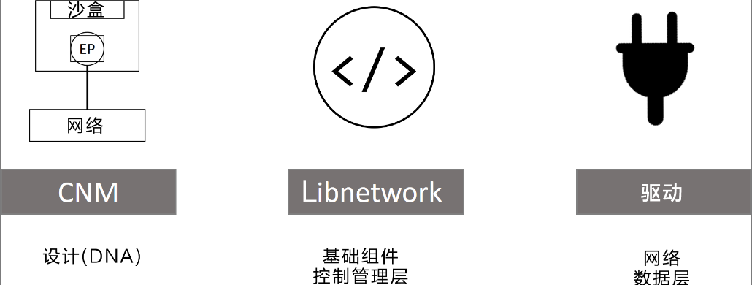
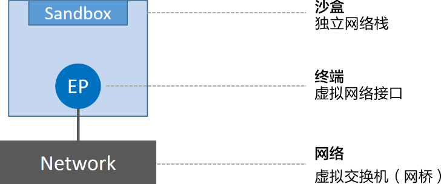
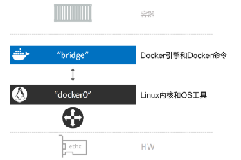
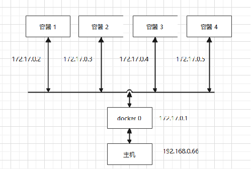
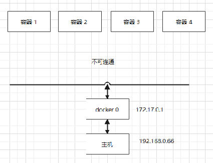
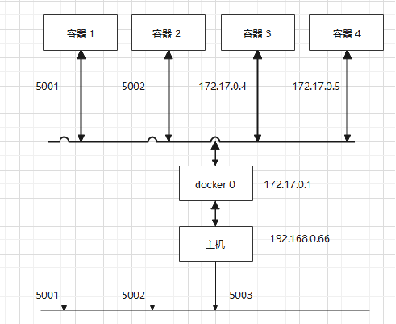
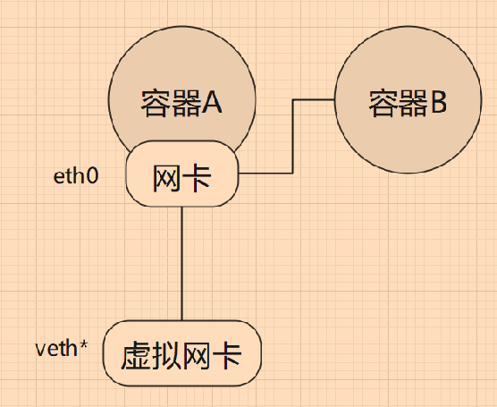
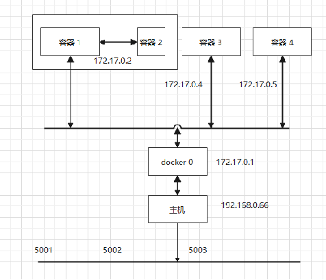
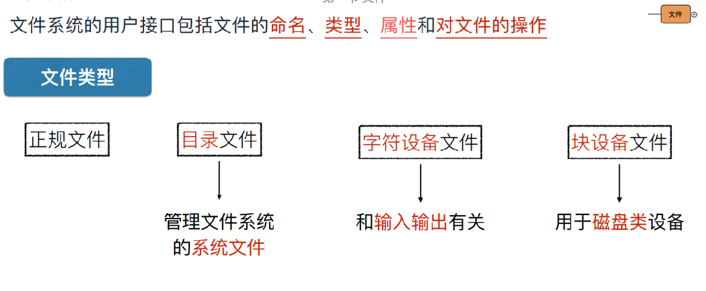

## Docker 网络

Docker 网络

Docker 网络架构源自一种叫作容器网络模型（CNM）的方案，该方案是开源的并且支持插接式连接。Libnetwork 是 Docker 对 CNM 的一种实现，提供了 Docker 核心网络架构的全部功能。不同的驱动可以通过插拔的方式接入 Libnetwork 来提供定制化的网络拓扑。

### Docker 网络类型

•基础理论
•单机桥接网络
•多机覆盖网络
•接入现有网络
•服务发现
•Ingress网络

### Docker 网络-基础理论

Docker网络架构由3个主要部分构成：CNM、Libnetwork和驱动

CNM是设计标准：在 CNM中，规定了Docker网络架构的基础组成要素；

Libnetwork：CNM 规范的实现，Libnetwork 通过Go语言编写；

驱动：通过实现特定网络拓扑的方式来拓展该模型的能力；

### Docker 网络-基础理论（CNM）

CNM定义了3个基本要素：沙盒（Sandbox）、终端（Endpoint）和网络（Network）。

沙盒是一个独立的网络栈。其中包括以太网接口、端口、路由表以及DNS配置。

终端就是虚拟网络接口，终端主要职责是负责创建连接。在CNM中，终端负责将沙盒连接到网络。

网络是802.1d网桥（类似大家熟知的交换机）的软件实现。

### 四类网络模式

| Docker网络模式 | 配置        | 说明                                                         |
| -------------- | ----------- | ------------------------------------------------------------ |
| host模式       | –net=host   | 容器和宿主机共享Network namespace。                          |
| container模式  | –net={id}   | 容器和另外一个容器共享Network namespace。 kubernetes中的pod就是多个容器共享一个Network namespace。 |
| none模式       | –net=none   | 容器有独立的Network namespace，但并没有对其进行任何网络设置，如分配veth pair 和网桥连接，配置IP等。 |
| bridge模式     | –net=bridge | （默认为该模式）                                             |

### bridge 模式

bridge 模式称为网桥模式，首先会在主机上创建一个名为docker0的虚拟网桥，这个虚拟网络处于七层网络模型的数据链路层。

一般情况下，网桥默认 IP 范围是 172.17.x.x 。
使用 bridge 模式新创建的容器，其内部都有一个虚拟网卡，网卡地址是 172.17.x.x。容器之间可以通过 172.17.x.x 相互访问。

使用了 bride 创建的容器，其网络与主机以及其他容器隔离，以太网接口、端口、路由表以及DNS配置 都是独立的，即 CNM 中的 沙盒部分。

而虚拟网卡属于 CNM 中的终端，即虚拟网络接口。

如右图。容器 1 可以通过 172.17.0.3 访问容器 2；
容器可以通过 172.17.0.1 访问主机上的应用；
主机可以通过 172.17.0.x 访问任意一个容器。

每个容器都好像是一个独立的主机 -- 这便是 bridge（网桥）的作用。

### none 模式

这种网络模式下容器只有lo回环网络，没有其他网卡，这种类型的网络没有办法联网，封闭的网络能很好的保证容器的安全性。

### host 模式

可以看作是 bridge 模式，并且在 bridge模式的网络隔离上，
与主机共享端口范围，即端口映射。

除了映射的端口可能会生产冲突外，容器的其余部分依然是隔离的。

### container 模式

container 模式可以让多个容器之间相互通讯，即容器之间共享网络。

## Docker 存储

### 什么是文件系统

文件系统是操作系统用于在存储设备上组织文件的方法。
操作系统中负责管理和存储文件信息的软件机构称为文件管理系统，简称文件系统。
文件系统由三部分组成：文件系统的接口，对对象操纵和管理的软件集合，对象及属性。

### Linux- Union FS(联合文件系统)

Union FS：将不同文件夹中的层联合（Union）到了同一个文件夹中，这些文件夹在 AUFS 中称作分支，整个『联合』的过程被称为联合挂载（Union Mount）

Docker 镜像分层(联合文件系统)

镜像在打包时，文件一层层叠加；容器启动时在这些文件层中操作。
每一层都是固定不变的，上一层对下一层的操作都是逻辑操作，只是标记为 “删除”等实际上物理文件没有任何变化。

#### 文件系统

docker 为我们提供了一个根目录系统，在宿主机对应一个很深的目录，但是我们在 Docker 容器中，看到的是 `/` 根路径。

如果我们使用 `docker inspect --format='{{.GraphDriver.Data.MergedDir}}' <容器名称>` 命令查看一个容器的文件在主机上的挂载路径，会获得容器中的文件系统在宿主机中真实的挂载路径，如 `/var/lib/docker/overlay2/a75df569413461c/merged`。

如果我们使用 `mount -l`，查看所有挂载的记录，会发现 docker 容器也使用了 mount。

当然，在 namespace 中，也有这种类似机制，这里不再深入，读者可自行了解。