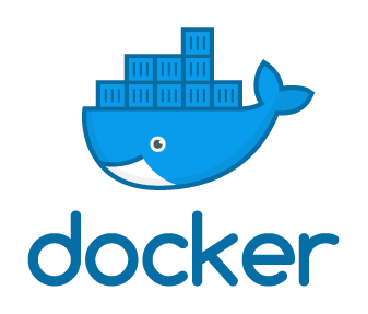

# 1.2 虚拟化

本章内容将讲解 虚拟化、虚拟化本质、namespace、cgroups。


本文其实跟 Kubernetes 没有多大的关系，这部分是对 Linux 虚拟化的一些探讨。

<iframe src="//player.bilibili.com/player.html?aid=433710342&bvid=BV13G411K78L&cid=919727537&page=1" scrolling="no" border="0" frameborder="no" framespacing="0" allowfullscreen="true"> </iframe>

## Docker 虚拟化

### 关于Docker

 本小节将介绍 Docker 虚拟化的一些特点。

<p>
    <div style="color: rgb(23, 23, 23); font-family: &quot;Segoe UI&quot;, SegoeUI, &quot;Segoe WP&quot;, &quot;Helvetica Neue&quot;, Helvetica, Tahoma, Arial, sans-serif; background-color: rgb(255, 241, 204);border-radius: 10px;padding:20px;">
	Docker 是一个开放源代码软件项目，自动化进行应用程序容器化部署，借此在 Linux 操作系统上，提供一个额外的软件抽象层，以及操作系统层虚拟化的自动管理机制。										-From wiki
</div>
</p>




在接触 Docker 的过程中，或多或少会了解到 Docker 的虚拟化，最常见的介绍方式是对比 Docker 和虚拟机之间的差别，笔者这里也给出两者的对比表格，以便后面详细地展开来讲。

|          | **虚拟机**                       | **Docker 容器**                              |
| -------- | -------------------------------- | -------------------------------------------- |
| 隔离程度 | 硬件级进程隔离                   | 操作系统级进程隔离                           |
| 系统     | 每个虚拟机都有一个单独的操作系统 | 每个容器可以共享操作系统（共享操作系统内核） |
| 启动时间 | 需要几分钟                       | 几秒                                         |
| 体积大小 | 虚拟机镜像GB级别                 | 容器是轻量级的（KB/MB）                      |
| 启动镜像 | 虚拟机镜像比较难找到             | 预建的 docker 容器很容易获得                 |
| 迁移     | 虚拟机可以轻松迁移到新主机       | 容器被销毁并重新创建而不是移动               |
| 创建速度 | 创建 VM 需要相对较长的时间       | 可以在几秒钟内创建容器                       |
| 资源使用 | GB级别                           | MB级别                                       |


Docker 中的虚拟化是依赖于 Windows 和 Linux 内核的，在 Windows 上会要求开启 Hyper-V，在 Linux 上需要依赖 namespace 和 cgroups 等，因此这里就不过多介绍 Docker 了，后面主要介绍 Linux 上的虚拟化技术。


### 传统虚拟化部署方式

传统虚拟化方式是在硬件抽象级别虚拟化，其特点是 虚拟化程度高。


传统虚拟化方式的优点是：

1，虚拟机之间通过虚拟化技术隔离互不影响
2，物理机上可部署多台虚拟机，提升资源利用率
3，应用资源分配、扩容通过虚拟管理器直接可配置
4，支持快照、虚拟机克隆多种技术，快速部署、容灾减灾

传统虚拟化部署方式的缺点：

1， 资源占用高，需要额外的操作系统镜像，需要占用GB级别的内存以及数十GB存储空间。
 2，启动速度慢，虚拟机启动需要先启动虚拟机内操作系统，然后才能启动应用。
 3，性能影响大，应用 => 虚拟机操作系统=> 物理机操作系统=> 硬件资源


## Linux 虚拟化

本节简单地讲解 Docker 的实现原理，读者可以从中了解 Linux 是如何隔离资源的、Docker 又是如何隔离的。

我们知道，操作系统是以一个进程为单位进行资源调度的，现代操作系统为进程设置了资源边界，每个进程使用自己的内存区域等，进程之间不会出现内存混用。Linux 内核中，有 cgroups 和 namespaces 可以为进程定义边界，使得进程彼此隔离。


### namespace 环境隔离

在容器中，当我们使用 top 命令或 ps 命令查看机器的进程时，可以看到进程的 Pid，每个进程都有一个 Pid，而机器的所有容器都具有一个 Pid = 1 的基础，但是为什么不会发生冲突？容器中的进程可以任意使用所有端口，而不同容器可以使用相同的端口，为什么不会发生冲突？这些都是资源可以设定边界的表现。

在 Linux 中，namespace 是 Linux 内核提供的一种资源隔离技术，可以将系统中的网络、进程环境等进行隔离，使得每个 namespace 中的系统资源不再是全局性的。目前有以下 6 种资源隔离，Docker 也基本在这 6 种资源上对容器环境进行隔离。


读者可以稍微记忆一下这个表格，后面会使用到。

| namespace | 系统调用参数  | 隔离内容                   |
| --------- | ------------- | -------------------------- |
| UTS       | CLONE_NEWUTS  | 主机名和域名               |
| IPC       | CLONE_NEWIPC  | 信号量、消息队列、共享内存 |
| PID       | CLONE_NEWPID  | 进程编号                   |
| Network   | CLONE_NEWNET  | 网络设备、网络栈、端口     |
| Mount     | CLONE_NEWNS   | 文件系统挂载               |
| User      | CLONE_NEWUSER | 用户和用户组               |

> **[info] 关于 Mount**
>
> namespace 的 Mount 可以实现将子目录挂载为根目录。


#### unshare

Linux 中，unshare 命令行程序可以创建一个 namespace，并且根据参数创建在 namespace 中隔离各种资源，在这里我们可以用使用这个工具简单地创建一个 namespace。

为了深刻理解 Linux 中的 namespace，我们可以在 Linux 中执行：

```shell
unshare --pid --fork --mount-proc /bin/bash
```

> `--pid` 仅隔离进程。


这命令类似于  `docker run -it {image}:{tag} /bin/bash` 。当我们执行命令后，终端会进入一个 namespace 中，执行 top 命令查看进程列表。

```
  PID USER      PR  NI    VIRT    RES    SHR S  %CPU %MEM     TIME+ COMMAND               
    1 root      20   0  160188   8276   5488 S   0.0  0.4   9:35.58 systemd               
    2 root      20   0       0      0      0 S   0.0  0.0   0:00.08 kthreadd             
    3 root       0 -20       0      0      0 I   0.0  0.0   0:00.00 rcu_gp               
    4 root       0 -20       0      0      0 I   0.0  0.0   0:00.00 rcu_par_gp          
```

可以看到，进程 PID 是从 1 开始的，说明在这个 namespace 中，与主机的进程是隔离开来的。

这个命令中，只隔离了进程，因为并没有隔离网络，因此当我们执行 `netstat --tlap` 命令时，这个命名空间的网络跟其它命名空间的网络是相通的。


在执行 unshare 命令前，使用 pstree 命令查看进程树：

```shell
init─┬─2*[init───init───bash]
     ├─init───init───bash───pstree
     ├─init───init───fsnotifier-wsl
     ├─init───init───server───14*[{server}]
     └─2*[{init}]
```

为了方便比较，我们使用 `unshare --pid top` 创建一个 namespace，对比执行了 unshare 命令后：

```shell
$>  pstree -lha
init
  ├─init
  │   └─init
  │       └─bash
  │           └─sudo unshare --pid top
  │               └─top
  ├─init
  │   └─init
  │       └─bash
  │           └─pstree -lha
  ├─init
  │   └─init
  │       └─fsnotifier-wsl
  ├─init
  │   └─init
  │       └─bash
  ├─init
  │   └─init
  │       └─server --port 29687 --instance WSL-Ubuntu
  │           └─14*[{server}]
  └─2*[{init}]
```

而在 namespace 中，查看 top 显示的内容，发现：

```shell
   PID USER      PR  NI    VIRT    RES    SHR S  %CPU  %MEM     TIME+ COMMAND
     1 root      20   0    1904   1136   1020 S   0.0   0.0   0:08.38 init
```


通过进程树可以看到，不同 namespace 内的进程处于不同的树支，他们的进程 PID 也是相互独立的。其功能类似于 Docker 中的 runc。

由于笔者对 Linux 了解不深，这部分内容就不深入探究了。


在 `unshare` 命令中，`--pid` 参数创建 隔离进程的命名空间，此外，还可以隔离多种系统资源：

* mount ：命名空间具有独立的挂载文件系统；
* ipc：Inter-Process Communication (进程间通讯)命名空间，具有独立的信号量、共享内存等；
* uts：命名空间具有独立的 hostname 、domainname；
* net：独立的网络，例如每个 docker 容器都有一个虚拟网卡；
* pid：独立的进程空间，空间中的进程 Pid 都从 1 开始；
* user：命名空间中有独立的用户体系，例如 Docker 中的 root 跟主机的用户不一样；
* cgroup：独立的用户分组；


#### Go 简单实现 进程隔离

在前面我们使用了 unshare 创建命名空间，在这里我们可以尝试使用 Go 调用 Linux 内核的 namespace，通过编程代码创建隔离的资源空间。

Go 代码示例如下：

```go
package main

import (
	"log"
	"os"
	"os/exec"
	"syscall"
)

func main() {

	cmd := exec.Command("/bin/bash")
	cmd.SysProcAttr = &syscall.SysProcAttr{
		Cloneflags: syscall.CLONE_NEWUTS |
			syscall.CLONE_NEWIPC |
			syscall.CLONE_NEWNS |
			syscall.CLONE_NEWNET |
			syscall.CLONE_NEWPID |
			syscall.CLONE_NEWUSER,
	}
	cmd.Stdin = os.Stdin
	cmd.Stdout = os.Stdout
	cmd.Stderr = os.Stderr
	if err := cmd.Run(); err != nil {
		log.Fatalln(err)
	}
}
```

> **[info] 提示** 
>
> 前面已经提到过 UTS 等资源隔离，读者可以参考表格中的说明，对照代码理解 Cloneflags 的作用。
>
> 代码示例参考 陈显鹭《自己动手写 Docker》一书。


在这个代码中，我们启动了 Linux 中的 sh 命令，开启一个新的进程，这个进程将会使用新的 IPC、PID 等隔离。

读者可以在 Linux 中，执行 `go run main.go` ，即可进入新的命名空间。


限于个人水平和篇幅有限，关于 namespace 的介绍就到这里。


### cgroups 硬件资源隔离

前面提到的 namepace 是逻辑形式使得进程之间相互不可见，形成环境隔离，这跟 Docker 容器的日常使用是一样的，隔离根目录，隔离网络，隔离进程 PID 等。

当然，Docker 处理环境隔离外，还能限制每个容器使用的物理资源，如 CPU 、内存等，这种硬件资源的限制是基于 Linux 内核的 cgroups 的。

在 Docker 中限制容器能够使用的资源量参数示例：

```shell
-m 4G --memory-swap 0 --cpu-period=1000000 --cpu-quota=8000000 
```


cgroups 是 control groups 的缩写，是 Linux 内核提供的一种可以进程所使用的物理资源的机制。


cgroups 可以控制多种资源，在 cgroups 中每种资源限制功能对应一个子系统，可以使用命令查看：

```shell
mount | grep cgroup
```


>**[info] 提示**
>
>每种子系统的功能概要如下：
>
>- `blkio` — 该子系统对进出块设备的输入/输出访问设置限制，如 USB 等。
>- `cpu` — 该子系统使用调度程序来提供对 CPU 的 cgroup 任务访问。
>- `cpuacct` — 该子系统生成有关 cgroup 中任务使用的 CPU 资源的自动报告。
>- `cpuset` — 该子系统将单个 CPU和内存节点分配给 cgroup 中的任务。
>- `devices` — 该子系统允许或拒绝 cgroup 中的任务访问设备。
>- `freezer` — 该子系统在 cgroup 中挂起或恢复任务。
>- `memory` — 该子系统对 cgroup 中的任务使用的内存设置限制，并生成有关自动报告。
>- `net_cls`— 允许 Linux 流量控制器 ( `tc`) 识别源自特定 cgroup 任务的数据包。
>- `net_prio` — 该子系统提供了一种动态设置每个网络接口的网络流量优先级的方法。
>- `ns`—*命名空间*子系统。
>- `perf_event` — 该子系统识别任务的 cgroup 成员资格，可用于性能分析。
>
>详细内容请参考：[redhat 文档](https://access.redhat.com/documentation/en-us/red_hat_enterprise_linux/6/html/resource_management_guide/ch01)


我们也可以使用 ` lssubsys`  命令，查看内核支持的子系统。

```
$> lssubsys -a
cpuset
cpu
cpuacct
blkio
memory
devices
freezer
net_cls
perf_event
net_prio
hugetlb
pids
rdma
```

> **[info] 提示**
>
> Ubuntu 可以使用 `apt install cgroup-tools` 安装工具。


为了避免篇幅过大，读者只需要知道 Docker 限制容器资源使用量、CPU 核数等操作，其原理是 Linux 内核中的 cgroups 即可，笔者这里不再赘述。


## 聊聊虚拟化

本节内容将从底层角度，聊聊虚拟化。

### 理论基础

#### 计算机层次结构

从语言角度，一台由软硬件组成的通用计算机系统可以看作是按功能划分的多层机器级组成的层次结构。

如果从语言角度来看，计算机系统的层次结构可用下图所示。


【图来源：《计算机组成原理》天勤考研 1.2.5 计算机系统的层次结构】


我们平时使用的笔记本、安卓手机、平板电脑、Linux 服务器等，虽然不同机器的系统和部分硬件差异很大，但是其系统结构是一致的。从 CPU 中晶体管、寄存器 到 CPU 指令集，再到操作系统、汇编，现在使用的通用计算机基本上这种结构。


下面讲解一下不同层次的主要特点。

计算机的最底层是硬联逻辑级，由门电路，触发器等逻辑电路组成，特征是使用极小的元件构成，表示了计算机中的 0、1。


微程序是使用微指令编写的，一个微程序即一个机器指令，一般直接由硬件执行，它可以表示一个最简单的操作。例如一个加法指令，由多个逻辑元件构成一个加法器，其元件组成如下图所示(图中为一个 8 位全加器)。


传统机器语言机器级是处理器的指令集所在，我们熟知的 X86、ARM、MIPS、RISC-V 等指令集，便是在这个层次。程序员使用指令集中的指令编写的程序，由低一层微程序解释。


操作系统机器层是从操作系统基本功能来看的，操作系统需要负责管理计算机中的软硬件资源，如内存、设备、文件等，它是软硬件的交互界面。常用的操作系统有 Windows、Linux、Unix 等。这个层次使用的语言是机器语言，即 0、1 组成的二进制代码，能够由计算机直接识别和执行。


汇编语言机器层顾名思义是汇编语言所在的位置，汇编语言与处理器有关，相同类型的处理器使用的汇编语言集是一致的。汇编语言需要被汇编语言程序变换为等效的二进制代码目标程序。由于计算机中的资源被操作系统所管理，因此汇编语言需要在操作系统的控制下进行。


到了高级语言机器层，便是我们使用的 C、C++ 等编程语言，高级语言是与人类思维相接近的语言。


### 软硬件实现等效

<p>
    <div style="color: rgb(23, 23, 23); font-family: &quot;Segoe UI&quot;, SegoeUI, &quot;Segoe WP&quot;, &quot;Helvetica Neue&quot;, Helvetica, Tahoma, Arial, sans-serif; background-color: rgb(255, 241, 204);border-radius: 10px;padding:20px;">
	计算机的某些功能即可以由硬件实现，也可以由软件来实现。即软件和硬件在功能意义上是等效的。
</div>
</p>


一个功能使用硬件来实现还是使用软件来实现？

硬件实现：速度快、成本高；灵活性差、占用内存少。

软件实现：速度低、复制费用低；灵活性好、占用内存多。

虚拟化技术是将原本 硬件实现的功能，使用软件来实现，它们在性能、价格、实现的难易程度是不同的。一个功能既可以使用硬件实现，也可以使用软件实现，也可以两者结合实现，可能要根据各种人力成本、研发难度、研发周期等考虑。


## 虚拟化

<p>
    <div style="color: rgb(23, 23, 23); font-family: &quot;Segoe UI&quot;, SegoeUI, &quot;Segoe WP&quot;, &quot;Helvetica Neue&quot;, Helvetica, Tahoma, Arial, sans-serif; background-color: rgb(255, 241, 204);border-radius: 10px;padding:20px;">
	虚拟化（技术）或虚拟技术是一种资源管理技术，将计算机的各种实体资源（CPU、内存、磁盘空间、网络适配器等），予以抽象、转换后呈现出来并可供分割、组合为一个或多个计算机配置环境。
</div>
</p>


### 不同层次的虚拟化

我们应该在很多书籍、文章中，了解到虚拟机跟 Docker 的比较，了解到 Docker 的优点，通过 Docker 打包镜像后可以随时在别的地方运行而不需要担心机器的兼容问题。但是 Docker 的虚拟化并不能让 Linux 跑 Windows 容器，也不能让 Windows 跑 Linux 容器，更不可能让 x86 机器跑 arm 指令集的二进制程序。但是 VMware 可以在 Windows 运行 Linux 、Mac 的镜像，但 WMWare 也不能由 MIPS 指令构建的 Linux 系统。

Docker 和 VMware 都可以实现不同程度的虚拟化，但也不是随心所欲的，它们虚拟化的程度相差很大，因为它们是在不同层次进行虚拟化的。


> **[Info] 提示**
>
> 许多虚拟化软件不单单是在一个层面上，可能具有多种层次的虚拟化能力。

在指令集级别虚拟化中，从指令系统上看，就是要在一种机器上实现另一种机器的指令系统。例如，QEMU 可以实现在 X64 机器上模拟 ARM32/64、龙芯、MIPS 等处理器。

虚拟化程度在于使用硬件实现与软件实现的比例，硬件部分比例越多一般来说性能就会越强，软件部分比例越多灵活性会更强，但是性能会下降，不同层次的实现也会影响性能、兼容性等。随着现在计算机性能越来越猛，很大程度上产生了性能过剩；加之硬件研发的难度越来越高，越来越难突破，非硬件程度的虚拟化将会越来越广泛。

