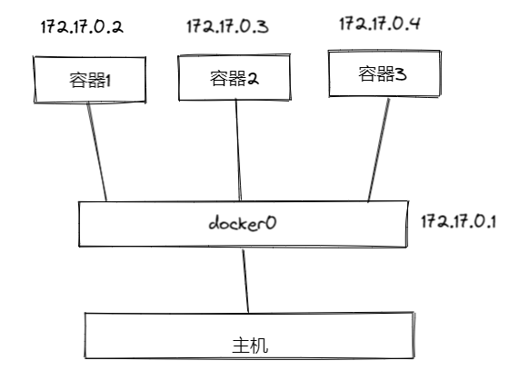
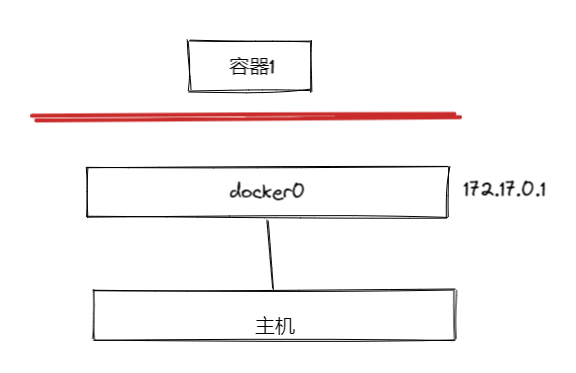
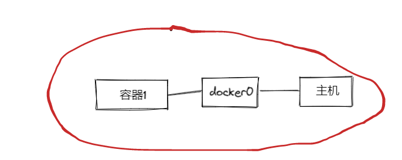
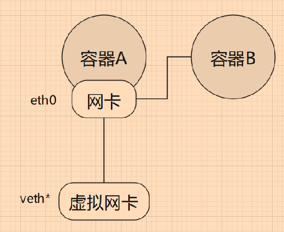

# 1.3 了解 Docker 网络

本章将会简单地讲述 Docker 中的网络，对于 CNM、Libnetwork 这些，限于笔者个人水平，将不会包含在内。


## Docker 的四种网络模式

Docker 有 bridge、none、host、container 四种网络模式，提供网络隔离、端口映射、容器间互通网络等各种支持，下面开门见山地直接介绍这四种网络模式。

这四种网络模式可以通过启动容器的时候指定，其命令或参数个数如下：

| 网络模式      | 参数         | 说明                                                         |
| ------------- | ------------ | ------------------------------------------------------------ |
| host模式      | -–net=host   | 容器和宿主机共享 Network namespace。                         |
| container模式 | –-net={id}   | 容器和另外一个容器共享 Network namespace。 kubernetes 中的pod就是多个容器共享一个 Network namespace。 |
| none模式      | –-net=none   | 容器有独立的Network namespace，但并没有对其进行任何网络设置，如分配 veth pair 和网桥连接，配置IP等。 |
| bridge模式    | -–net=bridge | 默认为该模式，通过 -p 指定端口映射。                         |


这四种模式可以理解成 Docker 怎么虚拟化容器的网络，隔离程度和共享程度。


### bridge 模式

使用 Docker 创建一个 bridge 模式的容器命令格式如下：

```shell
docker run -itd -p 8080:80 nginx:latest
```

bridge 模式称为网桥模式，首先 Docker 会在主机上创建一个名为 docker0 的虚拟网桥，这个虚拟网络处于七层网络模型的数据链路层，每当创建一个新的容器时，容器都会通过 docker0 与主机的网络连接，docker0 相当于网桥。


使用 bridge 模式新创建的容器，其内部都有一个虚拟网卡，名为 eth0，容器之间可以通过 172.17.x.x 相互访问。

一般情况下，网桥默认 IP 范围是 172.17.x.x ，可以在宿主机执行 ifpconfig 命令查看所有网卡，里面会包含 Docker  容器的虚拟网卡，可以查看某个容器的 ip。在容器中，也可以使用 ifconfig 命令查看自身的容器 ip：

```shell
root@cda6958393cb:/var# ./ifconfig 
eth0: flags=4163<UP,BROADCAST,RUNNING,MULTICAST>  mtu 1500
        inet 172.17.0.2  netmask 255.255.0.0  broadcast 172.17.255.255
        ether 02:42:ac:11:00:02  txqueuelen 0  (Ethernet)
        RX packets 347  bytes 9507996 (9.5 MB)
        RX errors 0  dropped 0  overruns 0  frame 0
        TX packets 278  bytes 22384 (22.3 KB)
        TX errors 0  dropped 0 overruns 0  carrier 0  collisions 0

lo: flags=73<UP,LOOPBACK,RUNNING>  mtu 65536
        inet 127.0.0.1  netmask 255.0.0.0
        loop  txqueuelen 1000  (Local Loopback)
        RX packets 0  bytes 0 (0.0 B)
        RX errors 0  dropped 0  overruns 0  frame 0
        TX packets 0  bytes 0 (0.0 B)
        TX errors 0  dropped 0 overruns 0  carrier 0  collisions 0
```


可以看到，此容器的 ip 是 172.17.0.2。


使用了 bride 创建的容器，其网络与主机以及其他容器隔离，以太网接口、端口、路由表以及 DNS配置 都是独立的。每个容器都好像是一个独立的主机 ，这便是 bridge（网桥）的作用。但是因为 docker0 的存在，对于容器来说，可以通过 ip 访问别的容器。





容器1 可以通过 172.17.0.3 访问容器2，同样，主机也可以使用这个 ip 访问容器2 中的服务。


> **[Error] 提示**
>
> bridge 模式 是默认模式，即使是 使用 `docker run -itd  nginx:latest` 命令启动容器，也会创建一个虚拟 IP。


### none 模式

这种网络模式下容器只有 lo 回环网络，没有其他网卡，这种类型的网络没有办法联网，外界也无法访问它，封闭的网络能很好地保证容器的安全性。

创建 none 网络的容器：

```shell
docker run -itd --net=none nginx:latest
```

```
root@5a67da130f62:/var# ./ifconfig 
lo: flags=73<UP,LOOPBACK,RUNNING>  mtu 65536
        inet 127.0.0.1  netmask 255.0.0.0
        loop  txqueuelen 1000  (Local Loopback)
        RX packets 0  bytes 0 (0.0 B)
        RX errors 0  dropped 0  overruns 0  frame 0
        TX packets 0  bytes 0 (0.0 B)
        TX errors 0  dropped 0 overruns 0  carrier 0  collisions 0
```





### host 模式

host 模式会让容器与主机共享网络，此时映射的端口可能会生产冲突，但是容器的其余部分(文件系统、进程等)依然是隔离的，此时容器与宿主机共享网络。



### container 模式

container 模式可以让多个容器之间相互通讯，即容器之间共享网络。

首先启动一个 A 容器，A 一般为 bridge 网络，接着 B 使用 `–-net={id}` 连接到 A 中，使用 A 的虚拟网卡，此时 A、B 共享网络，可以接着加入 B、C、D 等容器。




