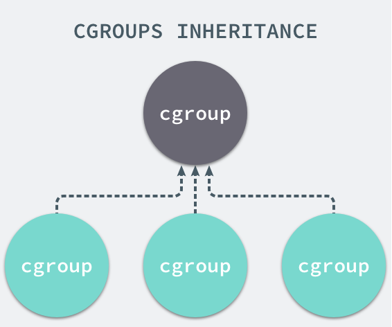

## Linux 虚拟化

前面介绍了 Docker 的结构，接下来笔者将讲解一下 Docker 是如何实现虚拟化的

### Linux-Namespace

Namespace 是 Linux 内核提供的一种资源隔离技术，目前实现了以下 6 种资源隔离，Docker 也基本在这 6 种资源上对容器环境进行隔离。

读者可以稍微记忆一下这个表格，后面会使用到。

| namespace | 系统调用参数  | 隔离内容                   |
| --------- | ------------- | -------------------------- |
| UTS       | CLONE_NEWUTS  | 主机名和域名               |
| IPC       | CLONE_NEWIPC  | 信号量、消息队列、共享内存 |
| PID       | CLONE_NEWPID  | 进程编号                   |
| Network   | CLONE_NEWNET  | 网络设备、网络栈、端口     |
| Mount     | CLONE_NEWNS   | 文件系统挂载               |
| User      | CLONE_NEWUSER | 用户和用户组               |


### unshare

Linux 中，unshare 命令行程序可以创建一个命名空间，并且创建一些资源。实际上这个命名空间是一个进程，命名空间中的其它进程是这个进程的子进程。为了深刻理解 Linux 中的 namespace，我们可以在 Linux 中执行：

```shell
unshare --pid /bin/sh  
```

此时我们进入了一个新的隔离的命名空间，执行 top 命令查看进程列表。

```
  PID USER      PR  NI    VIRT    RES    SHR S  %CPU %MEM     TIME+ COMMAND               
    1 root      20   0  160188   8276   5488 S   0.0  0.4   9:35.58 systemd               
    2 root      20   0       0      0      0 S   0.0  0.0   0:00.08 kthreadd             
    3 root       0 -20       0      0      0 I   0.0  0.0   0:00.00 rcu_gp               
    4 root       0 -20       0      0      0 I   0.0  0.0   0:00.00 rcu_par_gp          
```

> 我们还可以使用 nsenter 命令进入另一个命名空间。


上面查询到的结果是不是跟 Docker 容器执行命令的结果相似？

上面的命令中，`--pid` 参数创建 隔离进程的命名空间，此外，还可以隔离多种系统资源：

* mount ：命名空间具有独立的挂载文件系统；
* ipc：Inter-Process Communication (进程间通讯)命名空间，具有独立的信号量、共享内存等；
* uts：命名空间具有独立的 hostname 、domainname；
* net：独立的网络，例如每个 docker 容器都有一个虚拟网卡；
* pid：独立的进程空间，空间中的进程 Pid 都从 1 开始；
* user：命名空间中有独立的用户体系，例如 Docker 中的 root 跟主机的用户不一样；
* cgroup：独立的用户分组；

再这个命令中，只隔离了进程，因为并没有隔离网络，因此当我们执行 `netstat --tlap` 命令时，这个命名空间的网络跟其它命名空间的网络是一样的。


### Linux-Cgroups资源隔离

Cgroups是control groups的缩写，是Linux内核提供的一种可以限制、记录、隔离进程组（process groups）所使用的物理资源（如：cpu,memory,IO等等）的机制。



Linux-Cgroups功能

Resource limitation: 限制资源使用，比如内存使用上限以及文件系统的缓存限制。
Prioritization: 优先级控制，比如：CPU利用和磁盘IO吞吐。
Accounting: 一些审计或一些统计，主要目的是为了计费。
Control: 挂起进程，恢复执行进程。

Docker 限制容器能够使用的资源量参数：
-m 4G --memory-swap 0 --cpu-period=1000000 --cpu-quota=8000000 


### 资源隔离和共享

本小节简单地讲解 Docker 的实现原理，读者可以从中了解 Linux 是如何隔离资源的、Docker 又是如何隔离的。


我们知道，操作系统是以一个进程为单位进行资源调度的，现代操作系统为进程设置了资源边界，每个进程使用自己的内存区域等，进程之间不会出现内存混用。Linux 内核中，有 cgroups 和 namespaces 可以为进程定义边界，使得进程彼此隔离。

本小节中将讲解一些容器环境隔离以及资源共享的相关知识。

Docker 依赖 Linux 内核的 namespace 、cgroup 等实现的。

#### namespace

在容器中，当我们使用 top 命令或 ps 命令查看机器的进程时，可以看到进程的 Pid，每个进程都有一个 Pid，而机器的所有容器都具有一个 Pid = 1 的基础，但是为什么不会发生冲突？容器中的进程可以任意使用所有端口，而不同容器可以使用相同的端口，为什么不会发生冲突？这些都是资源可以设定边界的表现。

在 Linux 中，namespace 是一种资源隔离方案，可以将系统中的网络、进程环境等进行隔离，使得每个 namespace 中的系统资源不再是全局性的。


**namespace 主要是一种环境隔离机制**。


#### cgroups

cgroups 全称是 Control Groups，cgroups 可以限制进程可使用的内存、CPU、网络 IO，**是 Linux 内核中的物理资源隔离机制**。

cgroups 可以控制多种资源，在 cgroups 中每种资源对于一个子系统，可以使用命令查看：

```shell
mount | grep cgroup
```


>每种子系统的功能概要如下：
>
>- `blkio` — 该子系统对进出块设备的输入/输出访问设置限制，如 USB 等。
>- `cpu` — 该子系统使用调度程序来提供对 CPU 的 cgroup 任务访问。
>- `cpuacct` — 该子系统生成有关 cgroup 中任务使用的 CPU 资源的自动报告。
>- `cpuset` — 该子系统将单个 CPU和内存节点分配给 cgroup 中的任务。
>- `devices` — 该子系统允许或拒绝 cgroup 中的任务访问设备。
>- `freezer` — 该子系统在 cgroup 中挂起或恢复任务。
>- `memory` — 该子系统对 cgroup 中的任务使用的内存设置限制，并生成有关自动报告。
>- `net_cls`— 允许 Linux 流量控制器 ( `tc`) 识别源自特定 cgroup 任务的数据包。
>- `net_prio` — 该子系统提供了一种动态设置每个网络接口的网络流量优先级的方法。
>- `ns`—*命名空间*子系统。
>- `perf_event` — 该子系统识别任务的 cgroup 成员资格，可用于性能分析。
>
>请参考：[redhat 文档](https://access.redhat.com/documentation/en-us/red_hat_enterprise_linux/6/html/resource_management_guide/ch01)


为了避免篇幅过大，读者只需要知道 Docker 限制容器资源使用量、CPU 核数等操作，其原理是 Linux 内核中的 cgroups 即可，笔者这里不再赘述。


## Go 简单实现 进程隔离

