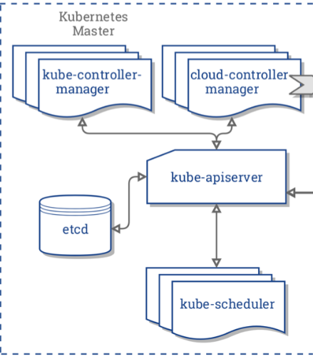

# 1.3 Master 节点

### 导读

在本章，主要介绍 Master 节点上的组件以及相关知识。

## 架构组成

一个 kubernetes 集群是由一组被称为节点的机器或虚拟机组成，节点有 master、worker 两种类型。一个集群中至少有一个 master 节点，是在没有 worker 节点的情况下， Pod 也可以部署到 master 节点上。如果集群中的节点数量非常多，则可考虑扩展 master 节点，使用多个 master 节点控制集群。

下面是一张简单的 Kubernetes 集群结构图。


Kubernetes 的组件分为两种，分别是 Control Plane Components(控制平面组件)、Node Components(节点组件)。

**Control Plane Components** 用于对集群做出全局决策，部署在 master 节点上；

**Node Components** 在 worker 节点中运行，为 Pod 提供 Kubernetes 环境。在上一章中，我们已经了解 worker 节点上的 kubelet、kube-proxy，在本章中将主要介绍 master 节点上的各个组件。

## Master 节点

Master 是由一组称为控制平面组件组成的，如果你已经根据第二章中，通过 minikube 或 kubeadm 部署了 kubernetes，那么我们可以打开 `/etc/kubernetes/manifests/` 目录，这里存放了 k8s 默认的控制平面组件的 YAML 文件。

```
.
├── etcd.yaml
├── kube-apiserver.yaml
├── kube-controller-manager.yaml
└── kube-scheduler.yaml
```

对于集群来说， 这四个组件都是是必不可少的。



在结构图中，还有一个 cloud-controller 组件，主要由云平台服务商提供，属于第三方组件，这里不再讨论。下面我们来了解 master 中的组件。

### kube-apiserver

kube-apiserver 是 k8s 主要进程之一，apiserver 组件公开了 Kubernetes API (HTTP API)，apiserver 是 Kubernetes 控制面的前端。

kubectl 是 Kubernetes 自带的一个非常强大的控制集群的工具，通过命令行操作去管理整个集群。正是 apiserver 提供了接口服务，kubectl 解析用户输入的指令后，向 apiserver 发起 HTTP 请求，再将结果反馈给用户。

Kubernetes 有很多可视化面板，例如 Dashboard，其背后也是调用 apiserver 的 API。

总之，我们使用的各种管理集群的工具，其后端都是 apiserver，通过 apiserver，我们还可以定制各种各样的管理集群的工具，例如网格管理工具 istio。腾讯云、阿里云等云平台都提供了在线的 kubernetes 服务，还有控制台可视化操作，也是利用了 apiserver。

apiserver 暴露的 endiont 端口是 6443。

### etcd

etcd 是兼具一致性和高可用性的键值数据库，作为保存 Kubernetes 所有集群数据的后台数据库。apiserver 的所有操作结果都会存储到 etcd 数据库中，etcd 主要存储 k8s 的状态、网络配置以及其它持久化数据，etcd 是使用 B+ 树实现的。

### kube-scheduler

scheduler 负责监视新创建的 pod，并把 pod 分配到节点上。当要运行容器时，发送的请求会被调度器转发到 API；调度器还可以寻找一个合适的节点运行这个容器。

### kube-controller-manager

kube-controller-manager 中包含了多个控制器，它们都被编译到一个二进制文件中，但是启动后会产生不同的进程。这些控制器有：

*   节点控制器（Node Controller）

    负责在节点出现故障时进行通知和响应
*   任务控制器（Job controller）

    监测代表一次性任务的 Job 对象，然后创建 Pods 来运行这些任务直至完成
*   端点控制器（Endpoints Controller）

    填充端点(Endpoints)对象(即加入 Service 与 Pod)
*   服务帐户和令牌控制器（Service Account & Token Controllers）

    为新的命名空间创建默认帐户和 API 访问令牌
