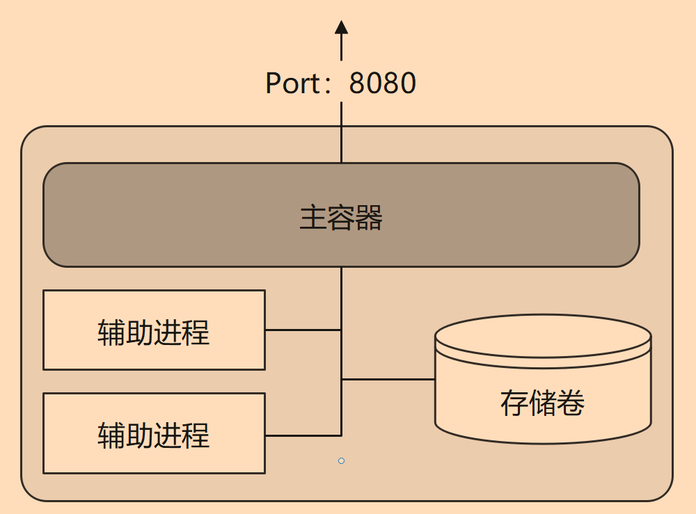
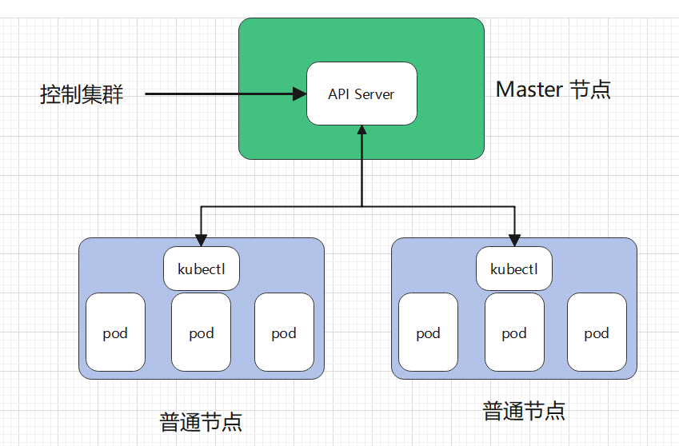

# 1.4 容器与 Pod

现在 Docker 的流行程度越来越高，越来越多的公司使用 Docker 打包和部署项目。但是也有很多公司只是追求新技术，将以前的单体应用直接打包为镜像，代码、配置方式等各方面保持不变，使用 Docker 后，并没有带来多大的便利，反而使得配置、启动过程变得更加繁杂，更难调试。

本章将讨论容器与 Pod 的关系，了解如何更好地将应用容器化。

<iframe src="//player.bilibili.com/player.html?aid=903691240&bvid=BV1JP4y1D7Ey&cid=919797507&page=1" scrolling="no" border="0" frameborder="no" framespacing="0" allowfullscreen="true"> </iframe>

## 什么是容器化应用

containerized applications 指容器化的应用，我们常常说使用镜像打包应用程序，使用 Docker 发布、部署应用程序，那么当你的应用成功在 Docker 上运行时，称这个应用是 containerized applications。

定义：

> **[Success] 定义**
>
> Containerized applications are bundled with their required libraries, binaries, and configuration files into a container.
>
> 容器化的应用程序与它们所需的库、二进制文件和配置文件绑定到一个容器中。

通常，容器都包含一个应用程序，以及正确执行二进制程序所需的依赖库、文件等，例如 Linux 文件系统+应用程序组成一个简单的容器。通过将容器限制为单个进程，问题诊断和更新应用程序都变得更加容易。与 VM(虚拟机)不同，容器不包含底层操作系统，因此容器被认为是轻量级的。Kubernentes 容器属于开发领域。

容器在操作系统之上，提供了 CPU、内存、网络、存储等资源的虚拟化，为应用在不同服务器里提供了一致的运行时环境。开发者可以通过容器创建一个可预测的环境，能够保证在开发、调试、生产时的环境都是一致的，减少开发团队和运维团队可以减少调试和诊断问题时，因环境差异带来的麻烦。同时，应用运行在一个沙盒中，对应用和系统进行了隔离，提高了安全性，还能限制应用程序使用的计算资源。

当然，并不是说能够将一个应用程序打包到容器中运行，就可以鼓吹产品；并不是每个应用程序都是容器化的优秀对象，例如在 DDD 设计中被称为大泥球的应用程序，具有设计复杂、依赖程度高、程序不稳定等确定，这种难以迁移、难以配置的应用程序明显是失败的产品。

在多年经验中，许多开发者对容器化技术进行了总结，这些强有力的经验、理论形成十二个云计算应用程序因素指导原则：

**1. Codebase:** One codebase tracked in revision control, many deploys

代码库： 一个代码库可以在版本控制和多份部署中被跟踪。一般使用 github 等对代码进行管理。

**2. Dependencies:** Explicitly declare and isolate dependencies

依赖项： 显式声明和隔离依赖项。

**3. Config:** Store config in the environment

配置：在环境中存储配置。

**4. Backing services:** Treat backing services as attached resources

支持服务：将支持服务视为附加资源(可拓展，而不是做成大泥球)。

**5. Build, release, run:** Strictly separate build and run stages

构建、发布、运行： 严格区分构建和运行阶段(连 Debug、Release 都没有区分的产品是真的垃圾)。

**6. Processes:** Execute the app as one or more stateless processes

过程：应用程序作为一个或多个无状态过程执行。

**7. Port binding:** Export services via port binding

端口绑定：可通过端口绑定服务对外提供服务。

**8. Concurrency**: Scale out via the process model

并发性：通过 process 模型进行扩展。

**9. Disposability:** Maximize robustness with fast startup and graceful shutdown

可处理性： 快速启动和完美关机，最大限度地增强健壮性。

**10. Dev/prod parity**: Keep development, staging, and production as similar as possible

开发/生产一致：尽可能保持开发中、演示时和生产时的相似性。

**11. Logs:** Treat logs as event streams

Logs：将日志视为事件流。

**12. Admin processes:** Run admin/management tasks as one-off processes

管理流程：将管理/管理任务作为一次性流程运行。

> 上述内容可能有笔者翻译不到位的地方，读者可阅读原文了解：[https://12factor.net/](https://12factor.net)

容器位于开发人员技能列表之中，开发人员需要掌握如何容器化应用。

另外，在一个产品中，好的容器化规范或方法，具有以下特点：

* 使用**声明式**的格式进行设置自动化，以最大限度地减少新开发人员加入项目的时间和成本；
* 与底层操作系统之间有一个**干净的契约**(资源隔离、统一接口)，在执行环境之间提供**最大的可移植性**；
* 适合**部署**在现代**云平台上**，无需服务器和系统管理；
* **最大限度地减少**开发和生产之间的**差异**，实现**持续部署**以实现最大敏捷性；
* 并且可以在不对工具、架构或开发实践进行重大更改的情况下进行**扩展**。

在制作云原生应用的过程中，可以参考云计算应用程序因素指导原则，设计更加优秀的产品。

## Pod

最简单的说法就是将多个容器打包起来一起运行，这个整体就是 Pod。

> **[Info] 提示**
>
> 在上一章的 Docker 网络中，介绍了 container 网络模式，Pod 正是通过这种网络模式，让 Pod 中的容器共享网络，也就是说，Pod 中的容器，网络是互通的，容器之间不能使用相同的端口。

Pod 是 Kubernetes 集群中最小的执行单位。在 Kubernetes 中，容器不直接在集群节点上运行，而是将一个或多个容器封装在一个 Pod 中，接着将 Pod 调度到节点上运行，这些容器会一起被运行、停止，它们是一个整体。

Pod 中的所有容器共享相同的资源和本地网络，从而简化了 Pod 中应用程序之间的通讯。在 Pod 中，所有容器中的进程共享网络，可以通过 `127.0.0.1`、`localhost` 相互进行访问。详见 [3.1 章](../3.pod/1.pod.md) 中 "Pod 共享网络和存储" 一节。

一个简单的 Pod，其结构如下：

> **[Info] 提示**
>
> Pod 启动时会启动一个容器，K8S 给这个容器分配虚拟 IP，接着，其他容器使用 container 网络模式，连接到这个容器中，此时有容器共享网络。

随着 Pod 负载的增加，Kubernetes 可以自动复制 Pod 以达到预期的可拓展性(部署更多的 Pod 提供相同的服务，负载均衡)。因此，设计一个尽可能精简的 Pod 是很重要的，降低因复制扩容、减少收缩过程中带来的资源损失。

前面提到，容器应当是无状态的，所以拓展 Pod 时，每个实例都提供了一模一样的服务，这些 Pod 分配到不同的节点上，可以利用更多的 CPU、内存资源。

在第三章中，我们会更加详细地学习 Pod，这里就不再赘述。

## 容器与 Pod 的区别

容器包含执行特定流程或函数所需的代码(编译后的二进制可执行程序)。在 Kubernetes 之前，可以直接在物理或虚拟服务器上运行容器，但是缺乏 Kubernetes 集群所提供的可伸缩性和灵活性。

Pod 为容器提供了一种抽象，可以将一个或多个应用程序包装到一个 Pod 中，而 Pod 是 Kubernetes 集群中最小的执行单元。例如 Pod 可以包含初始化容器，这些容器为其它应用提供了准备环境，然后在应用程序开始执行前终结。Pod 是集群中复制的最小单位，Pod 中的容器作为整体被扩展或缩小。

例如对应前后端分离的项目，可能不需要把前端文件和后端程序放在一起，而是分别放在两个容器中。然后通过 Pod，将这两个容器作为一组服务打包在一起。

## 节点

Pod 是 Kubernetes 中最小的**执行单元**，而 Node 是 Kubernetes 中最小的计算**硬件单元**，节点可以是物理的本地服务器，也可以是虚拟机，节点即使宿主服务器，可以运行 Docker 的机器。

与容器一样，Node 提供了一个抽象层。多个 Node 一起工作形成了 Kubernetes 集群，它可以根据需求的变化自动分配工作负载，增加或减少在节点上的 Pod 数量。如果 A 节点和 B 节点的硬件资源是一致的，那么 A 、B 两个节点是等价的，如果 A 节点失败，它将自动从集群中移除，由 B 节点接管，不会出现问题。

每个节点都运行着一个名为 kubelet 的组件，它是节点的主要组件，Kubernetes 与集群控制平面组件(API Server)通信，所有对节点有影响的操作都会通过 kubectl 控制此节点。kubelet 也是 master 节点跟 worker 节点之间直接通讯的唯一组件。

kubelet 的一些功能有：

* 在节点上创建、更新、删除容器；
* 参与调度 Pod；
* 为容器创建和挂载卷；
* 使用命令查看 Pod 、容器，例如 `exec`、`log` 等时，需要通过 kubelet；

例如，集群有 A、B 两个节点，Pod 部署在哪里了，这不是用户关心的事情，用户在想看到容器的日志，可以随便找集群中的一台主机，执行命令，Kubernetes 会自动寻找容器所在的节点，然后kubectl 取得需要的内容。

另外节点上还有 proxy，主要是为 Pod 提供代理服务，外界可通过此代理，使用节点的 IP 访问 Pod 中的容器。

## 云原生

### 划分 Pod 和容器

在本小节中，笔者来介绍一下云原生方面的思想或知识，我们应该如何设计我们的应用。

容器中应只包含一个进程，或进程和创建的子进程。如果在同一个容器中包含多个进程，那么需要同时管理进程的启动、日志等，一个进程崩溃时，容易影响到另一个进程。由于多个进程都会记录信息到标准输出中(如控制台输出)，容器日志会合在一起，可能会导致出现问题难以排查。

一个容器只应该运行一个进程，但是他们放到一个 Pod 中就行了吗？例如程序和数据库，在设计时应该放到同一个 Pod，还是单独不同的 Pod？接下来我们简单讨论一下这个问题，限于经验和技术水平，笔者的论点可能不到位，读者可以多参考一下别的文章，了解如何设计 这些架构。

下面以 Web 程序和数据库举例。

**耦合**

使用 Pod/容器 的原因，是为了让不同服务能够降低耦合，能够隔离环境，如果程序跟数据库放在一起，是否能够有足够的隔离程度？如果 Web 跟 数据库放在同一个 Pod，此时 web 跟数据库的实例(容器)数量是 1：1。对于 Kubernests 来说，Pod 是最小单位，Kbernetes 不能横向扩容单个容器，因此扩容的最小单位是 Pod，多个容器必须捆绑在一起。同时 Pod 中的所有容器都使用同一机器的资源。在同一个 Pod 中的容器，在生命周期、计算机资源(内存、CPU)、实例数量、网络等都会耦合在一起。

请参考 [https://kubernetes.io/zh/docs/concepts/workloads/pods/pod-lifecycle/](https://kubernetes.io/zh/docs/concepts/workloads/pods/pod-lifecycle/)

**访问压力**

一般来说，Web 是要被外界访问的，但是数据库为了安全，应当避免能够公网访问，只有处于集群中的程序或客户端才能访问数据库。同时Web的访问是直接面向用户的，访问量肯定比数据库的访问量大得多，而且数据库需要的存储空间比web大得多，那么两者使用的计算资源并不相近。

Pod 可以使用服务器资源，当服务器压力过大时，当太多用户访问 Web 时，Web就要考虑扩容实例，可以在其它节点上部署相同的 Pod(扩容)，降低单节点访问压力。而一个数据库实例能够支持多个 Web 程序同时访问，那么数据库实例有必要跟 Web 放在同一个 Pod 中，保持 1：1的实例数量？

**故障恢复**

在 Kubernetes 中，容器应当是无状态的，也就是说容器或容器中的进程挂了，Kubernetes 可以快速在其它地方再创建一个 Pod ，启动容器，维持一定数量的 Pod 实例。对于 Web 来说，只要配置文件和数据库数据在，再启动一个 Web 容器，结果是一样的，流水的程序铁打的数据，只要数据在，可以随时启动 Web 程序，很容易恢复服务。但是数据库却不一定，数据库的运维比 Web 程序复杂得多，我们要考虑数据的安全性和可用性，当容器甚至节点服务器挂了后、磁盘损坏等，如何恢复数据库。数据库的维护不觉得。

两者的维护难度不在同一水平上，此时我们要考虑两者放在不同的 Pod 中。(实际上很少将数据库放在容器中，一般都是裸机部署)。

其中负载均衡是通过 Ingress 和 Service 实现的，后面的章节会学习到。

### 何时使用多个容器

前面提到 Web 跟数据库，应当划分在不同的 Pod 中，类似地，对于微服务中的不同服务或模块，也应当放在不同的 Pod 中。微服务架构、容器化，并不是那么容易，例如，对于前后端分离的项目，前后端文件放在同一个 容器中还是同一个 Pod 中还是不同 Pod 中？在设计中我们要考虑很多问题。

对于单体 Web 来说，一个程序中包含了所有服务，那么 Web 完全可以托管前端静态文件，前端文件跟后端程序打包在一起即可。例如 PHP、ASP.NET Core 等使用 wwwroot、www 等 目录存储静态文件。

如果是一个较大的网站，网站使用了多个微服务，则前端更可能放到一个 Pod 中，用户访问前端页面，然后前端根据访问的模块，自动访问不同的服务。

如果前端和后端文件需要频繁发布，两者的发布版本分开工作，则为了避免一方等待另一方发布，或者从 Devops 角度，前端和和后端文件可以放在不同容器中，然后通过存储卷，两个容器共享文件。

如果一个 Pod 中，包含一个主进程和多个辅助进程，则可以使用一个 Pod 部署多个 容器，多个容器之间紧密联系。

具体怎么设计，需要根据实际情况考虑。
