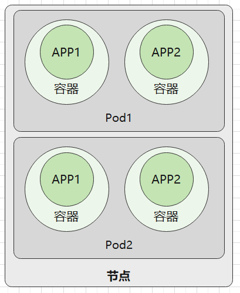
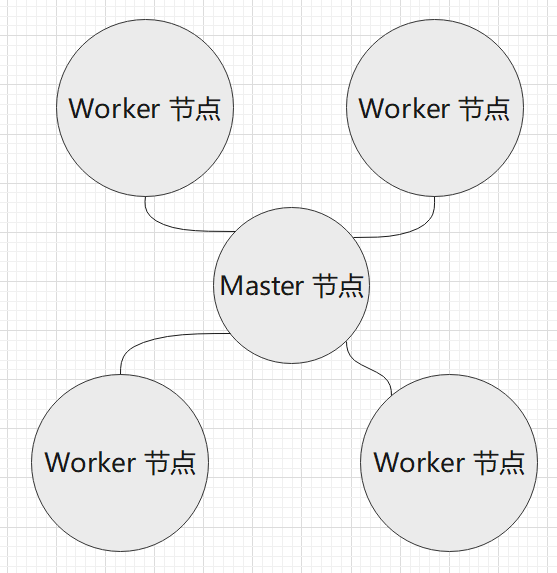
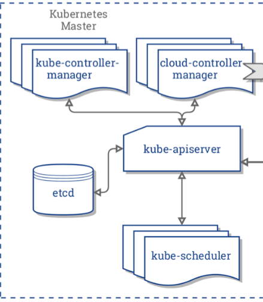

# 1.5 Kubernetes 入门基础

我们要学习 Kubernetes，就有首先了解 Kubernetes 的技术范围、基础理论知识库等，要学习 Kubernetes，肯定要有入门过程，在这个过程中，学习要从易到难，先从基础学习。

接下来笔者将为大家讲解 Kubernetes 各方面的知识，让读者了解 Kubernetes 是什么。


## Kubernetes 是什么

在 2008 年，**LXC（Linux containers）** 发布第一个版本，这是最初的容器版本；2013 年，Docker 推出了第一个版本；而 Google 则在 2014 年推出了 **LMCTFY**。

为了解决大集群(Cluster)中容器部署、伸缩和管理的各种问题，出现了 Kubernetes、Docker Swarm 等软件，称为 **容器编排引擎**。

容器的产生解决了很多开发、部署痛点，但随着云原生、微服务的兴起，纯 Docker 出现了一些管理难题。我们先思考一下，运行一个 Docker 容器，只需要使用 `docker run ...` 命令即可，这是相当简单(relatibely simple)的方法。

但是，要实现以下场景，则是困难的：

* 跨多台主机的容器相互连接(connecting containers across multiple hosts)
* 拓展容器(scaling containers)
* 在不停机的情况下配置应用(deploying applications without downtime)
* 在多个方面进行服务发现(service discovery among several aspects)


Kubernetes 是 Google 基于十多年的生产环境运维经验，开发出的一个生产级别的容器编排系统。在 Kunernetes 文档中，这样描述 Kubernetes：

> **[Success]**
>
> "an open-source system for automating deployment, scaling, and management of containerized applications".
>
> “一个自动化部署、可拓展和管理容器应用的开源系统”


Google 的基础设施在虚拟机(Virtual machines)技术普及之前就已经达到了很大的规模，高效地使用集群和管理分布式应用成为 Google 挑战的核心，而容器技术提供了一种高效打包集群的解决方案。

多年来，Google 一直使用 Borg 来管理集群中的容器，积累了大量的集群管理经验和运维软件开发能力，Google 参考 Borg ，开发出了 Kubernetes，即 Borg 是 Kubernetes 的前身。（但是 Google 目前还是主要使用 Borg）。

Kubernetes 从一开始就通过一组基元(primitives)、强大的和可拓展的 API 应对这些挑战，添加新对象和控制器地能力可以很容易地地址各种各样的产品需求(production needs)。

编排管理是通过一系列的监控循环控制或操作的；每个控制器都向询问对象状态，然后修改它，直至达到条件为止。容器编排是管理容器的最主要的技术。Dockers 也有其官方开发的 swarm 这个编排工具，但是在 2017 年的容器编排大战中，swarm 败于 Kubernetes。


### Kubernetes 集群的组成

在 Kubernets 中，运行应用程序的环境处于虚拟化当中，因此我们一般不谈论硬件。

我们谈起 Kubernetes 和应用部署时，往往会涉及到容器、节点、Pods 等概念，它们共同工作来管理容器化(containerized)应用的部署和执行，但是各种各样的术语，令人眼花缭乱。为了更好地摸清 Kubernetes，下面我们将列举这些有边界的对象。

| 成分                     | 名称         |
| :----------------------- | :----------- |
| Cluster                  | 集群         |
| Node                     | 节点         |
| Pod                      | 不翻译       |
| Container                | 容器         |
| Containerzed Application | 容器化的应用 |

在 Kubernetes 中，不同的对象其管理的范围、作用范围不同，它们的边界大小也不同。接下来的内容，按将从小到大的粒度介绍这些组成成分。


*Pod*

在上一章中已经介绍过，Pod 是 Kubernetes 中管理和调度的最小工作单位，Pod 中可以包含多个容器。这些容器会共享 Pod 中的网络等资源。当部署 Pod 时，会把一组关联性较强的容器部署到同一个节点上。


而节点则是指一台服务器、虚拟机等，运行着一个完整的操作系统，提供了 CPU、内存等计算资源，一个节点可以部署多个 Pod。



而一个集群(Cluster)之中，运行着 N 台服务器，即 N 个节点。这些节点有两种，一种是 master 节点，一种是 worker 节点。master 节点运行着 Kubernetes 系统组件，而 worker 节点负责运行用户的程序。所有节点都归 master 管，我们通过命令、API 的方式管理 Kubernetes 集群时，是通过发送命令或请求到 master 节点上的系统组件，然后控制整个集群。




另外，kubernetes 中有命名空间(namespace)的概念，这跟在 1.2 章中学习到的 Linux-namespace 类似，在一个集群中使用命名空间将不同的 Pod 隔离开来。但是 Kubernetes 中，不同 namespace 的 Pod 是可以相互访问的，它们不是完全隔离的。

 

### Kubernetes 结构

用图来表示体系结构，是阐述 Kubernetes 最快的方式，下面是一张称为 _Kubernetes Architecture_ graphic 。


上图是简单的 kubernetes 结构，左侧虚线方框中，是 master 节点，运行着各种各样的组件，master 节点负责控制整个集群，当然在很大的集群中也可以有多个 master 节点；而右侧是三个工作节点，负责运行我们的容器应用。这种结构一般称为 master-slave 结构，因为某些原因，在 Kubernetes 中后来改称为 master-minions。工作节点挂了没关系，master 节点会将故障节点上的业务自动在另一个节点上部署。


工作节点比较简单，在工作节点中，我们看到有 kubelet 和 kube-proxy 两个组件，这两个组件在上一章中接触过了，kubelet 和 kube-proxy 都是跟 主节点的 kube-apiserver 进行通信的。kube-proxy 全称是 Kubenetes Service Proxy，负责组件之间的负载均衡网络流量。


在上图中，  主节点由多个组件构成，结构比较复杂， 主节点中记录了整个集群的工作数据，负责控制整个集群的运行。工作节点挂了没关系，但是  主节点挂了，整个集群就挂了。因此， 有条件的情况下，也应该 设置多个  主节点。

一个 主节点中包含以下访问：

* 一个 API 服务(kube-apiserver)
* 一个调度器(kube-scheduler)
* 各种各样的控制器(上图有两个控制器)
* 一个存储系统(这个组件称为etcd)，存储集群的状态、容器的设置、网络配置等数据。

这张图片中还有很多东西，这里暂时不作讲解，我们在后面的章节再去学习那些 Kubernetes 中的术语和关键字。


### 组件

一个 kubernetes 集群是由一组被称为节点的机器或虚拟机组成，节点有 master、worker 两种类型。一个集群中至少有一个 master 节点，在没有 worker 节点的情况下， Pod 也可以部署到 master 节点上。如果集群中的节点数量非常多，则可考虑扩展 master 节点，使用多个 master 节点控制集群。


在上一小节中，我们看到 主节点中包含了比较多的组件，工作节点也包含了一些组件，这些组件可以分为两种，分别是 Control Plane Components(控制平面组件)、Node Components(节点组件)。

**Control Plane Components** 用于对集群做出全局决策，部署在 master 节点上；

**Node Components** 在 worker 节点中运行，为 Pod 提供 Kubernetes 环境。


## Master 节点

Master 是由一组称为控制平面组件组成的，如果你已经根据第二章中，通过 minikube 或 kubeadm 部署了 kubernetes，那么我们可以打开 `/etc/kubernetes/manifests/` 目录，这里存放了 k8s 默认的控制平面组件的 YAML 文件。

```
.
├── etcd.yaml
├── kube-apiserver.yaml
├── kube-controller-manager.yaml
└── kube-scheduler.yaml
```

对于集群来说， 这四个组件都是是必不可少的。




在结构图中，还有一个 cloud-controller 组件，主要由云平台服务商提供，属于第三方组件，这里不再讨论。下面我们来了解 master 中的组件。


master 节点中各个组件(控制平面组件)需要使用到的端口：

| 协议 | 方向 | 端口范围  | 作用                    | 使用者                       |
| ---- | ---- | --------- | ----------------------- | ---------------------------- |
| TCP  | 入站 | 6443      | Kubernetes API 服务器   | 所有组件                     |
| TCP  | 入站 | 2379-2380 | etcd 服务器客户端 API   | kube-apiserver, etcd         |
| TCP  | 入站 | 10250     | Kubelet API             | kubelet 自身、控制平面组件   |
| TCP  | 入站 | 10251     | kube-scheduler          | kube-scheduler 自身          |
| TCP  | 入站 | 10252     | kube-controller-manager | kube-controller-manager 自身 |

普通节点中各个组件需要使用到的端口：

| 协议 | 方向 | 端口范围    | 作用           | 使用者                     |
| ---- | ---- | ----------- | -------------- | -------------------------- |
| TCP  | 入站 | 10250       | Kubelet API    | kubelet 自身、控制平面组件 |
| TCP  | 入站 | 30000-32767 | NodePort 服务† | 所有组件                   |


### kube-apiserver

kube-apiserver 是 k8s 主要进程之一，apiserver 组件公开了 Kubernetes API (HTTP API)，apiserver 是 Kubernetes 控制面的前端，我们可以用 Go、C#  等编程语言写代码，远程调用 Kubernetes，控制集群的运行。apiserver 暴露的 endiont 端口是 6443。

为了控制集群的运行，Kubernetes 官方提供了一个名为 kubectl 的二进制命令行工具，正是 apiserver 提供了接口服务，kubectl 解析用户输入的指令后，向 apiserver 发起 HTTP 请求，再将结果反馈给用户。

> **[Info] kubectl**
>
> kubectl 是 Kubernetes 自带的一个非常强大的控制集群的工具，通过命令行操作去管理整个集群。


Kubernetes 有很多可视化面板，例如 Dashboard，其背后也是调用 apiserver 的 API，相当于前端调后端。

总之，我们使用的各种管理集群的工具，其后端都是 apiserver，通过 apiserver，我们还可以定制各种各样的管理集群的工具，例如网格管理工具 istio。腾讯云、阿里云等云平台都提供了在线的 kubernetes 服务，还有控制台可视化操作，也是利用了 apiserver。


### etcd

etcd 是兼具一致性和高可用性的键值数据库，作为保存 Kubernetes 所有集群数据的后台数据库。apiserver 的所有操作结果都会存储到 etcd 数据库中，etcd 主要存储 k8s 的状态、网络配置以及其它持久化数据，etcd 是使用 B+ 树实现的，etcd 是非常重要的组件，需要及时备份数据。


### kube-scheduler

scheduler 负责监视新创建的 pod，并把 pod 分配到节点上。当要运行容器时，发送的请求会被调度器转发到 API；调度器还可以寻找一个合适的节点运行这个容器。


### kube-controller-manager

kube-controller-manager 中包含了多个控制器，它们都被编译到一个二进制文件中，但是启动后会产生不同的进程。这些控制器有：

* 节点控制器（Node Controller）

  负责在节点出现故障时进行通知和响应

* 任务控制器（Job controller）

  监测代表一次性任务的 Job 对象，然后创建 Pods 来运行这些任务直至完成

* 端点控制器（Endpoints Controller）

  填充端点(Endpoints)对象(即加入 Service 与 Pod)

* 服务帐户和令牌控制器（Service Account & Token Controllers）

  为新的命名空间创建默认帐户和 API 访问令牌


控制器控制的 Pod、Job、Endpoints、Service 等，都是后面要深入学习的。