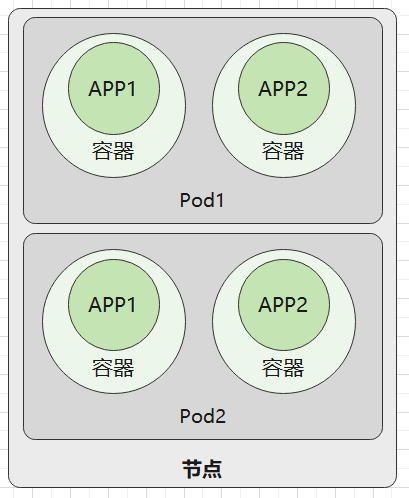
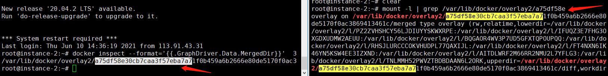

# 1.1 Kubernetes 入门基础

## 导读

我们要学习 Kubernetes，就有首先了解 Kubernetes 的技术范围、基础理论知识库等，要学习 Kubernetes，肯定要有入门过程，在这个过程中，学习要从易到难，先从基础学习。

接下来笔者将为大家讲解 Kubernetes 各方面的知识，让读者了解 Kubernetes 是什么，了解其与 Docker 的关系，学习 Kubernetes 的结构。


## Kubernetes 是什么

在 2008 年，**LXC（Linux containers）** 发布第一个版本，这是最初的容器版本；2013 年，Docker 推出了第一个版本；而 Google 则在 2014 年推出了 **LMCTFY**。

为了解决大集群(Cluster)中容器部署、伸缩和管理的各种问题，出现了 Kubernetes、Docker Swarm 等软件，称为 **容器编排引擎**。

容器的产生解决了很多开发、部署痛点，但随着云原生、微服务的兴起，纯 Docker 出现了一些管理难题。我们先思考一下，运行一个 Docker 容器，只需要使用 `docker run ...` 命令即可，这是相当简单(relatibely simple)的方法。

但是，要实现以下场景，则是困难的：

* 跨多台主机的容器相互连接(connecting containers across multiple hosts)
* 拓展容器(scaling containers)
* 在不停机的情况下配置应用(deploying applications without downtime)
* 在多个方面进行服务发现(service discovery among several aspects)


### Kubernetes 是什么？

Kubernetes 是 Google 基于十多年的生产环境运维经验，开发出的一个生产级别的容器编排系统。在 Kunernetes 文档中，这样描述 Kubernetes：

_"an open-source system for automating deployment, scaling, and management of containerized applications"._

_“一个自动化部署、可拓展和管理容器应用的开源系统”_


Google 的基础设施在虚拟机(Virtual machines)技术普及之前就已经达到了很大的规模，高效地使用集群和管理分布式应用成为 Google 挑战的核心，而容器技术提供了一种高效打包集群的解决方案。

多年来，Google 一直使用 Borg 来管理集群中的容器，积累了大量的集群管理经验和运维软件开发能力，Google 参考 Borg ，开发出了 Kubernetes，即 Borg 是 Kubernetes 的前身。（但是 Google 目前还是主要使用 Borg）。

Kubernetes 从一开始就通过一组基元(primitives)、强大的和可拓展的 API 应对这些挑战，添加新对象和控制器地能力可以很容易地地址各种各样的产品需求(production needs)。

编排管理是通过一系列的监控循环控制或操作的；每个控制器都向询问对象状态，然后修改它，直至达到条件为止。容器编排是管理容器的最主要的技术。Dockers 也有其官方开发的 swarm 这个编排工具，但是在 2017 年的容器编排大战中，swarm 败于 Kubernetes。


### Kubernetes 集群的组成

在 Kubernets 中，运行应用程序的环境处于虚拟化当中，因此我们一般不谈论硬件。在 Kubernetes 中，不同的对象其管理的范围、作用范围不同，它们的边界大小也不同。

我们谈起 Kubernetes 和应用部署时，往往会涉及到容器、节点、Pods 等概念，它们共同工作来管理容器化(containerized)应用的部署和执行，但是各种各样的术语，令人眼花缭乱。为了更好地摸清 Kubernetes，下面我们将列举这些有边界的对象。

| 成分                     | 名称         |
| :----------------------- | :----------- |
| Cluster                  | 集群         |
| Node                     | 节点         |
| Pod                      | 不翻译       |
| Container                | 容器         |
| Containerzed Application | 容器化的应用 |

接下来的内容，按将从小到大的粒度介绍这些组成成分。


在 Kubernetes 中，Pod 是管理和调度的最小工作单位，Pod 中可以包含多个容器。这些容器会共享 Pod 中的网络等资源。当部署 Pod 时，会把一组关联性较强的容器部署到同一个节点上。


而节点则是指一台服务器、虚拟机等，运行着一个完整的操作系统，提供了 CPU、内存等计算资源，一个节点可以部署多个 Pod。



而一个集群(Cluster)之中，运行着 N 台服务器，即 N 个节点。这些节点有两种，一种是 master 节点，一种是 worker 节点。master 节点运行着 Kubernetes 系统组件，而 worker 节点负责运行用户的程序。所有节点都归 master 管，我们通过命令、API 的方式管理 Kubernetes 集群时，是通过发送命令或请求到 master 节点上的系统组件，然后控制整个集群。


### Kubernetes 结构

用图来表示体系结构，是阐述s Kubernetes 最快的方式，下面是一张称为 _Kubernetes Architecture_ graphic 的图。


上图是简单的 kubernetes 结构，左侧虚线方框中，是 master 节点，运行着各种各样的组件，master 节点负责控制整个集群，当然在很大的集群中也可以有多个 master 节点；而右侧是三个工作节点，负责运行我们的容器应用。这种结构一般称为 master-slave 结构，在 Kubernetes 中后来改称为 master-minions。

在 上图中， master 节点由多个组件构成：

* 一个 API 服务(kube-apiserver)
* 一个调度器(kube-scheduler)
* 各种各样的控制器(上图有两个控制器)
* 一个存储系统(这个组件称为etcd)，存储集群的状态、容器的设置、网络配置等数据。

这张图片中还有很多东西，这里暂时不作讲解，我们在后面的章节再去学习那些 Kubernetes 中的术语和关键字。


### 资源隔离和共享

本小节简单地讲解 Docker 的实现原理，读者可以从中了解 Linux 是如何隔离资源的、Docker 又是如何隔离的。


我们知道，操作系统是以一个进程为单位进行资源调度的，现代操作系统为进程设置了资源边界，每个进程使用自己的内存区域等，进程之间不会出现内存混用。Linux 内核中，有 cgroups 和 namespaces 可以为进程定义边界，使得进程彼此隔离。

本小节中将讲解一些容器环境隔离以及资源共享的相关知识。

Docker 依赖 Linux 内核的 namespace 、cgroup 等实现的。

#### namespace

在容器中，当我们使用 top 命令或 ps 命令查看机器的进程时，可以看到进程的 Pid，每个进程都有一个 Pid，而机器的所有容器都具有一个 Pid = 1 的基础，但是为什么不会发生冲突？容器中的进程可以任意使用所有端口，而不同容器可以使用相同的端口，为什么不会发生冲突？这些都是资源可以设定边界的表现。

在 Linux 中，namespace 是一种资源隔离方案，可以将系统中的网络、进程环境等进行隔离，使得每个 namespace 中的系统资源不再是全局性的。


**namespace 主要是一种环境隔离机制**。


Linux 中，unshare 可以创建一个命名空间，并且创建一些资源。实际上这个命名空间是一个进程，命名空间中的其它进程是这个进程的子进程。为了深刻理解 Linux 中的 namespace，我们可以在 Linux 中执行：

```shell
unshare --pid /bin/sh  
```

此时我们进入了一个新的隔离的命名空间，执行 top 命令查看进程列表。

```
  PID USER      PR  NI    VIRT    RES    SHR S  %CPU %MEM     TIME+ COMMAND               
    1 root      20   0  160188   8276   5488 S   0.0  0.4   9:35.58 systemd               
    2 root      20   0       0      0      0 S   0.0  0.0   0:00.08 kthreadd             
    3 root       0 -20       0      0      0 I   0.0  0.0   0:00.00 rcu_gp               
    4 root       0 -20       0      0      0 I   0.0  0.0   0:00.00 rcu_par_gp          
```

> 我们还可以使用 nsenter 命令进入另一个命名空间。


上面查询到的结果是不是跟 Docker 容器执行命令的结果相似？

上面的命令中，`--pid` 参数创建 隔离进程的命名空间，此外，还可以隔离多种系统资源：

* mount ：命名空间具有独立的挂载文件系统；
* ipc：Inter-Process Communication (进程间通讯)命名空间，具有独立的信号量、共享内存等；
* uts：命名空间具有独立的 hostname 、domainname；
* net：独立的网络，例如每个 docker 容器都有一个虚拟网卡；
* pid：独立的进程空间，空间中的进程 Pid 都从 1 开始；
* user：命名空间中有独立的用户体系，例如 Docker 中的 root 跟主机的用户不一样；
* cgroup：独立的用户分组；

再这个命令中，只隔离了进程，因为并没有隔离网络，因此当我们执行 `netstat --tlap` 命令时，这个命名空间的网络跟其它命名空间的网络是一样的。


#### cgroups

cgroups 全称是 Control Groups，cgroups 可以限制进程可使用的内存、CPU、网络 IO，**是 Linux 内核中的物理资源隔离机制**。

cgroups 可以控制多种资源，在 cgroups 中每种资源对于一个子系统，可以使用命令查看：

```shell
mount | grep cgroup
```


>每种子系统的功能概要如下：
>
>- `blkio` — 该子系统对进出块设备的输入/输出访问设置限制，如 USB 等。
>- `cpu` — 该子系统使用调度程序来提供对 CPU 的 cgroup 任务访问。
>- `cpuacct` — 该子系统生成有关 cgroup 中任务使用的 CPU 资源的自动报告。
>- `cpuset` — 该子系统将单个 CPU和内存节点分配给 cgroup 中的任务。
>- `devices` — 该子系统允许或拒绝 cgroup 中的任务访问设备。
>- `freezer` — 该子系统在 cgroup 中挂起或恢复任务。
>- `memory` — 该子系统对 cgroup 中的任务使用的内存设置限制，并生成有关自动报告。
>- `net_cls`— 允许 Linux 流量控制器 ( `tc`) 识别源自特定 cgroup 任务的数据包。
>- `net_prio` — 该子系统提供了一种动态设置每个网络接口的网络流量优先级的方法。
>- `ns`—*命名空间*子系统。
>- `perf_event` — 该子系统识别任务的 cgroup 成员资格，可用于性能分析。
>
>请参考：[redhat 文档](https://access.redhat.com/documentation/en-us/red_hat_enterprise_linux/6/html/resource_management_guide/ch01)


为了避免篇幅过大，读者只需要知道 Docker 限制容器资源使用量、CPU 核数等操作，其原理是 Linux 内核中的 cgroups 即可，笔者这里不再赘述。


#### 文件系统

docker 为我们提供了一个根目录系统，在宿主机对应一个很深的目录，但是我们在 Docker 容器中，看到的是 `/` 根路径。

如果我们使用 
```
docker inspect --format='{{GraphDriver.Data.MergedDir}}' <容器名称>
```


 命令查看一个容器的文件在主机上的挂载路径，会获得容器中的文件系统在宿主机中真实的挂载路径，如 `/var/lib/docker/overlay2/a75df569413461c/merged`。

如果我们使用 `mount -l`，查看所有挂载的记录，会发现 docker 容器也使用了 mount。




当然，在 namespace 中，也有这种类似机制，这里不再深入，读者可自行了解。