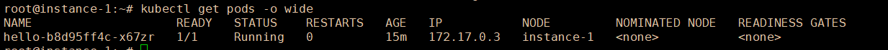

# 2.1 使用Minikube部署

## 导读

Minikube 是一个创建单机 Kubernetes 集群的 工具，它可以在一台服务器上快速创建一个学习环境，单机集群也可以学习到大多数入门的 Kubernetes 知识以及上手练习。CKAD 认证并不要求掌握 Minikube，不过我们可以初步学习练习，后面再使用 kubeadm 部署多节点集群。

本篇内容较为简单，可供读者练手使用，后面再详细介绍各方面的知识。

## Minikube

Minikube 是一个二进制工具，项目源码或文档等内容可以在 [https://github.com/kubernetes/minikube](https://github.com/kubernetes/minikube) 中找到，已经编译好的二进制可执行文件，可以在仓库的 Release 中下载，Minikube 支持 Windows 、Linux、MacOS。


直接下载 minikube 最新版本的二进制文件。

可以通过官方 Github 仓库下载，也可以使用国内代理下载。

下载地址(Linux版本)：

* [https://kubernetes.oss-cn-hangzhou.aliyuncs.com/minikube/releases/v1.20.0/minikube-linux-amd64](https://kubernetes.oss-cn-hangzhou.aliyuncs.com/minikube/releases/v1.20.0/minikube-linux-amd64)
* [https://storage.googleapis.com/minikube/releases/latest/minikube-linux-amd64](https://storage.googleapis.com/minikube/releases/latest/minikube-linux-amd64)

注：如果要下载 Win 版本，把 `minkube-linux-amd64` 改成 `minkube-windows-amd64.exe` 即可；如果是 MacOS 则是 `minikube-darwin-amd64`。另外要注意下载的版本号 。

阿里云源下载的二进制工具，本身可以使用国内镜像，不需要代理，可以到仓库了解 [https://github.com/AliyunContainerService/minikube](https://github.com/AliyunContainerService/minikube)。

你也可以看官方文档，按照文档安装 [https://minikube.sigs.k8s.io/docs/start/](https://minikube.sigs.k8s.io/docs/start/) 。


```sh
curl -Lo minikube {下载地址}
```

```shell
chmod +x minikube
```

```shell
sudo mv minikube /usr/local/bin
```


### 部署

直接执行 `minikube start` 命令即可进行部署，但是国内会被墙，可能拉取不了镜像，需要设置代理。

```shell
# 国外服务器
minikube start
# 使用阿里云版本时，指定国内源
minikube start --image-mirror-country=cn
# 使用阿里云版本时，指定镜像源
minikube start --image-mirror=registry.cn-hangzhou.aliyuncs.com/google_containers
```

注：虚拟机安装或其他方式，需要配置安装驱动，请参考官方文档。还是无法拉取镜像的话，打开文档看看 https://minikube.sigs.k8s.io/docs/handbook/vpn_and_proxy/ ，配置代理试试。


接下来 minikube 会拉取各种镜像，需要一些时间。

```shell
* Pulling base image ...
* Downloading Kubernetes v1.20.2 preload ...
    > preloaded-images-k8s-v10-v1...: 491.71 MiB / 491.71 MiB  100.00% 60.04 Mi
    > gcr.io/k8s-minikube/kicbase...: 357.67 MiB / 357.67 MiB  100.00% 7.41 MiB
* Creating docker container (CPUs=2, Memory=4000MB) .../
```


通过 `minikube version` 命令可以查看 minikube 的版本，接下来我们使用 `minikube start` 命令，可以直接创建一个 kubernetes 集群。


**问题一**

如果启动不起来提示没有 docker 用户，这是因为默认不应该使用 root 用户执行命令和启动程序，可以创建一个 docker 用户，也可以使用 `--driver=none` 指定不用 docker 用户。

如果要用 docker 用户：

```shell
    groupdel docker
    useradd -m docker
    passwd docker
    # 修改密码后，加入用户组
    gpasswd -a docker docker
```

打开 `/etc/sudoers` 文件，在 `root ALL=(ALL:ALL) ALL` 下 增加新的一行：

```shell
docker ALL=(ALL)ALL
```

然后切换为 docker 用户：`su docker` 。


 如果不用 docker 用户，只需要在初始化集群时加上 `--driver=none` 。

```
minikube start --driver=none
```


**问题二**

PS：如果报 `X Exiting due to GUEST_MISSING_CONNTRACK: Sorry, Kubernetes 1.20.2 requires conntrack to be installed in root's path`，则需要安装 constrack ，`apt install conntrack`。


如果没有问题，会自动进行安装。

 


minikube 完成初始化后，打开新的终端窗口，执行 `minikube dashboard` 启动面板，根据 URL 地址，可以访问面板。


正常的话，执行 `docker ps` 后是这样的。


### 查看集群状态

本身 minikube 带有一些简单的 `kubectl` 命令，可以查看集群状态信息。

获取集群所有节点(机器)：

```shell
minikube kubectl get nodes
```

获取集群所有命名空间：

```shell
minikube kubectl get namespaces
```

查看集群所有 Pod：

```shell
minikube kubectl -- get pods -A
```


## 创建资源

由于 minikube 不会自动下载 kubectl、kubelet 等工具，我们需要手动安安装，你可以参考 2.2 章的安装方法， 关于 kubectl 、kubelet ，后面的章节会详细介绍。最简单的安装方法：

```shell
# 仅供 ubuntu 参考
snap install kubectl --classic
snap install kubelet --classic
```

本节的内容供简单练习，不会详细说明命令的作用和相关知识，待读者阅读后面的章节时，可以学习到更多内容。


### 创建 Deployment

Deployment 可以部署应用并管理实例数量，它提供了一种故障的自我修复机制，当应用挂了后，Deployment 可以自动启动一个新的实例，维护固定数量的 Pod。

`kubectl create deployment`命令创建管理 Pod 的 Deployment。

```shell
# 格式 kubectl create deployment {deployment名称} {参数}
kubectl create deployment hello --image=nginx:latest
```


查看 Deployment：

```shell
kubectl get deployments
```

```text
NAME    READY   UP-TO-DATE   AVAILABLE   AGE
hello   1/1     1            1           6m39s
```


查看 Pod ：

```shell
kubectl get pods
```

```text
NAME                    READY   STATUS    RESTARTS   AGE
hello-b8d95ff4c-x67zr   1/1     Running   0          7m8s
```


查看集群事件：

```shell
kubectl get events
```

查看 `kubectl` 配置：

```shell
kubectl config view
```


### 创建 Service

Service 为 Pod 提供了一种外网访问能力，默认情况下，Pod 只能在 Kubernetes 集群的**同一节点访问**，如果要外部网络访问，则需要为 Pod 暴露一个 Kubnetes Service，Service 为 Pod 提供了外网访问能力。这里我们把上一小节的 hello 暴露出去。

nginx 镜像会暴露一个 80 端口，通过 80 端口我们可以访问到 nginx 服务。但是在 Kubernetes 中，则可能有些麻烦。

每个 Pod 在集群中都有一个唯一 IP，我们可以查看详细的 Pod 信息：

```shell
kubectl get pods -o wide
```



我们可以直接访问它：

```shell
curl 172.17.0.3
```


为了能够在外网访问，我们创建 Service：

```shell
kubectl expose deployment hello --type=LoadBalancer --port=80
```

然后查看刚刚创建的 service：

```shell
kubectl get service hello
# 或
minikube service hello
```

```text
NAME         TYPE           CLUSTER-IP      EXTERNAL-IP   PORT(S)        AGE
hello        LoadBalancer   10.102.73.188   <pending>     80:31286/TCP   5s
```

```text
|-----------|-------|-------------|-------------------------|
| NAMESPACE | NAME  | TARGET PORT |           URL           |
|-----------|-------|-------------|-------------------------|
| default   | hello |          80 | http://10.170.0.5:31286 |
|-----------|-------|-------------|-------------------------|
* Opening service default/hello in default browser...
  http://10.170.0.5:31286
```


此时，在集群内，通过 `http://10.170.0.5:31286` 可以访问此 Pod，或者在外网访问 31286 端口。


### 清理集群资源

由于 Minikube 创建的资源只是单机的，同时会产生很多 Docker 容器，我们练习完毕后，就要清除环境，以免影响后续实践环境。

首先清除 service、deployment (可以跳过这个步骤)。

```shell
kubectl delete service hello
kubectl delete deployment hello
```

然后停止 Minikube 虚拟机（VM）：

```shell
minikube stop
```

接着删除 Minikube 虚拟机（VM）：

```shell
minikube delete
```

