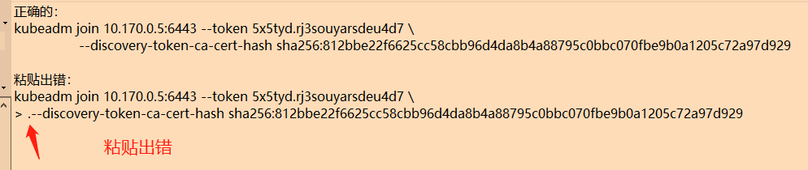

# 2.2 使用 kubeadm 部署

上一章中，我们用 minikube 去搭建单机集群，并且创建 Deployment、Service(在三章中讲解)，本篇将介绍利用 kubeadm 部署多节点集群，并学会 安装以及使用 kubernetes 的命令行工具，快速创建集群实例，完成部署 hello world 应用的实践。

Kubeadm 是 CKAD 认证中要求掌握的部署方式，但是镜像需要国外网络才能下载，读者如果是国内服务器，可以参考 2.4 章的内容，使用国内服务器进行代理。

本章内容主要介绍如何安装 kubeadm 以及部署集群、添加节点。

需要提前在服务器安装好 Docker。

### 命令行工具

在 kubernetes 中，主要有三个日常使用的工具，这些工具使用 kube 前缀命名，这三个工具如下：

* `kubeadm`：用来初始化集群的指令，能够创建集群已经添加新的节点。可用其它部署工具替代。
* `kubelet`：在集群中的每个节点上用来启动 Pod 和容器等，每个节点必须有，相对于节点与集群的网络代理。
* `kubectl`：用来与集群通信/交互的命令行工具，与 kubernetes API-Server 通讯，是我们操作集群的客户端。


在 1.5 章中介绍过 kubelet、kubectl，kubelet 负责集群中节点间的通讯，kubectl 供用户输入命令控制集群，而且 kubeadm 则是创建集群、添加减少节点的工具。


## 安装命令行工具

命令行工具是每个节点都需要安装的， kubectl、kubelet 两个是必需的组件，而 kubeadm 则可以被代替。kubeadm 是 Kubenetes 官方推荐的部署工具，但由于网络等各方面原因，中文社区中也开发了一些替代项目，例如 Kubesphere([https://kubesphere.com.cn/](https://kubesphere.com.cn))，可在国内部署 Kubernetes，省去网络问题。


### 通过软件仓库安装

下面介绍如何 通过 Google 的源下载安装工具包。

更新 `apt` 包索引并安装使用 Kubernetes `apt` 仓库所需要的包：

```bash
sudo apt-get update
sudo apt-get install -y apt-transport-https ca-certificates curl
```

下载 Google Cloud 公开签名秘钥：

```bash
sudo curl -fsSLo /usr/share/keyrings/kubernetes-archive-keyring.gpg https://packages.cloud.google.com/apt/doc/apt-key.gpg
```

添加 Kubernetes `apt` 仓库：

```bash
echo "deb [signed-by=/usr/share/keyrings/kubernetes-archive-keyring.gpg] https://apt.kubernetes.io/ kubernetes-xenial main" | sudo tee /etc/apt/sources.list.d/kubernetes.list
```

注：如果是国内服务器，请忽略以上两步，使用以下命令解决：

```bash
apt-get update && apt-get install -y apt-transport-https
curl https://mirrors.aliyun.com/kubernetes/apt/doc/apt-key.gpg | apt-key add - 
cat <<EOF >/etc/apt/sources.list.d/kubernetes.list
deb https://mirrors.aliyun.com/kubernetes/apt/ kubernetes-xenial main
EOF
```

更新 `apt` 包索引，安装 kubelet、kubeadm 和 kubectl，并锁定其版本：

```bash
sudo apt-get update
sudo apt-get install -y kubelet kubeadm kubectl
sudo apt-mark hold kubelet kubeadm kubectl
```

执行命令检查是否正常：

```bash
kubeadm --help
```


### 不同操作系统

只是这里介绍一下 ubuntu 和 centos 不同的安装方法，已经通过前面的安装方法安装好，则不需要理会这一小节。

Ubuntu 和 Debain 等系统可以使用以下命令通过软件仓库安装：

```bash
sudo apt-get update && sudo apt-get install -y apt-transport-https gnupg2 curl
curl -s https://packages.cloud.google.com/apt/doc/apt-key.gpg | sudo apt-key add -
echo "deb https://apt.kubernetes.io/ kubernetes-xenial main" | sudo tee -a /etc/apt/sources.list.d/kubernetes.list
sudo apt-get update
sudo apt-get install -y kubelet kubeadm kubectl
```

Centos、RHEL 等系统可以使用以下命令通过软件仓库安装：

```bash
cat <<EOF > /etc/yum.repos.d/kubernetes.repo
[kubernetes]
name=Kubernetes
baseurl=https://packages.cloud.google.com/yum/repos/kubernetes-el7-x86_64
enabled=1
gpgcheck=1
repo_gpgcheck=1
gpgkey=https://packages.cloud.google.com/yum/doc/yum-key.gpg https://packages.cloud.google.com/yum/doc/rpm-package-key.gpg
EOF
yum install -y kubelet kubeadm kubectl
```


## 集群管理

### 创建 kubernetes 集群

Kubeadm 是一个创建管理工具，主要提供了 `kubeadm init` 和 `kubeadm join` 两个命令，作为创建 Kubernetes 集群的 “快捷途径” 的最佳实践。

Kubernetes 集群由 Master 和 Worker 两种节点组成，Master 节点负责控制集群所有的节点。

注意，本教程集群中的节点应当都是内网可互通的服务器，这些服务器之间可以通过内网相互访问。如果是服务器之间通过公网相互通讯的，操作方法请查询其它教程。

**1，创建 Master**

执行 `hostname -i` 查看此 node 的 ip。

我们初始化一个 API Server 服务，绑定地址为 192.168.0.8（按照你的ip改）。此步骤创建了一个 master 节点。

注：可以直接使用 `kubeadm init`，它会自动使用默认网络ip。

```bash
kubeadm init
# 或 kubeadm init --apiserver-advertise-address 192.168.0.8
# 或 kubeadm init --apiserver-advertise-address $(hostname -i)
```
> 部署失败，可以参考下面两个命令，查看失败原因。
>
> ```
> systemctl status kubelet
> journalctl -xeu kubelet
> ```
>
>
> 常见与 Docker 有关的错误可参考：
> https://kubernetes.io/docs/setup/production-environment/container-runtimes/#docker


完成后，会提示一些信息，在提示的内容中找到：

```bash
kubeadm join 192.168.0.8:6443 --token q25z3f.v5uo5bphvgxkjnmz \
    --discovery-token-ca-cert-hash sha256:0496adc212112b5485d0ff12796f66b29237d066fbc1d4d2c5e45e6add501f64
```

保存这段信息下来备用，后面加入节点时需要使用到。

如果有提示 `Alternatively, if you are the root user, you can run:`则你还需要执行下面的命令。

```bash
export KUBECONFIG=/etc/kubernetes/admin.conf
```

> **[Info] 提示**
>
> admin.conf 是连接 Kubernetes 的认证文件，通过此文件才能连接到 kubernetes，kubectl 也需要这个文件；在 Linux 中，使用 KUBECONFIG 环境变量知道认证文件的所在。
>
> Linux 中每个用户的环境变量是不同的，如果切换了用户，则也需要设置 KUBECONFIG 环境变量；如果要在别的节点上连接集群，则可以把这个文件复制过去。


后面的操作都需要 admin.conf 文件，否则会报 `The connection to the server localhost:8080 was refused - did you specify the right host or port?` 。


由于 `export` 的环境变量不能持久化，请打开 `~/.bashrc` 文件，把这个命令加到文件最后面。

> **[Info] 提示**
>
> 为了保护 /etc/kubernetes/admin.conf，避免直接指向，建议每个用户复制一次此文件到用户目录下，其命令如下：
>
> ```bash
> mkdir -p $HOME/.kube
> cp -f /etc/kubernetes/admin.conf $HOME/.kube/config
> chown $(id -u):$(id -g) $HOME/.kube/config
> ```


**2，初始化网络**

这一步不是必需的，不过一般来说，部署 Kubernetes 会配置网络，否则会节点之间不能相互访问，读者可以跟着做一次，在后面的章节中我们在一探究竟。

通过远程配置文件初始化网络，需要从第三方拉取一个 yaml 文件。

```bash
kubectl apply  -f  "https://cloud.weave.works/k8s/net?k8s-version=$(kubectl version | base64 | tr -d '\n')"  --namespace=kube-system
#  --namespace=kube-system 表示插件放到 kube-system 命名空间中运行
```

成功的话会提示：

```bash
serviceaccount/weave-net created
clusterrole.rbac.authorization.k8s.io/weave-net created
clusterrolebinding.rbac.authorization.k8s.io/weave-net created
role.rbac.authorization.k8s.io/weave-net created
rolebinding.rbac.authorization.k8s.io/weave-net created
daemonset.apps/weave-net created
```

我们也可以手动配置，执行 `kubectl version` 查看版本号，找到 `GitVersion:v1.21.1` ，替换 yaml 文件的地址 `https://cloud.weave.works/k8s/net?k8s-version=v1.21.1`，然后执行 `kubectl apply -n kube-system -f net.yaml` 即可。


**3，加入集群**

前面已经创建了 Master 节点，接下来将另一个服务器以 Worker 节点的方式加入集群中。如果读者只有一台服务器，则可以跳过这个步骤。

当节点加入 kubeadm 初始化的集群时，双方需要建立双向信任，分为发现(Worker信任Master) 和 TLS 引导(Master信任待加入Worker)两部分。目前有两种加入方式，一种是通过令牌加入，一种是通过 kubeconfig 文件加入。

格式：

```bash
kubeadm join --discovery-token abcdef.xxx {IP}:6443 --discovery-token-ca-cert-hash sha256:xxx
kubeadm join--discovery-file file.conf
```

在第二个节点中，使用之前**<span style="color:red;">备份好的命令</span>**，直接执行，加入集群，**<span style="color:red;">格式如下命令所示</span>**。

```bash
kubeadm join 192.168.0.8:6443 --token q25z3f.v5uo5bphvgxkjnmz \
    --discovery-token-ca-cert-hash sha256:0496adc212112b5485d0ff12796f66b29237d066fbc1d4d2c5e45e6add501f64
```


复制粘贴时，要注意，可能会由于 `\` 换行符，导致粘贴时，多了一个小数点，导致报错。




### 可能碰到的问题

查看 docker 版本：`yum list installed | grep docker` 和 `docker version`。

如果部署过程中出现 `failed to parse kernel config: unable to load kernel module`，也说明了 docker 版本太高，需要降级。

如果服务器装了 dnf，那么降级 docker 版本的命令：

```
dnf remove docker \
                  docker-client \
                  docker-client-latest \
                  docker-common \
                  docker-latest \
                  docker-latest-logrotate \
                  docker-logrotate \
                  docker-selinux \
                  docker-engine-selinux \
                  docker-engine
```

```
dnf -y install dnf-plugins-core
```

```
dnf install docker-ce-18.06.3.ce-3.el7 docker-ce-cli containerd.io
```

不行的话就按照 [https://docs.docker.com/engine/install/centos/](https://docs.docker.com/engine/install/centos/) 降级，或者自行按照其它方法处理。

注意，`docker version` 会看到 client 和 server 版本，两者的版本号可能不一致。


### 删除节点

在生产环境中，由于节点上已经部署着服务，因此直接删除节点，可能会导致严重的故障问题。因此需要移除一个节点时，首先要在此节点上驱逐所有 Pods，Kubernetes 会自动将此节点上的 Pod 转移到其它节点上部署(第三章会讲)。

获取集群中的所有节点，找到需要驱逐的节点名称。

```bash
kubectl get nodes
```

驱逐此节点上所有的 Pod：

```bash
kubectl drain {node名称}
```

虽然驱逐了节点上所有的服务，但是节点依然在集群中，只是 Kubernetes 不会再部署 Pod 到此节点上。如果需要恢复此节点，允许继续部署 Pod，可使用：

```bash
kubectl uncordon {节点名称}
```

关于驱逐，后面的章节会学习到。

注：驱逐 Pod，并一定能够驱逐所有 Pod，有些 Pod 可能不会被清除。

最终删除此节点：

```bash
kubectl delete node {节点名称}
```

集群删除了此节点后，节点上还保留着一些数据，可以继续清除环境。


### 清除环境

如果步骤做错了想重来，或者移除节点需要清除环境，可以执行 `kubeadm reset [flags]` 命令。

注：只执行 `kubeadm reset` 命令无效。

`[flags]` 有四种类型：

```bash
preflight              Run reset pre-flight checks
update-cluster-status  Remove this node from the ClusterStatus object.
remove-etcd-member     Remove a local etcd member.
cleanup-node           Run cleanup node.
```

我们需要执行：

```bash
kubeadm reset cleanup-node 
kubeadm reset
```

即可在当前服务器上清除 Kubernetes 残留的 容器或者其它数据。

