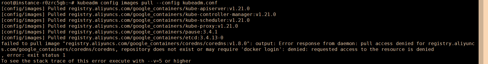
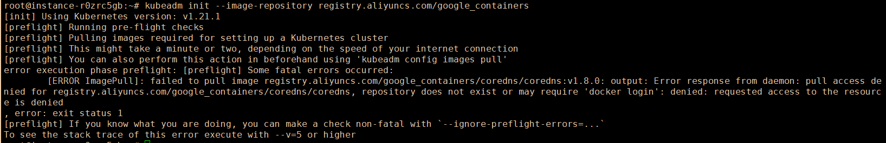

# 2.4 国内服务器部署


### 导读

在本章中，将会学习如果在国内服务器中拉取 Kubernetes 镜像，解决 kubeadm 网络问题。

首先按照 2.2 中的教程，安装好 `kubeamd`、`kubectl`、`kubelet` 三个工具。


### 配置

当使用 `kubeadm init` 命令时，如果不传递参数，则会使用默认的配置文件初始化集群，我们可以导出默认的配置文件内容。

```shell
kubeadm config print init-defaults > kubeadm.conf
```

找到大约在 31 行的 `imageRepository: k8s.gcr.io ` ，修改为镜像地址：

```yaml
imageRepository: registry.aliyuncs.com/google_containers
```


通过配置文件kubeadm 会在阿里云源拉取镜像。

```shell
kubeadm config images pull --config kubeadm.conf
```

但并不是所有 Kubernetes 镜像阿里云源都有，可能有些镜像会报错。






例如 coredns 镜像，阿里云源的 `google_containers` 仓库中不能直接拉取到，那么我们可以手动拉取再改 tag。

```shell
docker pull coredns/coredns:latest
```

```shell
docker tag coredns/coredns:latest registry.aliyuncs.com/google_containers/coredns/coredns:v1.8.0
```


### 使用

当我们要在国内的服务器创建集群时，在 `kubeadm init` 命令后面指定代理源。

```shell
kubeadm init --image-repository registry.aliyuncs.com/google_containers
```

耐心等待，即可完成集群的初始化。