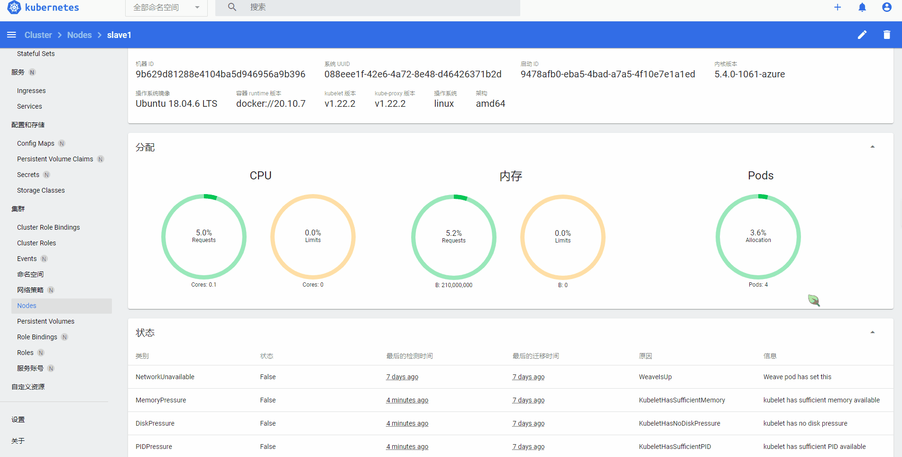
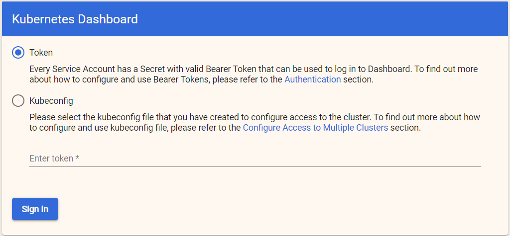

# 2.5 Dashboard

Kubernetes-Dashboard 是一个 管理 Kubernetes 集群的 Web UI，其界面大气优雅，跟 kubectl 一样，其后端是 API-Server，通过它可以查看集群中每个集群的节点状态，各类资源的调度状况，还可以动态伸缩节点、管理资源。

其界面如下：




dashboard 的 Github 仓库地址为：https://github.com/kubernetes/dashboard/tags，请从中选择最新版本的 yaml。


使用在线的 YAML 文件部署 Kubernetes-Dashboard ：

```bash
kubectl apply -f https://raw.githubusercontent.com/kubernetes/dashboard/v2.2.0/aio/deploy/recommended.yaml
```

> 请替换 url 中的 2.2.0。


dashboard 创建后会出现在 kubernetes-dashboard 命名空间中。

```bash
root@instance-1:~# kubectl get pods --namespace=kubernetes-dashboard
NAME                                         READY   STATUS    RESTARTS   AGE
dashboard-metrics-scraper-856586f554-4nd9v   1/1     Running   0          9d
kubernetes-dashboard-78c79f97b4-288js        1/1     Running   0          9d

root@instance-1:~# kubectl get services --namespace=kubernetes-dashboard
NAME                            TYPE        CLUSTER-IP       EXTERNAL-IP   PORT(S)         AGE
dashboard-metrics-scraper       ClusterIP   10.98.50.123     <none>        8000/TCP        9d
kubernetes-dashboard            NodePort    10.111.44.44     <none>        443/TCP   9d
```

> **[Error] 提示**
>
> 如果你的集群上有多个节点，那么可能会被放到某个节点上。


接着，查看 dashboard 被放到哪个节点上运行：

```bash
root@master:~# kubectl get pods --namespace=kubernetes-dashboard -o wide
NAME                                        READY   STATUS    RESTARTS   AGE   IP          NODE     NOMINATED NODE   READINESS GATES
dashboard-metrics-scraper-c45b7869d-d9s2m   1/1     Running   0          15m   10.32.0.5   slave1   <none>           <none>
kubernetes-dashboard-576cb95f94-8dzcj       1/1     Running   0          15m   10.32.0.4   slave1   <none>           <none>
```

可以看到，笔者的 dashboard 服务被放到 slave1 节点上去了，接着请记录 slave1 的服务器 ip。


由于 dashboard 网络默认是 ClusterIP 方式，因此外网是不能访问的，所以为了能够被外界访问，可以修改其 service。

```bash
kubectl edit service kubernetes-dashboard --namespace=kubernetes-dashboard
```
将 `  type: ClusterIP ` 改成 `  type: NodePort`，然后直接保存即可(会使用 vi 编辑器打开文件，修改和保存请使用 vi 方式处理)。
```yaml
  ports:
    port: 443
    protocol: TCP
    targetPort: 8443
  selector:
    k8s-app: kubernetes-dashboard
  sessionAffinity: None
  type: NodePort 
```


然后执行 `kubectl get services --namespace=kubernetes-dashboard -o wide` 命令，查看随机生成的端口。

```bash
root@master:~# kubectl get services --namespace=kubernetes-dashboard -o wide
NAME                        TYPE        CLUSTER-IP      EXTERNAL-IP   PORT(S)         AGE   SELECTOR
dashboard-metrics-scraper   ClusterIP   10.97.89.174    <none>        8000/TCP        40m   k8s-app=dashboard-metrics-scraper
kubernetes-dashboard        NodePort    10.108.209.60   <none>        443:31984/TCP   40m   k8s-app=kubernetes-dashboard
```

笔者的端口是 31984，接着可以在外网访问 `https://{ip}:31984`。注意，访问的 IP 是部署了 dashboard 的节点的 I。

打开网页后，其页面如下：



可以看到，访问方式有 Token 和配置文件方式(kubeconfing)，这两者后面再讲。

通过下面这条命令我们可以查看 Token：

```bash
kubectl -n kube-system describe $(kubectl -n kube-system get secret -n kube-system -o name | grep namespace) | grep token
```


复制 token，填写到 Web UI 中，即可进入控制台。

