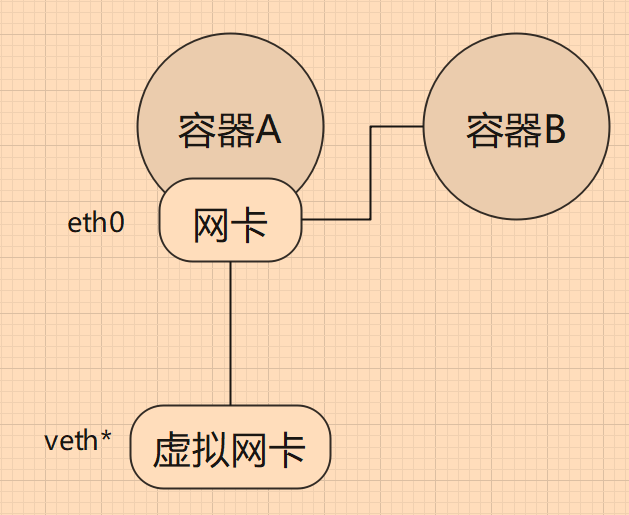
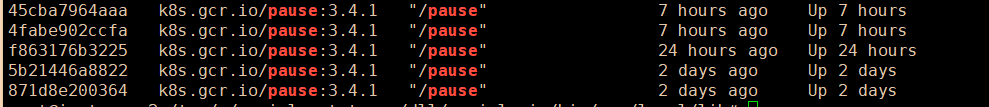
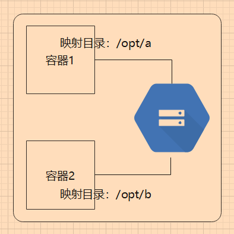
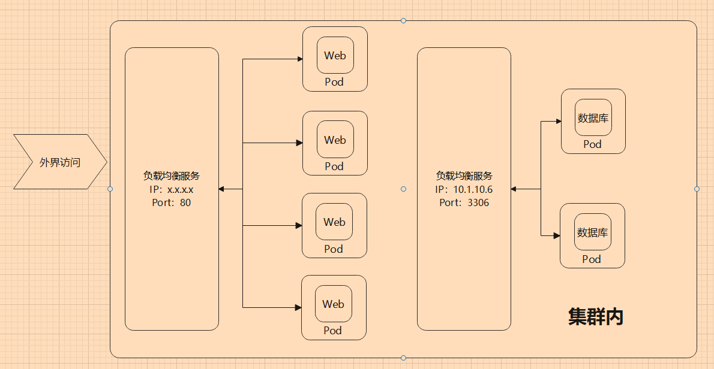
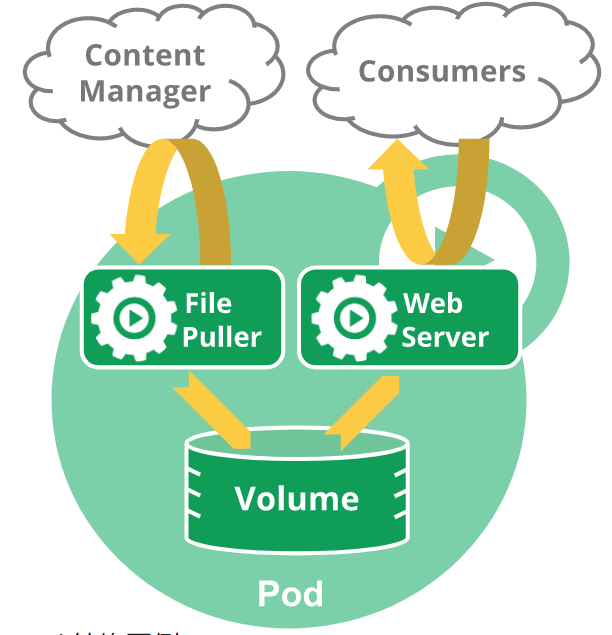
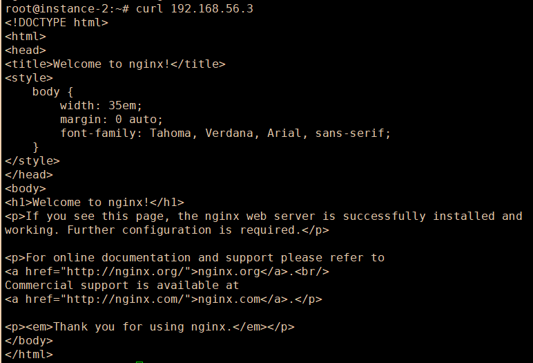

# 3.1 Pod

### 导读

Pod 是在 Kubernetes 中创建和管理的、最小的可部署的计算单元。一个 Pod 中包含一个或多个容器，这些容器在 Pod 中能够共享网络、存储等环境。

学习 Kubernetes，Pod 是最重要最基本的知识，本章将介绍什么是 Pod、Pod 的结构等，并练习创建 Pod。

## Pod 基础知识

### 了解 Pod

Pod 是 Kubernetes 中调度资源的最小单位，一个 Pod 中可以包含多个容器，Pod 中的容器被打包在一起作为一个整体，被部署到同一个节点中， **Pod 中的容器不会被分配到不同节点中**。

每个 Pod 有且只有一个唯一的 IP 地址，通过 `kubectl get pod {pod名称} -o wide` 可以查询到。

```
root@instance-2:~# kubectl get pods -o wide
NAME                     READY   STATUS    RESTARTS   AGE     IP             NODE         NOMINATED NODE   READINESS GATES
nginx-55649fd747-s4824   1/1     Running   0          22h     192.168.56.4   instance-2   <none>           <none>
nginx-55649fd747-sr4d2   1/1     Running   0          5h57m   192.168.56.5   instance-2   <none>           <none>
nginx-55649fd747-xtmh8   1/1     Running   0          5h57m   192.168.56.6   instance-2   <none>           <none>
```

.png>)

> kube-system 命名空间的 Pod 较为特殊，这里不作讲解。

### Pod 共享网络和存储

我们可以把一个 Pod 形容为一个虚拟主机。在 Pod 中，所有容器(进程)都在一个主机上，我们知道，同一个主机上的所有进程共享着主机网络，多个进程自然不能同时占用一个端口，否则会冲突。容器共享 Pod 中的网络，所以 Pod 中的容器也能够通过 localhost 相互访问，因此 Pod 中的 容器(进程)不能暴露/使用相同的端口。


通过 Pod 和 `locahost` ，解决了 高度耦合的容器间通信问题。

Docker 有一个 Contaner 模式，能够让多个容器共享一个 Network Namespace，可以让一个容器和另一个容器共享 IP、端口范围。

假如容器 A 已经创建起来，那么容器 A 会创建一个虚拟网卡；然后指定 容器 B 与容器 A 共享网络，那么两者就可以直接通过 localhost 进行通讯。



而在 Kubernetes 中，当创建 Pod 时，会先启动一个 pause 容器，然后 Pod 中我们定义的容器会以 Container 模式共享 pause 中的网络。

```
docker ps | grep pause
```



> 当然，pause 不只是实现容器的网络互通，还有其它功能。

Pod 中的容器是部分隔离的，每个容器都有自己的文件系统，各自的文件被隔离，容器不能访问或修改其它容器的文件。

为了让多个 容器之间能够共享文件，可以使用卷，把同一个卷映射到容器中。



### 划分 Pod 和容器

容器中应只包含一个进程，或进程和创建的子进程。如果在同一个容器中包含多个进程，那么需要同时管理进程的启动、日志等，一个进程崩溃时，容易影响到另一个进程。由于多个进程都会记录信息到标准输出中(如控制台输出)，容器日志会合在一起，可能会导致出现问题难以排查。

一个容器只应该运行一个进程，但是他们放到一个 Pod 中就行了吗？例如程序和数据库，在设计时应该放到同一个 Pod，还是单独不同的 Pod？接下来我们简单讨论一下这个问题，限于经验和技术水平，笔者的论点可能不到位，读者可以多参考一下别的文章，了解如何设计 这些架构。

下面以 Web 程序和数据库举例。

**耦合**

使用 Pod/容器 的原因，是为了让不同服务能够降低耦合，能够隔离环境，如果程序跟数据库放在一起，是否能够有足够的隔离程度？如果 Web 跟 数据库放在同一个 Pod，此时 web 跟数据库的实例(容器)数量是 1：1。对于 Kubernests 来说，Pod 是最小单位，Kbernetes 不能横向扩容单个容器，因此扩容的最小单位是 Pod，多个容器必须捆绑在一起。同时 Pod 中的所有容器都使用同一机器的资源。在同一个 Pod 中的容器，在生命周期、计算机资源(内存、CPU)、实例数量、网络等都会耦合在一起。

请参考 [https://kubernetes.io/zh/docs/concepts/workloads/pods/pod-lifecycle/](https://kubernetes.io/zh/docs/concepts/workloads/pods/pod-lifecycle/)

**访问压力**

一般来说，Web 是要被外界访问的，但是数据库为了安全，应当避免能够公网访问，只有处于集群中的程序或客户端才能访问数据库。同时Web的访问是直接面向用户的，访问量肯定比数据库的访问量大得多，而且数据库需要的存储空间比web大得多，那么两者使用的计算资源并不相近。

Pod 可以使用服务器资源，当服务器压力过大时，当太多用户访问 Web 时，Web就要考虑扩容实例，可以在其它节点上部署相同的 Pod(扩容)，降低单节点访问压力。而一个数据库实例能够支持多个 Web 程序同时访问，那么数据库实例有必要跟 Web 放在同一个 Pod 中，保持 1：1的实例数量？

**故障恢复**

在 Kubernetes 中，容器应当是无状态的，也就是说容器或容器中的进程挂了，Kubernetes 可以快速在其它地方再创建一个 Pod ，启动容器，维持一定数量的 Pod 实例。对于 Web 来说，只要配置文件和数据库数据在，再启动一个 Web 容器，结果是一样的，流水的程序铁打的数据，只要数据在，可以随时启动 Web 程序，很容易恢复服务。但是数据库却不一定，数据库的运维比 Web 程序复杂得多，我们要考虑数据的安全性和可用性，当容器甚至节点服务器挂了后、磁盘损坏等，如何恢复数据库。数据库的维护不觉得。

两者的维护难度不在同一水平上，此时我们要考虑两者放在不同的 Pod 中。(实际上很少将数据库放在容器中，一般都是裸机部署)。



其中负载均衡是通过 Ingress 和 Service 实现的，后面的章节会学习到。

### 何时使用多个容器

前面提到 Web 跟数据库，应当划分在不同的 Pod 中，类似地，对于微服务中的不同服务或模块，也应当放在不同的 Pod 中。微服务架构、容器化，并不是那么容易，例如，对于前后端分离的项目，前后端文件放在同一个 容器中还是同一个 Pod 中还是不同 Pod 中？在设计中我们要考虑很多问题。

对于单体 Web 来说，一个程序中包含了所有服务，那么 Web 完全可以托管前端静态文件，前端文件跟后端程序打包在一起即可。例如 PHP、ASP.NET Core 等使用 wwwroot、www 等 目录存储静态文件。

如果是一个较大的网站，网站使用了多个微服务，则前端更可能放到一个 Pod 中，用户访问前端页面，然后前端根据访问的模块，自动访问不同的服务。

如果前端和后端文件需要频繁发布，两者的发布版本分开工作，则为了避免一方等待另一方发布，或者从 Devops 角度，前端和和后端文件可以放在不同容器中，然后通过存储卷，两个容器共享文件。

如果一个 Pod 中，包含一个主进程和多个辅助进程，则可以使用一个 Pod 部署多个 容器，多个容器之间紧密联系。

.png>)

具体怎么设计，需要根据实际情况考虑。

### Pod 生命周期

当 Pod 被分配到某个节点时， Pod 会一直在该节点运行，直到停止或被终止，Pod 在整个生命周期中只会被调度一次。

Pod 的整个生命周期可能有四种状态：

* Pending，尝试启动容器，如果容器正常启动，则进入下一个阶段；
* Running，处于运行状态；
* Succeeded、Failed，正常结束或故障等导致容器结束；
* Unknown，因为某些原因无法取得 Pod 的状态。

我们可以创建一个 Deployment，查看当前正在发生的事件：

```
kubectl create deployment nginx --image=nginx:latest --replicas=3
```

```
kubectl get events
```


通过 `kubectl describe pod {pod名称}` 查看一个 Pod 的事件：

```
  Type    Reason     Age    From               Message
  ----    ------     ----   ----               -------
  Normal  Scheduled  3m22s  default-scheduler  Successfully assigned default/nginx-* to instance-2
  Normal  Pulling    3m19s  kubelet            Pulling image "nginx:latest"
  Normal  Pulled     3m17s  kubelet            Successfully pulled image "nginx:latest" in 2.570763819s
  Normal  Created    3m17s  kubelet            Created container nginx
  Normal  Started    3m16s  kubelet            Started container nginx
```

上面查询到的事件均发生在 Pod 的 `Pending` 状态，我们可以看到在这个阶段中，Pod 被调度，然后拉取镜像、启动容器，如果容器启动成功，Pod 便会进入 `Running` 状态。

> 事件记录保存在 etcd 中。

在 Kubernetes 中，**Pod 被认为是相对的临时性实体，而不是长期存在的**。由于 Pod 本身不具有治愈能力，如果 节点故障或者节点资源耗尽、节点被维护、Pod 被驱逐等，那么 Pod 无法在节点上继续存活。无论 Pod 因为何种原因被删除，在 Pod 中的网络、存储卷等，也会被销毁，新的 Pod 被创建时，相关的网络、存储卷也会被重建。



【图来源：[https://kubernetes.io/zh/docs/concepts/workloads/pods/pod-lifecycle/](https://kubernetes.io/zh/docs/concepts/workloads/pods/pod-lifecycle/)】

> 由于 Pod 是临时性的，为了保障服务能够在 Pod 挂了后自动重建，可以使用 Deployement、Daemon 等对象管理 Pod，这些对象被称为 控制器。

### 容器重启策略

这是一个简单的 Pod 的 YAML 定义：

```yaml
apiVersion: v1
kind: Pod
metadata:
  labels:
    app: nginx
spec:
  containers:
  - image: nginx:latest
    imagePullPolicy: Always
    name: nginx
    ... ...
  restartPolicy: Always
```

在这个 YAML 中，有两个`*Policy`，取值有 Always、OnFailure 和 Never 三种。

对于每个容器，都可以设置 `imagePullPolicy` ，指示在拉取镜像时如果失败，是否进行重试。

在 `spec` 中，有个 `restartPolicy` 字段，其值默认为 `Always`，指示 Pod 中所有容器的重启动作，但是在 `Deployment`、`StatefulSet`、`DaemonSet` 等控制器中，`restartPolicy` 只支持 Always ，不支持 OnFailure 和 Never 。

> 如果容器启动失败，重试间隔会越来越长。 kubelet 会在 10s 后重试第一次，如果还是失败，第二次 20s 后再重试；按照 10s、20s、40s、80s ... 的间隔重试，但最长不超过 5 分钟。如果容器被成功运行且运行了 10 分钟以上，那么计时器会被重置，下次出现故障时，按照 10s、20s 的间隔时间重试。

如果单独创建 Pod，并且设置了 `restartPolicy: Always`，那么 Pod 会一直停留在此节点上，如果 容器故障，Pod 可能会无限重试。

如果我们使用 `Deployment`、`StatefulSet`、`DaemonSet` 等控制器管理 Pod，这些控制器能够处理 Pod/副本 的管理、上线，并且在 Pod 失效时提供治愈能力，当节点上的 Pod 停止工作时，可以创建替代性的 Pod， Pod 被调度到一个健康的节点执行。

> 为什么要使用控制器管理 Pod 呢？
>
> 举个例子，笔者有个朋友，写了个 A 程序，这个程序能够在执行后，关闭计算机(关机)。本来是需要的时候执行一次，但是后面配置了一个守护进程，这个守护进程会自动启动 A 程序。这样出现了无限循环，开机 -> 启动守护进程 -> A 出现 -> 关机，结果这个朋友的电脑无法正常开机，一开机就被关机。
>
> 这种情况跟单独的 Pod 部署类似，很容易因为某些原因无限重试，并且一直驻留在节点上。因为重试是在原来的基础上进行重试，使用原来的文件、数据、网络等。控制器则可以将其重置，恢复 `出厂设置`。
>
> 如果一个节点上的 CPU、内存不够用了，那么容器有可能因为资源不足，无法启动，导致无限重试；如果使用控制器，控制器会在有充足资源的、健康的节点上重建 Pod。

## Pod 的部署和管理

但是一般很少直接创建或管理 Pod，一般使用控制器来管理 Pod。下面列出一些控制器，在后面的学习中我们会一步步深入学习。

* Deployment
* StatefulSet
* DaemonSet

单独创建 Pod ，一般用于临时调试的等。

### 创建 Pod

在 Kubernetes 中，所有对象都可以使用 YAML 表示。我们可以使用 YAML 来定义 Pod 对象，一个 Pod 的基本模板：

```yaml
apiVersion: v1
kind: Pod
metadata:
  name: nginx
spec:
  containers:
  - name: nginx
    image: nginx:latest
```

如果要映射网络端口，则 YAML

```yaml
apiVersion: v1
kind: Pod
metadata:
  name: nginx
spec:
  containers:
  - name: nginx
    image: nginx:latest
    ports: 
    - containerPort: 80
      protocol: TCP
```

> 由于 Pod 中的容器共享网络，技术不加上 `ports`，照样能够访问。在 YAML 中多写一些，有助于其他人快速了解此 Pod 的定义信息。

将上面的 YAML 内容复制到 pod.yaml 中，然后执行命令应用 YAML ：

```
kubectl apply -f pod.yaml
# 或
kubectl create -f pod.yaml
```

> 使用 `kubectl run` 命令也可以创建 pod，命令示例：
>
> ```
> kubectl run nginx-pod --image=nginx:latest
> ```

### Pod 管理

输入 `kubectl get pods` 可以查看名为 default 命名空间的 Pod。输入 `kubectl get pods -o wide` 可以查看多几个字段的 Pod 信息，输入 `kubectl describe pods` 可以查看每个 Pod 的所有详细信息。

```
root@instance-2:~# kubectl get pods -o wide
NAME    READY   STATUS    RESTARTS   AGE   IP             NODE         NOMINATED NODE   READINESS GATES
nginx   1/1     Running   0          11s   192.168.56.3   instance-2   <none>           <none>
```

可以看到 Pod 在第二个节点上部署，其 IP 为 `192.168.56.3`。Pod 的 IP 只能在被部署服务的节点上访问，不同节点不能访问其的 Pod。

nginx 默认使用了 80 端口，因此通过 `192.168.56.3:80` ，可以访问到容器中的 nginx 服务。



### 查看日志

在 Docker 中，我们可以通过 `docker logs {容器id}` 来查看容器中的日志，这些日志是进程打印到控制器的标准输出，例如 C# 的 `Console.Write`、C 语言的 `printf`、Go 语言的 `fmt.Print`，Docker 的 本地日志驱动会捕获容器的 stdout/stderr 输出记录驱动器。

Docker 日志默认限制 5个日志文件，每个最大 20 MB ，每天会轮替一个日志文件，默认情况下会为每个容器保留 100MB 的日志消息，并使用自动压缩来减少磁盘文件大小。

> Docker 日志驱动程序使用基于文件的存储。文件格式和存储机制被设计为由 Docker 守护进程独占访问，不应被外部工具使用，因为在未来的版本中实现可能会发生变化。
>
> 笔者没有明确查找到 Docker 的日志具体限制情况，以上内容来自 [https://docs.docker.com/config/containers/logging/local/](https://docs.docker.com/config/containers/logging/local/) 的参考资料。

在 Kubernetes 中，也可以通过命令快速查看 Pod 中的容器的日志。

如果 Pod 中只有一个容器，则直接使用类似命令即可：

```
kubectl logs {pod名称}
```

如果 Pod 中有多个容器，则需要指定容器名称：

```
kubectl logs {pod名称} -c {容器名称}
```

`kubectl logs` 只能获取当前正在运行的 Pod 的日志，如果 Pod 被删除，所有日志记录都会被删除。

> 查看、维护 Pod 状态，比较常用的命令有：
>
> * **kubectl get** - 列出资源
> * **kubectl describe** - 显示有关资源的详细信息
> * **kubectl logs** - 打印 pod 和其中容器的日志
> * **kubectl exec** - 在 pod 中的容器上执行命令
