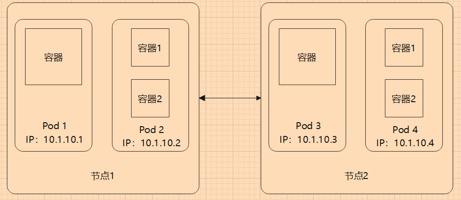
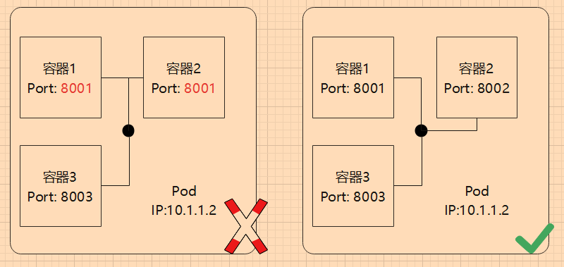
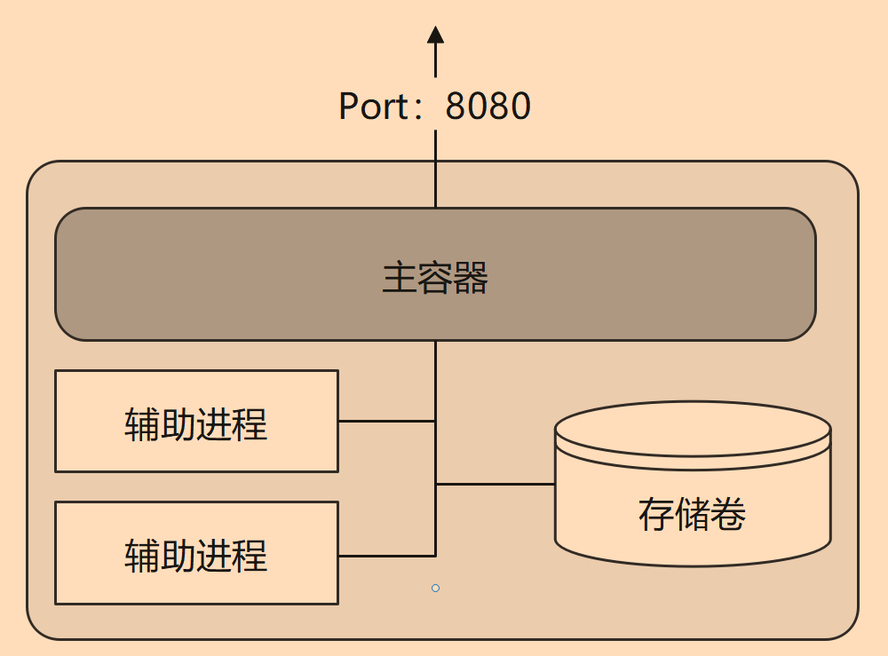

# 3.1 Pod


### 导读

Pod 是在 Kubernetes 中创建和管理的、最小的可部署的计算单元。一个 Pod 中包含一个或多个容器，这些容器在 Pod 中能够共享网络、存储等环境。

学习 Kubernetes，Pod 是最重要最基本的知识。


## Pod 基础知识

### 了解 Pod

Pod 是 Kubernetes 调度资源的最小单位，一个 Pod 中可以包含多个容器，但是 Pod 中的容器不会被分配到不同节点中。

每个 Pod 有且只有一个唯一的 IP 地址，通过 `kubectl get pod {pod名称} -o wide` 可以查询。kube-system 命名空间的 Pod 较为特殊，这里忽略。




### Pod 共享网络和存储

我们可以把一个 Pod 形容为一个虚拟主机，在 Pod 中，所有容器共享网络，Pod 中的容器能够通过 localhost 相互访问。由于容器共享 Pod 中的网络，因此 Pod 中的 容器(进程)不能暴露相同的端口。




Pod 中的容器是部分隔离的，每个容器都有自己的文件系统，各自的文件被隔离，容器不能访问或修改其它容器的文件。

为了让多个 容器之间能够共享文件，可以使用卷，把同一个卷映射到容器中。


### 划分 Pod 和容器

容器中应只包含一个进程，或进程以及进程一个容器中包含多个进程。如果在同一个容器中包含多个进程，那么需要同时管理他们的运行、日志等，一个进程崩溃时，容易影响到另一个进程。由于多个进程都会记录信息到标准输出中(如控制台输出)，可能会导致问题难以排查。

一个容器只应该运行一个进程，但是他们放到一个 Pod 中就行了吗？

例如程序和数据库，在设计时应该放到同一个 Pod，还是单独不同的 Pod？

**耦合**

使用 Pod/容器 的原因，是为了让不同服务能够低耦合，能够隔离，如果程序跟数据库放在一起，是否能够有足够的隔离程度？此时web跟数据库的实例数量是 1：1。对于 Kubernests 来说，Pod是最小单位，因此扩容的最小单位是 Pod，Kbernetes 不能横向扩容单个容器。同时 Pod 中的所有容器都使用同一机器的资源。在同一个 Pod 中的容器，在生命周期、计算机资源(内存、CPU)、实例数量、网络等耦合在一起。


**压力**

一般来说，web 是要被外界访问的，但是数据库应当避免能够公网访问，只有处于集群中的程序或客户端才能访问数据库。同时Web的访问是直接面向用户的，访问量肯定比数据库的访问量大得多。那么两者使用的计算资源并不相近。

Pod 可以使用服务器资源，当服务器压力过大时，可以在其它节点上部署相同的 Pod，缓解服务压力过大。web的访问量比数据库大，而且数据库需要的存储空间比web大得多。当太多用户访问 web 时，web 就要考虑扩容实例。而一个数据库实例能够支持多个web程序同时访问，那么数据库实例有必要跟 web 放在同一个 Pod 中，保持 1：1的实例数量？


**故障恢复**

在 Kubernetes 中，容器应当是无状态的，也就是说容器或容器中的进程挂了，Kubernetes 可以快速在其它地方再创建一个 Pod ，启动容器，维持一定数量的 Pod 实例。对于web来说，只要配置文件和数据库数据在，再启动一个web程序，结果是一样的，流水的程序铁打的数据，只要数据在，随时启动web程序，就能恢复服务。但是数据库却不一定，数据库的运维比web程序复杂得多，我们要考虑数据的安全性，当 容器甚至节点服务器挂了后，如何恢复数据库。

web挂了，数据在数据库，只需要重新部署 Web即可；但是数据库挂了呢？

两者的维护难度不在同一水平上，此时我们要考虑两者放在不同的 Pod 中。


其中负载均衡是通过 Ingress 和 Service 实现的，后面的章节会学习到。


### 何时使用多个容器

前面提到 程序跟数据库，应当划分在不同的 Pod 中，类似地，对于微服务中的不同服务或模块，也应当放在不同的 Pod 中。

对于前后端分离的项目，前后端放在同一个 容器中还是同一个 Pod 中还是不同 Pod 中？

对于单体 web 来说，一个程序中包含了所有服务，那么web完全可以托管前端静态文件，前端文件跟后端程序打包在一起即可。

如果是一个较大的网站，网站使用了多个微服务，则前端更可能放到一个 Pod 中，用户访问前端页面，然后前端根据访问的模块，自动访问不同的服务。

如果前端和后端文件需要频繁发布，两者的发布版本分开工作，则为了避免一方等待另一方发布，或者从 Devops 角度，前端和和后端文件可以放在不同容器中，然后通过存储卷，两个容器共享文件。


如果一个 Pod 中，包含一个主进程和多个辅助进程，则可以使用一个 Pod 部署多个 容器，多个容器之间紧密联系




## Pod 的部署和管理

但是一般很少直接创建或管理 Pod，一般使用控制器来管理 Pod。下面列出一些控制器，在后面的学习中我们会一步步深入学习。

- Deployment
- StatefulSet
- DaemonSet

单独创建 Pod ，一般用于临时调试的等。


### 创建 Pod 

在 Kubernetes 中，所有对象都可以使用 YAML 表示。

一个 Pod 的基本模板：

```yaml
apiVersion: v1
kind: Pod
metadata:
  name: nginx
spec:
  containers:
  - name: nginx
    image: nginx:latest
```

如果要映射网络端口，则 YAML 

```yaml
apiVersion: v1
kind: Pod
metadata:
  name: nginx
spec:
  containers:
  - name: nginx
    image: nginx:latest
    ports: 
    - containerPort: 80
      protocol: TCP
```

将上面的 YAML 内容复制到 pod.yaml 中，然后执行命令应用 YAML ：

```shell
kubectl apply -f pod.yaml
# 或
kubectl create -f pod.yaml
```


### Pod 管理

输入 `kubectl get pods` 可以查看名为 default 命名空间的 Pod。输入 `kubectl get pods -o wide` 可以查看多几个字段的 Pod 信息，输入 `kubectl describe pods` 可以查看每个 Pod 的所有详细信息。

```
root@instance-2:~# kubectl get pods -o wide
NAME    READY   STATUS    RESTARTS   AGE   IP             NODE         NOMINATED NODE   READINESS GATES
nginx   1/1     Running   0          11s   192.168.56.3   instance-2   <none>           <none>
```

可以看到 Pod 在第二个节点上部署，其 IP 为 `192.168.56.3`。Pod 的 IP 只能在被部署服务的节点上访问，不同节点不能访问其的 Pod。

由于在 Pod 中，我们为容器放通了 80 端口，因此通过访问 `192.168.56.3` 这个 IP，可以访问到容器中的 nginx 服务。


### 查看日志

在 Docker 中，我们可以通过 `docker logs {容器id}` 来查看容器中的日志，这些日志是进程打印到控制器的标准输出，例如 C# 的 `Console.Write`、C 语言的 `printf`、Go 语言的 `fmt.Print`，Docker 的 本地日志驱动会捕获容器的 stdout/stderr 输出记录驱动器。

Docker 日志默认限制 5个日志文件，每个最大 20 MB ，每天会轮替一个日志文件，默认情况下会为每个容器保留 100MB 的日志消息，并使用自动压缩来减少磁盘文件大小。

> Docker 日志驱动程序使用基于文件的存储。文件格式和存储机制被设计为由 Docker 守护进程独占访问，不应被外部工具使用，因为在未来的版本中实现可能会发生变化。
>
> 笔者没有明确查找到 Docker 的日志具体限制情况，以上内容来自 [https://docs.docker.com/config/containers/logging/local/](https://docs.docker.com/config/containers/logging/local/) 的参考资料。


在 Kubernetes 中，也可以通过命令快速查看 Pod 中的容器的日志。

如果 Pod 中只有一个容器，则直接使用类似命令即可：

```shell
kubectl logs {pod名称}
```


如果 Pod 中有多个容器，则需要指定容器名称：

```
kubectl logs {pod名称} -c {容器名称}
```


`kubectl logs` 只能获取当前正在运行的 Pod 的日志，如果 Pod 被删除，所有日志记录都会被删除。


