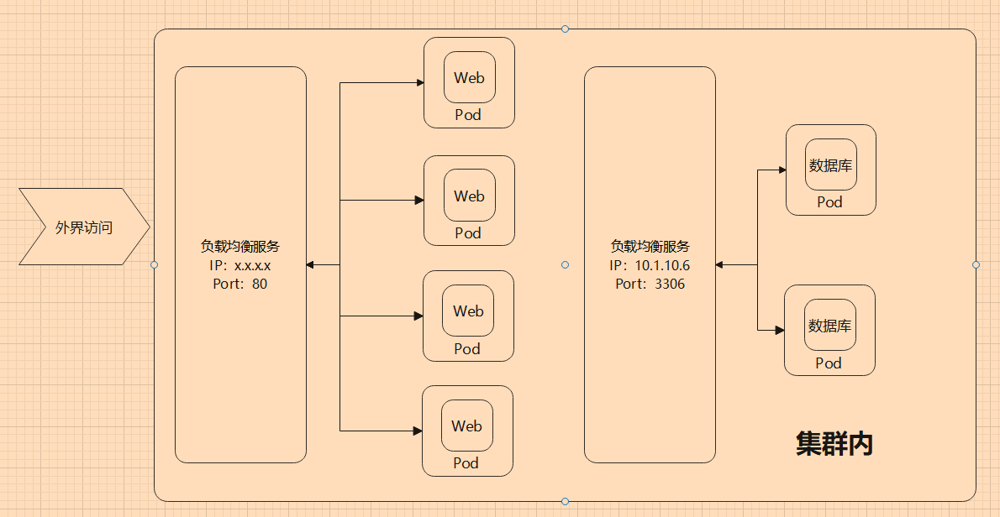

# 章节


但是描述 Pod 的 YAML 文件，包含哪些内容？格式如何？每个字段是什么意思？我们不可能记住所有 Kubernetes 对象的  YAML 文件的每个字段吧？

还好，Kuberentes 提供了 `kubectl explain` 命令，可以帮助我们快速了解创建一个对象的 YAML 需要哪几部分内容。例如创建 Pod 的 YAML 定义如下：

```bash
oot@master:~# kubectl explain pod
KIND:     Pod
VERSION:  v1

DESCRIPTION:
     Pod is a collection of containers that can run on a host. This resource is
     created by clients and scheduled onto hosts.

FIELDS:
   apiVersion	<string>
     APIVersion defines the versioned schema of this representation of an
     object. Servers should convert recognized schemas to the latest internal
     value, and may reject unrecognized values. More info:
     https://git.k8s.io/community/contributors/devel/sig-architecture/api-conventions.md#resources

   kind	<string>
     Kind is a string value representing the REST resource this object
     represents. Servers may infer this from the endpoint the client submits
     requests to. Cannot be updated. In CamelCase. More info:
     https://git.k8s.io/community/contributors/devel/sig-architecture/api-conventions.md#types-kinds

   metadata	<Object>
     Standard object's metadata. More info:
     https://git.k8s.io/community/contributors/devel/sig-architecture/api-conventions.md#metadata

   spec	<Object>
     Specification of the desired behavior of the pod. More info:
     https://git.k8s.io/community/contributors/devel/sig-architecture/api-conventions.md#spec-and-status

   status	<Object>
     Most recently observed status of the pod. This data may not be up to date.
     Populated by the system. Read-only. More info:
     https://git.k8s.io/community/contributors/devel/sig-architecture/api-conventions.md#spec-and-status
```

如果要查更深一层的字段，则可以：

```bash
root@master:~# kubectl explain pod.kind
KIND:     Pod
VERSION:  v1

FIELD:    kind <string>

DESCRIPTION:
     Kind is a string value representing the REST resource this object
     represents. Servers may infer this from the endpoint the client submits
     requests to. Cannot be updated. In CamelCase. More info:
     https://git.k8s.io/community/contributors/devel/sig-architecture/api-conventions.md#types-kinds
```

> **[Info] 提示**
>
> 此方式查询到的文档，其列举的字段不一定都是 Pod YAML 所需要的，还需要读者多练习多学习，从文档中补充需要的信息。


## 云原生


### 划分 Pod 和容器

在本小节中，笔者来介绍一下云原生方面的思想或知识，我们应该如何设计我们的应用，让


容器中应只包含一个进程，或进程和创建的子进程。如果在同一个容器中包含多个进程，那么需要同时管理进程的启动、日志等，一个进程崩溃时，容易影响到另一个进程。由于多个进程都会记录信息到标准输出中(如控制台输出)，容器日志会合在一起，可能会导致出现问题难以排查。

一个容器只应该运行一个进程，但是他们放到一个 Pod 中就行了吗？例如程序和数据库，在设计时应该放到同一个 Pod，还是单独不同的 Pod？接下来我们简单讨论一下这个问题，限于经验和技术水平，笔者的论点可能不到位，读者可以多参考一下别的文章，了解如何设计 这些架构。

下面以 Web 程序和数据库举例。

**耦合**

使用 Pod/容器 的原因，是为了让不同服务能够降低耦合，能够隔离环境，如果程序跟数据库放在一起，是否能够有足够的隔离程度？如果 Web 跟 数据库放在同一个 Pod，此时 web 跟数据库的实例(容器)数量是 1：1。对于 Kubernests 来说，Pod 是最小单位，Kbernetes 不能横向扩容单个容器，因此扩容的最小单位是 Pod，多个容器必须捆绑在一起。同时 Pod 中的所有容器都使用同一机器的资源。在同一个 Pod 中的容器，在生命周期、计算机资源(内存、CPU)、实例数量、网络等都会耦合在一起。

请参考 [https://kubernetes.io/zh/docs/concepts/workloads/pods/pod-lifecycle/](https://kubernetes.io/zh/docs/concepts/workloads/pods/pod-lifecycle/)

**访问压力**

一般来说，Web 是要被外界访问的，但是数据库为了安全，应当避免能够公网访问，只有处于集群中的程序或客户端才能访问数据库。同时Web的访问是直接面向用户的，访问量肯定比数据库的访问量大得多，而且数据库需要的存储空间比web大得多，那么两者使用的计算资源并不相近。

Pod 可以使用服务器资源，当服务器压力过大时，当太多用户访问 Web 时，Web就要考虑扩容实例，可以在其它节点上部署相同的 Pod(扩容)，降低单节点访问压力。而一个数据库实例能够支持多个 Web 程序同时访问，那么数据库实例有必要跟 Web 放在同一个 Pod 中，保持 1：1的实例数量？

**故障恢复**

在 Kubernetes 中，容器应当是无状态的，也就是说容器或容器中的进程挂了，Kubernetes 可以快速在其它地方再创建一个 Pod ，启动容器，维持一定数量的 Pod 实例。对于 Web 来说，只要配置文件和数据库数据在，再启动一个 Web 容器，结果是一样的，流水的程序铁打的数据，只要数据在，可以随时启动 Web 程序，很容易恢复服务。但是数据库却不一定，数据库的运维比 Web 程序复杂得多，我们要考虑数据的安全性和可用性，当容器甚至节点服务器挂了后、磁盘损坏等，如何恢复数据库。数据库的维护不觉得。

两者的维护难度不在同一水平上，此时我们要考虑两者放在不同的 Pod 中。(实际上很少将数据库放在容器中，一般都是裸机部署)。



其中负载均衡是通过 Ingress 和 Service 实现的，后面的章节会学习到。


### 何时使用多个容器

前面提到 Web 跟数据库，应当划分在不同的 Pod 中，类似地，对于微服务中的不同服务或模块，也应当放在不同的 Pod 中。微服务架构、容器化，并不是那么容易，例如，对于前后端分离的项目，前后端文件放在同一个 容器中还是同一个 Pod 中还是不同 Pod 中？在设计中我们要考虑很多问题。

对于单体 Web 来说，一个程序中包含了所有服务，那么 Web 完全可以托管前端静态文件，前端文件跟后端程序打包在一起即可。例如 PHP、ASP.NET Core 等使用 wwwroot、www 等 目录存储静态文件。

如果是一个较大的网站，网站使用了多个微服务，则前端更可能放到一个 Pod 中，用户访问前端页面，然后前端根据访问的模块，自动访问不同的服务。

如果前端和后端文件需要频繁发布，两者的发布版本分开工作，则为了避免一方等待另一方发布，或者从 Devops 角度，前端和和后端文件可以放在不同容器中，然后通过存储卷，两个容器共享文件。

如果一个 Pod 中，包含一个主进程和多个辅助进程，则可以使用一个 Pod 部署多个 容器，多个容器之间紧密联系。


具体怎么设计，需要根据实际情况考虑。
