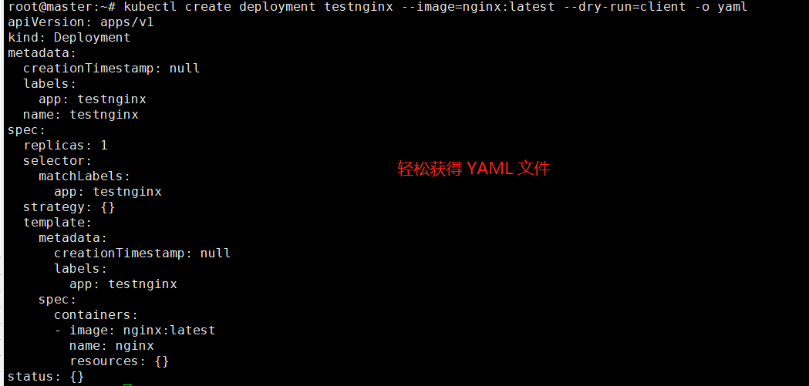
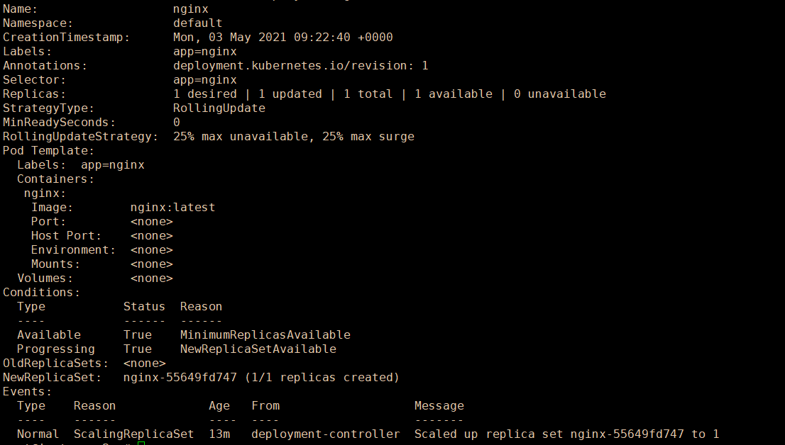

# 3.2 Deployment 部署


Deployment 是 Kubernetes **提供的一种自我修复机制来解决机器故障维护的问题**。

前面提到了单独部署 Pod，但是这种方式只适合临时的 Pod，用于测试调试。

如果要用于生产，则需要 Deployment 等控制器**管理部署 Pod，维持 Pod 的副本数量以及 Pod 监控和维护**。


对于 Kubernetes 对象的部署，例如 Pod、Deployment、Service 等，有三种部署方式：

* Using Generators (Run, Expose)
* Using Imperative way (Create)
* Using Declarative way (Apply)


在 3.1 章中，我们已经学习了 `Run` 和 `apply` 等，在本篇以及后面的章节中，我们会一步步深入学习这些部署方式。

本篇包含或需要掌握以下内容：

> * 创建 Deployment
> * 修改 Deployment
> * 查看 Deployment 、Pod、Services、副本


在 3.1 章中，我们了解如何使用 Pod 创建一个 Nginx ，也学习了 Pod 的一些概念、网络等知识，当时笔者提到了 Deployment，那么在本章中，我们将会来学习如何使用 Deployment 来部署应用，并学会管理 Pod。


## Deployment

当我们单独使用 docker 部署应用时，为了让应用挂了后能够重启，我们可以使用 `--restart=always` 参数，例如：

```bash
docker run -itd --restart=always -p 666:80 nginx:latest
```


但是这种方式只能单纯重启容器，并**不具备从机器故障中恢复的能力**，即**当一台服务器挂了后，此服务器上所有的容器全部挂掉**。


Kubernetes Deployment 是一种 Pod 管理方式，它可以指挥 Kubernetes 如何创建和更新你部署的应用实例，创建 Deployment 后，Kubernetes 会将应用程序调度到集群中的各个节点上。

Kubernetes Deployment 提供了一种与众不同的应用程序管理方法。


Deployment 的创建，有两种方法，一种是直接使用命令创建(`kubectl create`)，一种是通过 YAML(`kubectl apply`)，后面我们会介绍这两种创建方法。


### 创建 Deployment

在 Kubernetes 中，Pod 是调度的最小单位，一个 Pod 中包含多个 容器，所以我们的各种操作都是在 Pod 之上。


我们来使用 deployment 部署一个 Pod，这个 Pod 包含一个 Nginx 容器。

```bash
kubectl create deployment nginx --image=nginx:latest
```

格式：

```bash
kubectl create deployment {deployment对象名称} --images={镜像名称和标签}
```


此时，nginx 容器会以 Pod 的方式部署到节点中，但是被部署到哪个节点是随机的，如果你只有一个 worker 节点，则 Pod 必定在这个 Worker 节点上。当然，我们可以获取到具体的调度信息，从中查看 Pod 被调度到哪个节点。


```bash
root@instance-1:~# kubectl get deployments -o wide
NAME    READY   UP-TO-DATE   AVAILABLE   AGE   CONTAINERS   IMAGES         SELECTOR
nginx   1/1     1            1           52s   nginx        nginx:latest   app=nginx
root@instance-1:~# kubectl get pods -o wide
NAME                     READY   STATUS    RESTARTS   AGE   IP             NODE         NOMINATED NODE   READINESS GATES
nginx-55649fd747-s4824   1/1     Running   0          61s   192.168.56.4   instance-2   <none>           <none>
```

可以看到， Pod 在 instance-2 中运行着。


Deployment 会为我们自动创建 Pod，Pod 由 `{deployment名称}-{随机名称}` 组成。

> **[Info] 提示**
>
> 还有一个地方也说一下，`kubectl get xxx` 时，带不带 `s` 都没关系，例如 `kubectl get nodes` / `kubectl get node` 都是一样的。
>
> 不过，一般从语义上，我们获取全部对象时，可以使用 `kubectl get nodes`，获取具体的对象时，可以使用 `kubectl get node nginx`。类似的，`kubectl describe nodes` 、`kubectl describe node nginx`。实际上加不加 `s` 都一样。


### kubectl apply/create


当我们创建一个 deployment 时，`kubectl create` 和 `kubectl apply` 效果是一样的，但是 `apply` 还具有更新(update) 的功能。

`kubectl apply` 会在以前的配置、提供的输入和资源的当前配置之间 找出三方差异，以确定如何修改资源，`kubectl apply` 命令将会把推送的版本与以前的版本进行比较，并应用你所做的更改， **但是不会自动覆盖任何你没有指定更改的属性**。


另外还有 `kubectl replace` 、`kubectl edit`。

`kubectl replace` 是破坏性更新/替换，容易导致问题；

`kubectl edit` 可以更新 Deployment 等已存在的对象。


根据 Kubernetes 官方的文档说明，**应始终使用 `kubectl apply` 或 `kubectl create --save-config` 创建资源**。


前面已经学习了 `kubectl create`，这里学习一下 `kubectl apply`。


通过 YAML 文件部署 nginx：

```bash
kubectl apply -f https://k8s.io/examples/controllers/nginx-deployment.yaml
```

> 很多开源软件提供了 YAML 文件，我们通过 YAML 文件可以快速部署服务，如 Redis、Consul 等。
>
> 开发者可以将自己的软件或者中间件等，制作为 yaml 文件，这样当别人执行 yaml 文件时，会很容易地将一个软件安装到别的 kubernetes 环境中。


这里再说一下创建 Deployment 的区别。

如果使用 create 创建，命令格式：

```bash
kubectl create deployment {deployment的名字} --image={镜像名称}
```


如果使用 apply 命令创建，YAML 中需要指定一些信息，可定制性很高。

```yaml
kind: Deployment
... ...
medatada:
    name:nginx
... ...
    spec:
      containers:
      - image: nginx:latest
```


然后执行 `kubectl apply -f xxx.yaml` 文件。

一个是 `kubectl create deployment` ；

另一个是 `kubectl apply -f`，在 yaml 中指定 `kind: Deployment`。

如果我们只需要快速创建，使用命令形式就行；如何生产生产，还是得使用 YAML 文件，并于留存记录。


要删除一个对象，可以使用 `kubectl delete -f {名称}.yaml`，如删除  calico。

```bash
kubectl delete -f calico.yaml
```


### 检查 YAML

有时我们不知道我们的创建命令或 yaml 是否正确，可以使用 `--dry-run=client` ，`--dry-run=client` 参数来表示当前内容只是预览而不真正提交。

```bash
kubectl create deployment testnginx --image=nginx:latest --dry-run=client
```


在一些 k8s 认证中，我们没时间一点点写 yaml ，但是又需要定制，此时可以使用 `--dry-run=client -o yaml` ，既可以不生效 Deployment，又可以导出 yaml 文件。

>  **[Info] 提示**
>
>  `-o wide` 可以查看对象更多的字段信息；`kubectl describe` 可以查看对象的全部详细信息；`-o yaml` 或 `-o json` 可以查看对象的定义/描述文件。
>
>  `--dry-run` 取值必须为none、server或client。如果客户端策略，只打印将要发送的对象，而不发送它。如果是服务器策略，提交服务器端请求而不持久化资源。


命令示例如下：

```bash
kubectl create deployment testnginx --image=nginx:latest --dry-run=client -o yaml
# -o json 可以输出 json 格式
```





使用这样的方法，可以快速获得需要的 YAML 模板，然后复制到 YAML 文件，根据需要改动、定制。除了 Deployment，其它 kubernetes 对象也可以使用这种方法。


### 查看 Deployment

我们以 Deployment 的方式部署 Pod ，就会创建一个 Deployment 对象，获得 deployment 列表：

```bash
kubectl get deployments
kubectl get deployments -o wide
```

```bash
NAME    READY   UP-TO-DATE   AVAILABLE   AGE
nginx   1/1     1            1           2m24s

NAME    READY   UP-TO-DATE   AVAILABLE   AGE     CONTAINERS   IMAGES         SELECTOR
nginx   1/1     1            1           2m42s   nginx        nginx:latest   app=nginx
```

> 在 `kubectl get ...` 后面加上 `-o wide` 可以获得更多的标签信息。


使用 `kubectl get events` 可以获得集群中最近发生的事件，如创建 Deployment 到部署容器过程的详细事件记录。

```
Successfully assigned default/nginx-55649fd747-wdrjj to instance-2
Pulling image "nginx:latest"
Successfully pulled image "nginx:latest" in 8.917597859s
Created container nginx
Started container nginx
Created pod: nginx-55649fd747-wdrjj
Scaled up replica set nginx-55649fd747 to 1
```


使用 `kubectl describe deployment nginx` 可以获得更加详细的信息，是各种信息的集合。




### 查看 Pod

我们通过 Deployment 创建了应用，当时这些 Pod 是怎么跟 Deployment 对象关联起来的？接下来我们需要了解如何查看 Pod 。

```bash
kubectl get pods
```

```bash
NAME                     READY   STATUS    RESTARTS   AGE
nginx-55649fd747-msw8g   1/1     Running   0          4h16m
```


可以看到一个 Pod 名为 `nginx-` ，因为我们是利用 Deployment 部署 Pod 的，没有指定这个 Pod 的名称，所以默认 Pod 名称以 Deployment 名称为前缀。

我们查看这个 pods 被部署到了哪个节点上：

```bash
kubectl get pods -o wide
```

```bash
NAME                     READY   STATUS    RESTARTS   AGE     IP              NODE         
nginx-55649fd747-msw8g   1/1     Running   0          4h19m   192.168.56.57   instance-2
```


可以看到，这个 Pod 在 `instances-2` 这个节点上，同时这个 Pod 也有一个 IP，Kubernetes 会为每个 Pod 分配一个唯一的 IP，这个 IP 可以在节点上访问，其它 Pod 也可以通过 IP 访问此 Pod。


由于这个 Pod 里面的容器是 Nginx(80端口)，所以我们可以访问这个 IP 可以打开 Nginx 页面。

```
root@instance-1:~# curl 192.168.56.57
<!DOCTYPE html>
<html>
<head>
<title>Welcome to nginx!</title>
<style>
    body {
... ...
```


对于没有指定的 Deployment、Pod、Service 等对象，会默认分配到 default 命名空间中，我们在执行`kubectl get {}` 时，会获取 default 命名空间中的对象， 后面加上 `--all-namespaces` 可以获得所有命名空间中的对象，使用 `--namespace=` 可以指定获取某个命名空间中的对象。

```bash
kubectl get pods --all-namespaces
# kubectl get pods --namespace=default
```

```
NAMESPACE              NAME                                         READY   STATUS      RESTARTS   AGE
default                nginx-55649fd747-msw8g                       1/1     Running     0          4h28m
kube-system            etcd-instance-1                              1/1     Running     1          13d
kube-system            kube-apiserver-instance-1                    1/1     Running     1          13d
kube-system            kube-controller-manager-instance-1           1/1     Running     1          13d
kube-system            kube-proxy-bhj76                             1/1     Running     1          13d
kube-system            kube-proxy-pm597                             1/1     Running     0          13d
kube-system            kube-scheduler-instance-1                    1/1     Running     1          13d
kubernetes-dashboard   dashboard-metrics-scraper-856586f554-4nd9v   1/1     Running     1          13d
kubernetes-dashboard   kubernetes-dashboard-78c79f97b4-288js        1/1     Running     1          13d
```


在 worker 节点上执行 `docker ps`，可以看到 Nginx 容器：

```
root@instance-2:~# docker ps
CONTAINER ID   IMAGE     COMMAND                  CREATED          STATUS          PORTS     NAMES
fe7433f906a0   nginx     "/docker-entrypoint.…"   7 seconds ago    Up 6 seconds              k8s_nginx_nginx-55649fd747-wdrjj_default_ea41dcc4-94fe-47f9-a804-5b5b1df703e9_0
```


### 实时修改

使用 `kubectl edit` 可以实时修改一个对象，这里我们使用前面已经部署好的 Nginx 这个 Deployment，因为创建的 Pod 名称有点长，我们希望直接改成 nginx。

`kubectl edit` 默认使用的是 `vi/vim` 编辑器。

修改 Deployment：

```bash
kubectl edit pod nginx-55649fd747-msw8g
```


在 metadata 字段中，找到 `name: nginx-55649fd747-msw8g` ，修改为合适的名称。

修改完毕后，会提示：

```bash
A copy of your changes has been stored to "/tmp/kubectl-edit-w11bx.yaml"
error: At least one of apiVersion, kind and name was changed
```

> 出于某些原因，直接修改 name 字段是不行的，可能还需要修改其它地方。


这里读者了解，可以通过 `kubectl edit` 实时直接修改对象即可，后面还会介绍另一种修改方法。


### 导出 yaml

我们可以从已经创建的 Deployment 、Pod、Service 等对象导出 yaml 文件，使用 `-o yaml` 即可导出(`-o json` 导出json)。

```bash
kubectl get deployment nginx -o yaml
# 保存到文件
# kubectl get deployment nginx -o yaml > mynginx.yaml
```

然后终端会打印：

```bash
apiVersion: apps/v1
kind: Deployment
metadata:
  annotations:
    deployment.kubernetes.io/revision: "1"
  creationTimestamp: "2021-04-21T00:37:13Z"
  generation: 1
  labels:
    app: nginx
  name: nginx
  namespace: default
... ...
```


虽然我们创建对象时的命令很简单，但是生成的 YAML 很复杂。

我们可以尝试把 yaml 导出到 mynginx.yaml 文件中，然后我们删除这个 Deployment。

```bash
kubectl get deployment nginx -o yaml > mynginx.yaml
```

```bash
kubectl delete deployment nginx
```


然后利用导出的 mynginx.yaml 再创建一个 Deployment。

```bash
kubectl apply -f mynginx.yaml
```


### 多个 容器

一个 Pod 中，是可以包含多个容器的，我们可以使用命令或 YAML 形式创建包含多个容器的 Pod 服务。示例如下：

```yaml
root@master:~# kubectl create deployment testnginx --image=nginx:latest --image=busybox:latest --dry-run=client -o yaml
apiVersion: apps/v1
kind: Deployment
metadata:
  creationTimestamp: null
  labels:
    app: testnginx
  name: testnginx
spec:
  replicas: 1
  selector:
    matchLabels:
      app: testnginx
  strategy: {}
  template:
    metadata:
      creationTimestamp: null
      labels:
        app: testnginx
    spec:
      containers:
      - image: nginx:latest
        name: nginx
        resources: {}
      - image: busybox:latest
        name: busybox
        resources: {}
status: {}
```


### 总结

本小章中不只是讲解 Deployment，还包含了很多日常管理对象的命令，读者可多做练习，加深记忆。
