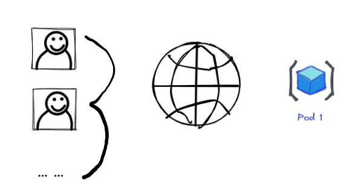
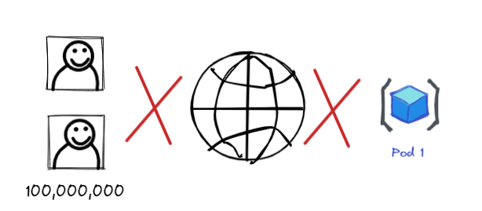
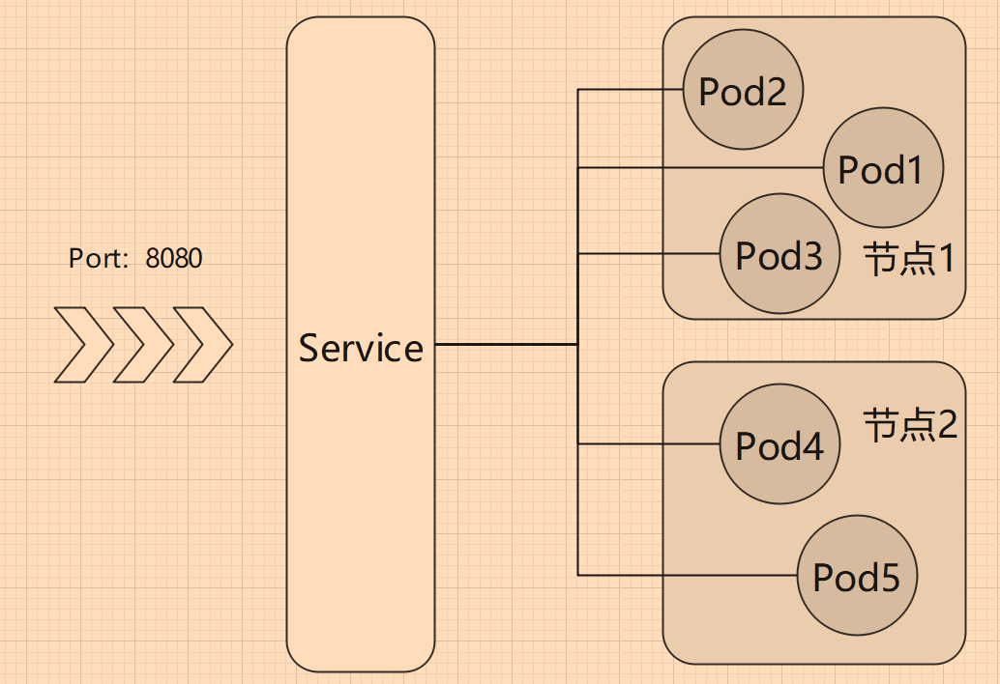

# 3.3 副本集(ReplicaSet)

ReplicaSet 也是一种管理 Pod 的对象，跟上一章提到的 Deployment 一样，可以守护 Pod ，保证 Pod 挂了后能够恢复。


## 副本集

ReplicaSet 为副本集的意思，Delpoyment 部署的 Pod，可以指定其副本数量，副本数量就是表示部署多少个 Pod，一个 Pod 模板 生成 N个 Pod 实例，而不是指一个原型+多个克隆，数量是 N，而不是 N+1。


### Deployment 保护 Pod

前面我们学习到 Deployment，使用 Deployment 部署 Pod，当 Pod 或所在节点出现故障时，Deployment 会自动创建新的 Pod。

我们执行 `kubectl get deployments` 命令，输出：

```
NAME    READY   UP-TO-DATE   AVAILABLE   AGE
nginx   1/1     1            1           38m
```

* `NAME` 列出了集群中 Deployment 的名称。
* `READY` 显示应用程序的可用的 _副本_ 数。显示的模式是“就绪个数/期望个数”。
* `UP-TO-DATE` 显示为了达到期望状态已经更新的副本数。
* `AVAILABLE` 显示应用可供用户使用的副本数。
* `AGE` 显示应用程序运行的时间。

如果你使用命令创建 Deployment，在 Pod 没有创建完成前， `READY` 字段可能显示为 `0/1`。


这是因为 Deployment 中默认只维护一个 Pod 实例，我们可以查看 Deployment 的 YAML 文件，找到：

```yaml
# 查看命令 kubectl get deployment nginx -o yaml
...
spec:
  progressDeadlineSeconds: 600
  replicas: 1
...
```

replicas 字段设置了维持多少个 Pod 实例，所以当 Pod 挂了后，Deployment 会重新创建一个 Pod，而不是两个，三个。这个字段跟 ReplicaSet  有关，创建 Deployment 后，会自动创建 ReplicaSet，ReplicaSet 管理的副本数量跟 YAML `replicas` 字段值一致。

查看 replicaset 实例：

```bash
root@slave1:~# kubectl get replicaset
NAME               DESIRED   CURRENT   READY   AGE
nginx-55649fd747   1         1         1       22h
```

> replicaset 可缩写为 rs，即 `kubectl get rs`。


### 扩容 Pod

在项目初期，用户人数少的时候，单个应用实例可能就满足了所有用户的访问需求。



但是随着时间发展，用户数量越来越多，单个应用无法撑起高并发，访问速度变慢了，响应时间变长了，内存爆炸了。




这个时候，如果可以提供多个实例，则可以均分用户的访问请求，让一个 Pod 只负载一部分用户，这样就能有效地支持亿级用户并发。


支持亿级并发？有这么简单吗？是的，部署一百万台服务器不就行了，多简单。

> **[Info] 开玩笑的**
>
> 笔者虽然学了 Kubernetes 以及很多地方动手实践过，都是些小项目，对企业级的 Kubernetes 完全没经验。从别的地方了解到， Kubernetes 单集群是有一定程度的瓶颈，机器数量多了，流量大了，可能会把 Kubernetes 压垮，于是又出现了多集群、怎么对多集群负载均衡等。


回归正题，要扩展 Pod 实例，需要保证 Pod 应当是无状态的，即每个 Pod 都是一样的，它们不能表现出差异来，同一个请求无论被哪个 Pod 处理，其响应结果都是一致的。

在 1.4 章中，根据云原生十二因素([https://12factor.net/](https://12factor.net))的方法论和核心思想，一个 `Processes` 应当是无状态的，任何持久化的数据都要存储在后端服务中。A 镜像，启动 N 个 docker 容器，端口为 801、802、803...，他们其实都是一样的，我们访问哪个容器，最终提供的服务都是一致的。

如果我们把这些容器放到不同 Node 中，再通过 k8s ，就可以为多个实例之间分配流量，即负载均衡。即，**<span style="color:red;">加机器就能解决问题</span>**。


在 Deployment 中，可以通过指定 YAML 文件的 `.spec.replicas` 字段或者以命令参数 `--replicas=` 设置副本数量。

我们可以动态修改一个 控制器只能的 Pod 数量，直接编辑 YAML 文件即可：

```
kubectl edit deployment nginx
```

在 `spec` 字段后面找到 `replicas: 1`，修改为 `replicas: 2`。


再次查看 Deployment：

```
root@instance-1:~# kubectl get deployments
NAME    READY   UP-TO-DATE   AVAILABLE   AGE
nginx   2/2     2            2           24m
```

> 在创建 Deployment 时，我们也可以使用 `--replicas=` 参数决定 Pod 的副本数量。
>
> ```
> kubectl create deployment nginx --image=nginx:latest --replicas=2
> ```


### Scale

前面，已经通过修改 Deployment 对象的 YAML 文件实现多副本扩容，但是我们总不能老是直接操作 YAML 文件吧？Kubernetes 提供了 `kubectl scale` 扩容命令，可以为指定对象扩容 Pod 数量。

为 Deployment 对象扩容 Pod 数量：

```bash
kubectl scale deployment nginx --replicas=3
```

然后等几秒后执行 `kubectl get deployments` 查看结果。

```bash
NAME    READY   UP-TO-DATE   AVAILABLE   AGE
nginx   3/3     3            3           3h15m
```

查看 ReplicaSet ：

```bash
root@slave1:~# kubectl get rs
NAME               DESIRED   CURRENT   READY   AGE
nginx-55649fd747   3         3         3       23h
```


执行 `kubectl get pod -o wide` 可以输出信息的 pod 信息 。

```
NAME       READY   STATUS   ESTARTS   AGE     IP              NODE     NOMINATED NODE   READINESS GATES
nginx-581   1/1     Running   0     3h11m   192.168.56.24   instance-2   <none>           <none>
nginx-582   1/1     Running   0     3m30s   192.168.56.25   instance-2   <none>           <none>
nginx-583   1/1     Running   0     3m30s   192.168.56.26   instance-2   <none>           <none>
# 注，笔者删除了Name的部分名称
```

当我们使用 `kubectl delete xxx` 删除 pod 时，或者 Pod 故障时、手贱改了 Pod 状态时，Deployment 会自动保持三个副本集，会自动启用新的 pod ，你可以删除其中一个或多个 Pod，再查看 Pod 数量，会发现一直保持 3 个。

ReplicaSet 可以简单地设置副本数量，而我们后面会学习到更加复杂的 Pod 扩容收缩机制。

> `kubectl scale` 命令也可作用于 ReplicaSet 和 ReplicationController，两者可用简化名称 rs、rc 代替。
>
> ```
> kubectl scale rc {名称} --replicas=10
> kubectl scale rs {名称} --replicas=10
> ```


### DaemonSet

在 Kubernetes 中，负载类型有 Deployments、ReplicaSet、DaemonSet、StatefulSets 等(或者说有这几个控制器)。

前面已经介绍过 Deployments 和 ReplicaSet，它们都可以通过命令和 YAML 创建，但是 ReplicaSet 一般没必要使用 YAML 创建的。

DaemonSet 可以确保一个节点只运行一个 Pod 副本。

假如有个 Pod，当新的 节点加入集群时，会自动在这个 节点 上部署一个 Pod；当节点从集群中移开时，这个 Node 上的 Pod 会被回收；如果 DaemontSet 配置被删除，则也会删除所有由它创建的 Pod。DaemonSet 无视节点的排斥性，即 节点可以排斥调度器在此节点上部署 Pod，DaemonSet 则会绕过调度器，强行部署。Kubernetes 的一些系统服务，也是 DaemonSet 部署模式。

DaemonSet 的一些典型用法：

* 在每个节点上运行集群守护进程
* 在每个节点上运行日志收集守护进程
* 在每个节点上运行监控守护进程

在 yaml 中，要配置 Daemont，可以使用 `tolerations`，配置示例：

```yaml
kind: DaemontSet
... ...
```

其它地方跟 Deployment 一致，这里据不多说了，读者了解即可。

关于 3.10 章会提及。


### 负载均衡

我们可以通过 Deployment，或者 DaemonSet，为 Pod 创建多个副本，这些 Pod 副本实例，会自动分到各个节点上。


创建多个 Pod 能够实现负载均衡的原因时 Pod 被分配到多个节点中，利用了多台服务器的计算资源，本质是分配更多的资源，如果只有一个服务器，那么再扩容 Pod ，能够使用的资源是有限的，不会带来什么效果。当然，如果 Pod 被设置了资源限制，只要该服务器上还有剩余资源，那么分配更多的 Pod，也是有效的。这点我们后面的章节再讲解。

Pod 实例数量是多了，也分配到不同的 节点上，但是我们怎么访问 Pod？难道 2 个节点，我们要单独访问 IP？

其实我们无需担心太多，因为 Kubernetes 提供了 Service、Ingress 等网络服务，我们以 Service 举例。

Pod 提供了一个 8080端口，我们可以创建一个 Service，这个 Service 对外也提供了 8080 端口，当用户访问公网 `IP:8080` 时，Service 会随机选择一个 Pod 为用户提供服务，我们无需关注访问了哪个 Pod。





不过 Deployment 部署的 Pod，假如有 5 个节点，要部署 5 个 Pod，不会每个节点都刚好有一个 Pod。同样，5 个节点，10 个 Pod，不一定每个 节点都有两个 Pod。如果我们需要 Pod 能够平均地分配到 节点中，可以使用 DaemonSet。


### ReplicationController 和 ReplicaSet

ReplicationController、ReplicaSet 都是 Kubernetes 里面的副本管理机制，能够保证最终具有一定数量的 Pod 处于运行状态中，当节点故障或者 Pod 故障时、Pod 被节点逐出时，能够及时在其它节点上恢复一定数量的 Pod 实例。

ReplicationController 出现较早，后面出现了 ReplicaSet 用于替代它。从中文翻译来看，ReplicationController 译为 复制控制器，ReplicaSet 译为 副本集。两者主要区别是选择器支持，在 [3.7 标签](https://github.com/whuanle/kubernetes_ckad/tree/2952854b09e0e28859774b48b508f6f02669066f/3.pod/3.7label.md) 、[3.8 调度](8.schedule.md) 两章，你可以了解标签和选择器的使用方法。

ReplicationController 只支持等值选择器，示例：

```
environment = production
```

ReplicaSet 支持基于集合的选择器：

```
environment in (production, qa)
```

另外就是 ReplicaSet 一般不单独使用，而是结合 Deployment 等一起使用。

> ReplicaSet 虽然是 ReplicationController 的替代方案，但是两者属于不同的资源。
>
> ```bash
> root@instance-2:~# kubectl get replicationcontroller
> No resources found in default namespace.
> root@instance-2:~# kubectl get replicaset
> NAME                    DESIRED   CURRENT   READY   AGE
> nginxtaint-6c6dd878f9   5         5         5       2d19h
> ```

既然 ReplicationController 要淘汰了，那么在本章以及后面章节，只会讨论 ReplicaSet。

