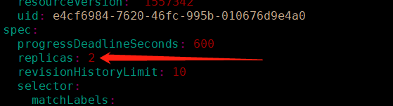
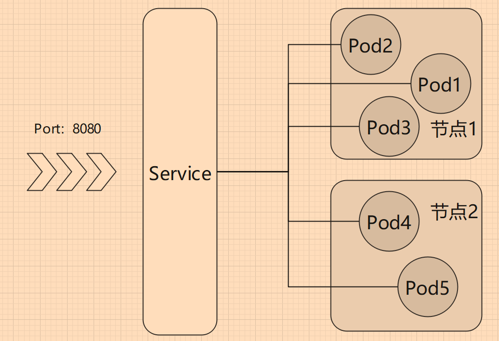

# 3.4 副本集

### 导读

ReplicationController、ReplicaSet 都是 Kubernetes 里面的副本管理机制，能够保证最终具有一定数量的 Pod 处于运行状态中，当节点故障或者 Pod 故障时、Pod 被节点逐出时，能够及时在其它节点上恢复一定数量的 Pod 实例。


ReplicationController 出现较早，后面出现了 ReplicaSet 用于替代它。从中文翻译来看，ReplicationController 译为 复制控制器，ReplicaSet 译为 副本集。两者主要区别是选择器支持，在 [3.7 标签](./3.7label.md) 、[3.8 调度](./8.schedule.md) 两章，你可以了解标签和选择器的使用方法。

ReplicationController 只支持等值选择器，示例：

```
  environment = production 
```

ReplicaSet 支持基于集合的选择器：

```
environment in (production, qa) 
```

另外就是 ReplicaSet 一般不单独使用，而是结合 Deployment 等一起使用。

>ReplicaSet 虽然是 ReplicationController 的替代方案，但是两者属于不同的资源。
>
>```sh
>root@instance-2:~# kubectl get replicationcontroller
>No resources found in default namespace.
>root@instance-2:~# kubectl get replicaset
>NAME                    DESIRED   CURRENT   READY   AGE
>nginxtaint-6c6dd878f9   5         5         5       2d19h
>```


在本章以及后面章节，只讨论 ReplicaSet。


### Deployment 保护 Pod

前面我们学习到 Deployment，使用 Deployment 部署 Pod，当 Pod 或所在节点出现故障时，Deployment 会自动创建新的 Pod。

这是因为 Deployment 中默认只维护一个 Pod 实例，我们可以查看 Deployment 的 YAML 文件，找到：

```yaml
# 查看命令 kubectl get deployment nginx -o yaml
...
spec:
  progressDeadlineSeconds: 600
  replicas: 1
... 
```

replicas 字段设置了维持多少个 Pod 实例，所以当 Pod 挂了后，Deployment 会重新创建一个 Pod，而不是两个，三个。

在使用 Deployment 时，会自动创建一个 ReplicaSet，ReplicaSet 管理的副本数量跟 YAML  `replicas` 字段值一致。


## ReplicaSet

ReplicaSet 为副本集的意思，Delpoyment 部署的 Pod，可以指定其副本数量，副本数量就是表示部署多少个 Pod，而不是指一个原型+多个克隆。

我们执行 `kubectl get deployments` 命令，输出：

```text
NAME    READY   UP-TO-DATE   AVAILABLE   AGE
nginx   1/1     1            1           38m
```

* `NAME` 列出了集群中 Deployment 的名称。
* `READY` 显示应用程序的可用的 _副本_ 数。显示的模式是“就绪个数/期望个数”。
* `UP-TO-DATE` 显示为了达到期望状态已经更新的副本数。
* `AVAILABLE` 显示应用可供用户使用的副本数。
* `AGE` 显示应用程序运行的时间。


如果你使用命令创建 Deployment，在 Pod 没有创建完成前， `READY` 字段可能显示为 `0/1`。


### 扩容 Pod

因为容器化应用中，根据云原生十二因素([https://12factor.net/](https://12factor.net/))的方法论和核心思想，一个 `Processes` 应当是无状态的，任何持久化的数据都要存储在后端服务中。A 镜像，启动 N 个 docker 容器，端口为 801、802、803...，他们其实都是一样的，我们访问哪个容器，最终提供的服务都是一致的。

如果我们把这些容器放到不同 Node 中，再通过 k8s ，就可以为多个实例之间分配流量，即负载均衡。

在 Deployment 中，可以通过指定 YAML 文件的 `.spec.replicas` 字段或者以命令参数 `--replicas=` 设置副本数量。

我们可以动态修改一个 控制器只能的 Pod 数量，直接编辑 YAML 文件即可：

```shell
kubectl edit deployment nginx
```

在 `spec` 字段后面找到 `replicas: 1`，修改为 `replicas: 2`。




再次查看 deployment：

```shell
root@instance-1:~# kubectl get deployments
NAME    READY   UP-TO-DATE   AVAILABLE   AGE
nginx   2/2     2            2           24m
```

> 在创建 Deployment 时，我们也可以使用 `--replicas=` 参数决定 Pod 的副本数量。
>
> ```shell
> kubectl create deployment nginx --image=nginx:latest --replicas=2
> ```


### Scale

前面，已经通过修改 Deployment 对象的 YAML 文件实现多副本\(扩容，这里学习一下 `kubectl scale` 扩容命令，可以为指定对象扩容 Pod 数量。

```shell
kubectl scale deployment nginx --replicas=3
```

然后等几秒后执行 `kubectl get deployments` 查看结果。

```text
NAME    READY   UP-TO-DATE   AVAILABLE   AGE
nginx   3/3     3            3           3h15m
```

执行 `kubectl get pod -o wide` 可以输出信息的 pod 信息 。

```text
NAME       READY   STATUS   ESTARTS   AGE     IP              NODE     NOMINATED NODE   READINESS GATES
nginx-581   1/1     Running   0     3h11m   192.168.56.24   instance-2   <none>           <none>
nginx-582   1/1     Running   0     3m30s   192.168.56.25   instance-2   <none>           <none>
nginx-583   1/1     Running   0     3m30s   192.168.56.26   instance-2   <none>           <none>
# 注，笔者删除了Name的部分名称
```

当我们使用 `kubectl delete xxx` 删除 pod 时，或者 Pod 故障时、手贱改了 Pod 状态时，Deployment 会自动保持三个副本集，会自动启用新的 pod ，你可以删除其中一个或多个 Pod，再查看 Pod 数量，会发现一直保持 3 个。


ReplicaSet 可以简单地设置副本数量，而我们后面会学习到更加复杂的 Pod 扩容收缩机制。

>`kubectl scale` 命令也可作用于 ReplicaSet 和 ReplicationController，两者可用简化名称 rs、rc 代替。
>
>```shell
>kubectl scale rc {名称} --replicas=10
>kubectl scale rs {名称} --replicas=10
>```


### DaemonSet

在 Kubernetes 中，负载类型有 Deployments、ReplicaSet、DaemonSet、StatefulSets 等\(或者说有这几个控制器\)。

前面已经介绍过 Deployments 和 ReplicaSet，它们都可以通过命令和 YAML 创建，但是 ReplicaSet 一般没必要使用 YAML 创建的。

DaemonSet 可以确保一个节点只运行一个 Pod 副本。

假如有个 Pod，当新的 节点加入集群时，会自动在这个 节点 上部署一个 Pod；当节点从集群中移开时，这个 Node 上的 Pod 会被回收；如果 DaemontSet 配置被删除，则也会删除所有由它创建的 Pod。

DaemonSet 的一些典型用法：

* 在每个节点上运行集群守护进程
* 在每个节点上运行日志收集守护进程
* 在每个节点上运行监控守护进程

在 yaml 中，要配置 Daemont，可以使用 `tolerations`，配置示例：

```yaml
kind: DaemontSet
... ...
```

其它地方跟 Deployment 一致，这里据不多说了，读者了解即可。

关于 StatefulSets ，后面章节会提及。


### 负载均衡

我们可以通过 Deployment，或者 DaemonSet，为 Pod 创建多个副本，这些 Pod 副本实例，会自动分到各个节点上。


创建多个 Pod 能够实现负载均衡的原因时 Pod 被分配到多个节点中，利用了多台服务器的计算资源，本质是分配更多的资源，如果只有一个服务器，那么再扩容 Pod ，能够使用的资源是有限的，不会带来什么效果。当然，如果 Pod 被设置了资源限制，只要该服务器上还有剩余资源，那么分配更多的 Pod，也是有效的。这点我们后面的章节再讲解。


Pod 实例数量是多了，也分配到不同的 节点上，但是我们怎么访问 Pod？难道 2 个节点，我们要单独访问 IP？

其实我们无需担心太多，因为 Kubernetes 提供了 Service、Ingress 等网络服务，我们以 Service 举例。

Pod 提供了一个 8080端口，我们可以创建一个 Service，这个 Service 对外也提供了 8080 端口，当用户访问公网 `IP:8080` 时，Service 会随机选择一个 Pod 为用户提供服务，我们无需关注访问了哪个 Pod。




不过 Deployment 部署的 Pod，假如有 5 个节点，要部署 5 个 Pod，不会每个节点都刚好有一个 Pod。同样，5 个节点，10 个 Pod，不一定每个 节点都有两个 Pod。如果我们需要 Pod 能够平均地分配到 节点中，可以使用 DaemonSe。