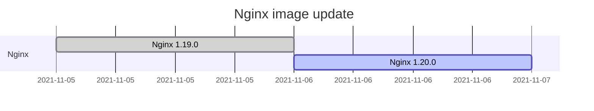
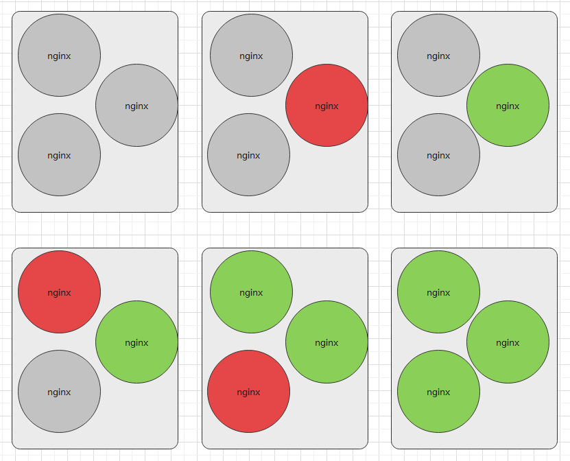
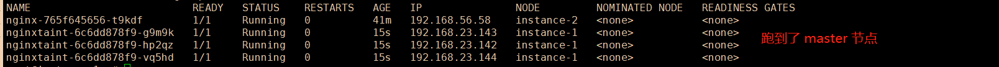
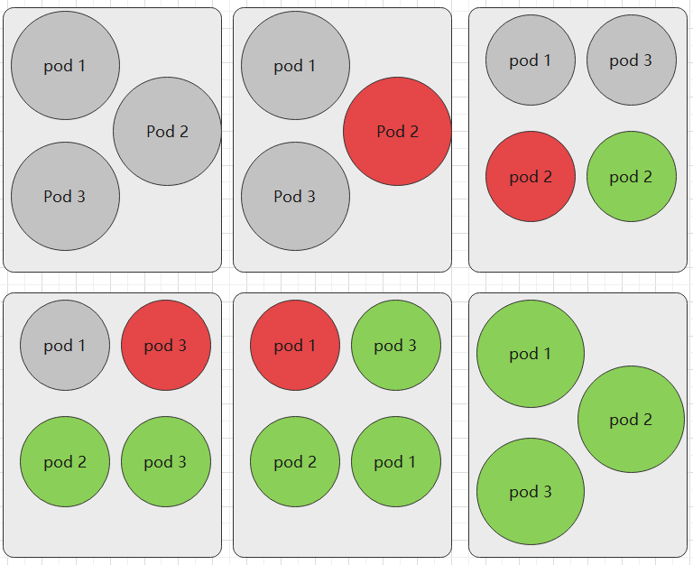
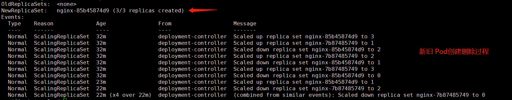

# 3.5 Pod 升级、回滚

本篇主要讨论如何实现滚动更新和回滚，任意更换版本并且回滚以前的版本(版本更新)，而下一章会讨论到 Pod 缩放，根据机器资源自动拓展和收缩应用(自动扩容实例)。


## 滚动更新和回滚

### 部署应用

首先我们来部署 nginx，使用 nginx 作为练习的镜像。

打开 [https://hub.docker.com/\_/nginx](https://hub.docker.com/\_/nginx) 可以查询 nginx 的镜像版本，笔者这里选择三个版本：`1.19.10`、`1.20.0`、`latest`，后续我们更新和回滚时，会在这几个版本之间选择。

> **[Info] 提示**
>
> 需要读者明确选择nginx 的三个不同版本，我们后面的升级回滚练习会在这三个版本中来回切换。
>
> ```
> 1.19.10 -> 1.20.0 -> latest
> ```


首先，我们创建一个 Nginx 的 Deployment，副本数量为 3，首次部署的时候，跟之前的操作一致，不需要什么特殊的命令。这里我们使用旧一些的版本，笔者使用的是 1.19.0。

```bash
kubectl create deployment nginx --image=nginx:1.19.0 --replicas=3
# 或者
# kubectl create deployment nginx --image=nginx:1.19.0 --replicas=3 --record
```

> **注：** 我们也可以加上 `--record` 标志将所执行的命令写入资源注解 `kubernetes.io/change-cause` 中。 这对于以后的检查是有用的。例如，要查看针对每个 Deployment 修订版本所执行过的命令，对于这个参数的作用，我们后面再解释。


执行 `kubectl get pods`、`kubectl describe pods`可以观察到有有三个 Pod，每个 Pod 的 nginx 镜像版本都是 1.19.0。

```bash
NAME                     READY   STATUS    RESTARTS   AGE
nginx-85b45874d9-7jlrv   1/1     Running   0          5s
nginx-85b45874d9-h22xv   1/1     Running   0          5s
nginx-85b45874d9-vthfb   1/1     Running   0          5s
```

```bash
Events:
  Type    Reason     Age   From               Message
  ----    ------     ----  ----               -------
  Normal  Scheduled  119s  default-scheduler  Successfully assigned default/nginx-85b45874d9-vthfb to instance-2
  Normal  Pulled     117s  kubelet            Container image "nginx:1.19.0" already present on machine
  Normal  Created    117s  kubelet            Created container nginx
  Normal  Started    117s  kubelet            Started container nginx
```


### 更新版本

其实更新 Pod 是非常简单的，我们不需要控制每个 Pod 的更新，也不需要担心会不会对业务产生影响，K8S 会自动控制这些过程。我们只需要触发镜像**版本更新事件**，K8S 会自动为我们更新所有 Pod 的。

`kubectl set image` 可以更新现有资源对象的容器镜像，对象包括 `Pod`、`Deployment`、`DaemonSet`、`Job`、`ReplicaSet`。在更新版本中，单个容器的 Pod，对于多个容器的 Pod 行为是差不多的，所以我们使用单容器 Pod 练习即可。

更新 Deployment 中的镜像版本，触发 Pod：

```bash
kubectl set image deployment nginx nginx=nginx:1.20.0
```

格式为：

```
kubectl set image deployment {deployment名称} {镜像名称}:={镜像名称}:{版本}
```

> 此命令可以任意修改 Pod 中的其中一个容器的版本，只要某个容器的镜像版本变化，整个 Pod 都会重新部署。如果镜像版本没有变化，即使是执行了 `kubectl set image` ，也不会产生影响。




我们可以查看 Pod 的详细信息：

```bash
kubectl describe pods
```

找到 Events 描述：

```
... ...
Events:
  Type    Reason     Age   From               Message
  ----    ------     ----  ----               -------
  Normal  Scheduled  66s   default-scheduler  Successfully assigned default/nginx-7b87485749-rlmcx to instance-2
  Normal  Pulled     66s   kubelet            Container image "nginx:1.20.0" already present on machine
  Normal  Created    66s   kubelet            Created container nginx
  Normal  Started    65s   kubelet            Started container nginx
```

可以看到，现在现在创建的 Pod 实例为 1.20.0 版本。

> 更新过程中，会创建新版本的 Pod，旧的 Pod 会被逐渐移除。


我们在创建 Deployment 时，生成了三个 Pod ，而当我们触发镜像版本更新时，Pod 不会一次性更新，而是按照一定规则每次只重新部署一部分 Pod，Pod 更新替换过程类似下图所示(实际上 Pod 数量可能大于 3个)：




另外，我们还可以通过 `kubectl edit yaml` 的方式方式更新 Pod。

执行：

```bash
kubectl edit deployment nginx
```

然后会弹出编辑 YAML 的界面，将 `.spec.template.spec.containers[0].image` 从 `nginx:1.19.0` 更改至 `nginx:1.20.0`，然后保存即可。

> 为了记录版本更新信息，我们需要在 `kubectl create deployment`、`kubectl set image` 命令后面加上 `--record`。
>
> 别忘记了 `kubectl scale` 命令也可以更改副本数量。


### 上线

仅当 Deployment Pod 模板（即 `.spec.template`）发生改变时，例如模板的标签或容器镜像被更新， 才会触发 Deployment 上线。

其他更新（如对 Deployment 执行扩缩容的操作）不会触发上线动作，Deployment 的上线动作可以为我们更新 Pod 的版本(Pod 中的容器版本)。

这里提到的 上线/更新版本 是因为容器版本会发生变化，而更新一般指修改了 YAML 等，不一定会对容器产生影响。

当我们更新 Pod 版本时，K8S 会自动负载均衡，而不是把所有 pod 删除，再重新创建新版本 Pod，**它会以稳健的方式逐渐替换 Pod 副本**，所以叫**滚动更新**。


我们可以通过 `kubectl rollout status` 命令，查看 Pod 的上线状态，即 Pod 副本集的更替状态：

```bash
kubectl rollout status deployment nginx
```

输出结果一般有两种：

```bash
# 已经完成时：
deployment "nginx-deployment" successfully rolled out
# 还在更新时：
Waiting for rollout to finish: 2 out of 3 new replicas have been updated...
```

我们也可以通过获取 Deployment 信息时，查看已更新的 pod 数量：

```bash
kubectl get deployment
```

```bash
NAME    READY   UP-TO-DATE   AVAILABLE   AGE
nginx   3/3     3            3           18m
```

UP-TO-DATE 字段可以看到成功更新的 pod 数量。


还可以查看 ReplicaSet 和 Pod：

```bash
kubectl get replicaset
kubectl get pods
```

输出类型于：

```
NAME               DESIRED   CURRENT   READY   AGE
nginx-7b87485749   0         0         0       20m
nginx-85b45874d9   3         3         3       21m
```

```
NAME                     READY   STATUS    RESTARTS   AGE
nginx-85b45874d9-nrbg8   1/1     Running   0          12m
nginx-85b45874d9-qc7f2   1/1     Running   0          12m
nginx-85b45874d9-t48vw   1/1     Running   0          12m
```

可以看到有两个 ReplicaSet，nginx-7b87485749 是 1.19.0 版本，已经被全部更新到 1.20.0 版本 了，所以前者的数量为 0，我们也可以看到 Pod 中，所有 Pod 都是以 `nginx-85b45874d9` 作为前缀的。这几个关键信息，我们可以截图，后面再次对照。


### 如何滚动更新

我们更新 镜像版本时，旧的 Pod 版本会被替换，但是 ReplicaSet 副本记录是不会被删除的。实际上滚动更新就是控制副本数量，原本 1.19.0 的副本数量为 3，现在变成 0，1.20.0 的副本数量变成 3 。

如果我们的项目上线了，我们更新软件版本，如果一次性更新所有容器或者 pod，那么我们的软件会有一段时间处于不可用状态，直到所有 Pod 都完成更新。

Deployment 可确保在更新时仅关闭一定数量的 Pod，默认情况下，它确保至少所需 Pods 75% 处于运行状态，也就是说正在被更新的 Pod 比例不超过 25%。当然，只有两三个 pod 的 Deployment 不会按照这个比例限定。也就是说，Deployment 等处于滚动更新状态时，其始终可以保证有可用的 Pod 提供服务。


如果我们的 Pod 数量足够大，或者在更新 Deployment 时迅速输出上线状态，可以看到新旧的 Pod 数量加起来不一定就是 3 个，因为它不会杀死老 Pods，直到有足够的数量新的 Pods 已经出现。 在足够数量的旧 Pods 被杀死前并没有创建新 Pods。当副本数量为3个时，它确保至少 2 个 Pod 可用，同时 最多总共 4 个 Pod 存在(不同版本)。



滚动更新过程如下图所示：




Deployment 确保仅所创建 Pod 数量只可能比期望 Pods 数高一点点。 默认情况下，它可确保启动的 Pod 个数比期望个数最多多出 25%（最大峰值 25%）所以在自动更新 Deployment 时，观察到的 pod 可能为 4个，这是由 Deployment 的缩放配置决定的(下一章讲解)。另外，在 Deployment 更新时，除了可以更改镜像的版本，也可以更改 ReplicaSet 的数量。

执行 `kubectl describe deployment nginx` 查看 Deployment 详细信息，我们查看 Event 字段，也可以观察到新旧 Pod 的更替过程。




但是这些原理等知识我们都不需要记，也不需要深入，我们记得有这回事就行，有需要的时候也可以直接查看文档的，后面的章节还会详细介绍 ReplicaSet 的规则。


### 查看上线记录

默认情况下， Deployment 的上线记录都会保留在系统中，以便可以随时回滚，前面我们也提到了查看 `kubectl get replicasets` 时出现的副本记录。


我们查看 Deployment 的上线历史记录：

```bash
kubectl rollout history deployment nginx
```

```bash
REVISION  CHANGE-CAUSE
1         <none>
2         <none>

# 带 --record 的话，输出是
REVISION  CHANGE-CAUSE
2       kubectl set image deployment nginx nginx=nginx:1.20.0 --record=true
```

可以看到有两个版本，但是`CHANGE-CAUSE` 为 `<none>` 呢？这是因为笔者没有使用 `--record` 参数记录信息，如果没带上 `--record` 的话，我们看着这个历史记录，完全分不出到底是什么版本。


现在我们查看 版本2 的详细信息：

```
kubectl rollout history deployment nginx --revision=2
```

```yaml
deployment.apps/nginx with revision #2
Pod Template:
  Labels:    app=nginx
    pod-template-hash=85b45874d9
  Containers:
   nginx:
    Image:    nginx:1.20.0
    Port:    <none>
    Host Port:    <none>
    Environment:    <none>
    Mounts:    <none>
  Volumes:    <none>
```


### 回滚

当部署的新版本程序发现严重 bug 影响平台稳定性时，你可能需要将项目切换为上一个版本。目前介绍了几个查看 Deployment 上线的历史记录的命令，下面介绍如果将 Pod 换到旧的版本。


回滚到上一个版本的命令：

```bash
root@master:~# kubectl rollout undo deployment nginx
deployment.apps/nginx rolled back
```

> 例如当前是 版本2，那么会回滚到 版本1。


再执行 `kubectl rollout history deployment nginx` 会发现 revision 变成 3 了。

```bash
root@master:~# kubectl rollout history deployment nginx
deployment.apps/nginx 
REVISION  CHANGE-CAUSE
2         <none>
3         <none>
```

>revision 记录的是部署记录，与 Pod 的镜像版本无关，每次更新版本或进行回滚等操作时， revision 会自动递增 1。


如果版本数量多了，我们还可以指定回滚到特点的版本。

```bash
kubectl rollout undo deployment nginx --to-revision=2
```

这里提一下 `--record`，在前面，我们创建和更新 Deployment 时，都没有使用到这个参数，其实这个参数很有用的，接下来我们每次执行滚动更新时都要带上这个参数才行。


更新镜像到指定版本：

```bash
kubectl set image deployment nginx nginx=nginx:1.19.0 --record
```

```
kubectl rollout history deployment nginx
```

输出：

```
REVISION  CHANGE-CAUSE
5         <none>
6         kubectl set image deployment nginx nginx=nginx:1.19.0 --record=true
```


但是我们这里目前来说，只有两个记录，我们明明提交了多次，虽然 revision 会变化，但是这里查询的只有两条记录，这时因为我们操作的时候，只用到了 1.19.0、1.20.0 两个版本，所以也就只有这两个版本的提交记录。多用几个版本，输出结果：


```
REVISION  CHANGE-CAUSE
7         kubectl set image deployment nginx nginx=nginx:1.19.0 --record=true
8         kubectl set image deployment nginx nginx=nginx:1.20.0 --record=true
9         kubectl set image deployment nginx nginx=nginx:latest --record=true
```

REVISION 字段的数字是会递增的，当我们触发上线动作(容器标签、版本等)时，会产生新的上线记录。


### 暂停上线

本小节需要水平缩放、比例缩放等知识，请先阅读 3.6 章关于缩放的内容。


如果在上线过程中，发现机器不够用了，或者需要调整一些配置等，可以暂停上线过程。

`kubectl rollout pause` 命令可以让我们在 Deployment 的 Pod 版本时，暂停滚动更新。

命令：

```bash
kubectl rollout pause deployment nginx
```


在滚动更新过程中，会有一些现象需要我们留意。

先创建一个 Deployment 或者更新 Deployment 的 Pod 为 10 个副本。

```bash
kubectl create deployment --image=nginx:1.19.0 --replicas=10
```

我们执行 `kubectl edit deployment nginx` 修改缩放个数：

```yaml
  strategy:
    rollingUpdate:
      maxSurge: 3
      maxUnavailable: 2
    type: RollingUpdate
```

> 设置了这个 maxSurge 和 maxUnavailable，可以让 Deployment 替换 Pod 时慢一些。


之前我们已经使用了 `1.19.0`、`1.20.0` 两个版本进行演示，这里我们使用 `latest` 版本进行实践。

复制以下两条命令快速执行，可以快速卡住上线过程。我们暂停上线后，查看一些状态信息。

```bash
kubectl set image deployment nginx nginx=nginx:latest
kubectl rollout pause deployment nginx
```

执行 `kubectl get replicaset` 查看这些版本的数量。

```bash
NAME               DESIRED   CURRENT   READY   AGE
nginx-7b87485749   8         8         8       109m
nginx-85b45874d9   0         0         0       109m
nginx-bb957bbb5    5         5         5       52m
```

> 可以看到，所有的 Pod 加起来数量大于 10，旧容器以每次 2 个的数量减少；新容器以每次 3 个的数量创建；暂停上线后，多次执行 `kubectl get replicaset` ，会发现副本数量不会变化。


前面我们已经暂停了上线，如果我们执行上线命令换成别的版本：

```bash
kubectl set image deployment nginx nginx=nginx:1.19.0
```

会发现虽然提示更新了，但是实际上没有变化。执行 `kubectl rollout history deployment nginx` 也查不到我们提交的 `1.19.0` 的请求。这是因为在已经暂停上线的控制器对象中，执行新的上线动作是无效的。


暂停的时候，我们可以更新一些配置，例如限制 Pod 中的 nginx 容器使用的 CPU 和 资源：

```bash
kubectl set resources deployment nginx -c=nginx --limits=cpu=200m,memory=512Mi
```

再恢复 Deployment 上线：

```bash
kubectl rollout resume deployment nginx
```

