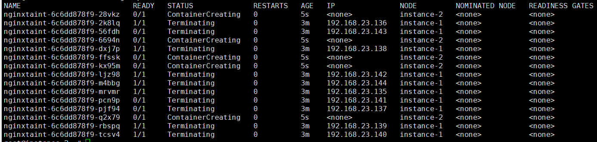

# 3.8 节点调度

### 导读

在上一章中，我们学习了 Label，可以为对象设置标签，并且使用选择器筛选对象，本章中我们将学习节点调度的相关知识，在标签之上控制 Pod 在节点中的部署。


## 亲和性

### 亲和性和反亲和性

前面我们学习了 `nodeSelector` ，使用 `nodeSelector` 选择合适的 节点部署 Pod。

例如选择磁盘空间大的节点部署 Pod：

```yaml
    spec:
      containers:
      - image: nginx:latest
        name: nginx
      nodeSelector:
        disksize: "big"
```


节点亲和性类似于 `nodeSelector` ，可以根据节点上的标签约束 Pod 可以调度到哪些节点。

Pod 亲和性有两种别为：

* `requiredDuringSchedulingIgnoredDuringExecution`

  硬需求，将 Pod 调度到一个节点必须满足的规则。

* `preferredDuringSchedulingIgnoredDuringExecution`。

  尽量满足，尝试执行但是不能保证偏好。
  
  

这是官方的一个例子：

```yaml
apiVersion: v1
kind: Pod
metadata:
  name: with-node-affinity
spec:
  affinity:
    nodeAffinity:
      requiredDuringSchedulingIgnoredDuringExecution:
        nodeSelectorTerms:
        - matchExpressions:
          - key: kubernetes.io/e2e-az-name
            operator: In
            values:
            - e2e-az1
            - e2e-az2
      preferredDuringSchedulingIgnoredDuringExecution:
      - weight: 1
        preference:
          matchExpressions:
          - key: another-node-label-key
            operator: In
            values:
            - another-node-label-value
  containers:
  - name: with-node-affinity
    image: k8s.gcr.io/pause:2.0
```

> `requiredDuringSchedulingIgnoredDuringExecution` 亲和性的约束相对于：
>
> ```yaml
> ... ... -l kubernetes.io/e2e-az-name in (e2e-az1,e2e-az2)
> ```
>


这个 YAML 的层级太多，记也记不下，需要的时候查看官方文档或者收藏本篇文章。


```yaml
  affinity:
    nodeAffinity:
      requiredDuringSchedulingIgnoredDuringExecution:
        nodeSelectorTerms:
        - matchExpressions:
        ... ...
      preferredDuringSchedulingIgnoredDuringExecution:
        nodeSelectorTerms:
        - matchExpressions: 
        ... ...
```

affinity 设置亲密关系，nodeAffinity 设置节点亲密关系，最后才到 亲和性，它们表示必须满足和尽量满足。

如果我们设置了多个 nodeSelectorTerms ：

```yaml
requiredDuringSchedulingIgnoredDuringExecution:
  nodeSelectorTerms:
  ...
  nodeSelectorTerms:
```

则只需要满足其中一种即可调度 Pod 到 节点 上。

如果你同时指定了 `nodeSelector` 和 `nodeAffinity`，则两者必须同时满足条件， 才能将 Pod 调度到候选节点上。


节点亲和性语法支持下面的操作符： `In`，`NotIn`，`Exists`，`DoesNotExist`，`Gt`，`Lt`。

Pod 亲和性与反亲和性的合法操作符有 `In`，`NotIn`，`Exists`，`DoesNotExist`。


通过 `Affinity` 后缀 可以设置亲和性，例如节点亲和性 `nodeAffinity`。而设置反亲和性使用 `AntiAffinity` 后缀，例如 `nodeAntiAffinity`。


反亲和性跟亲和性一样，都有 `requiredDuringSchedulingIgnoredDuringExecution` 硬限制和 `preferredDuringSchedulingIgnoredDuringExecution` 软限制，只是反亲和性是相反的表示，如果符合条件则不能调度。


关于亲和性和反亲和性的说明就到这里，这两者的配置比较多和复杂，读者可以参考官方文档，这里不再赘述。

> 亲和性和反亲和性的 YAML 很复杂，所以手写不出来的，只需要努力了解大概的意思和看懂就行，需要使用时查看文档。
>
> [https://kubernetes.io/zh/docs/concepts/scheduling-eviction/assign-pod-node](https://kubernetes.io/zh/docs/concepts/scheduling-eviction/assign-pod-node)


## 污点和容忍度

### 污点

前面提到亲和性和反亲和性，我们可以让 Pod 选择合适的 Node，或者 service 选择合适的 Pod，这些拥有 Label 的对象都是被选择的。

```text
Pod -选择-> 节点
```


这里，我们介绍污点和容忍度，它们可以排斥 “被选择” 的命运。

> 当节点添加一个污点后，除非 Pod 声明能够容忍这个污点，否则 Pod 不会被调度到这个 节点上。
>
> 也就是说，节点可以 “丑拒” Pod。


如果节点存在污点，那么 Pod 可能不会被分配到此节点上；如果节点一开始没有设置污点，然后部署了 Pod，后面节点设置了污点，节点可能会删除已部署的 Pod，这种行为称为驱逐。


节点污点\(taint\) 可以排斥一类特定的 Pod，而 容忍度\(Tolerations\)则表示 Pod 能够容忍这个对象的污点。

节点说自己又笨又丑，但是 Pod 说我不介意，要跟你谈一场轰轰烈烈的恋爱。

```text
Node - taint > 排斥 Pod
Pod  - tolerations -> 我是真爱，我能容忍污点 -> Node
```


污点有强制和尽量两种，前者完全排斥，后者尽可能排斥，另外某些污点可以将已经在这台节点上部署的 Pod 逐出，这个称为 effect。

> 系统会 尽量避免将 Pod 调度到存在其不能容忍污点的节点上， 但这不是强制的。Kubernetes 处理多个污点和容忍度的过程就像一个过滤器：从一个节点的所有污点开始遍历， 过滤掉那些 Pod 中存在与之相匹配的容忍度的污点。
>
> 但是如果你只有一个 Worker，那么设置了污点，那 Pod 也只能选择在这个节点上运行。全世界只剩下一女(Node)一男(Pod)，不想在一起也得在一起。


添加污点格式：

```shell
kubectl taint node [node] key=value:[effect]
```

更新污点或覆盖：

```shell
kubectl taint node [node] key=value:[effect] --overwrite=true
```

我们也可以修改节点的 YAML 文件，修改污点：

```Yaml
apiVersion: v1
kind: Node
metadata:
...
...
spec:
  taints:
  - effect: NoSchedule
    key: node-role.kubernetes.io/master
...
```


我们来实际尝试命令，使用 `kubectl taint` 给节点增加一个污点。

```shell
kubectl taint node instance-2 key1=value1:NoSchedule
```

移除污点：

```shell
kubectl taint node instance-2 key1=value1:NoSchedule-
```

> 给节点设置的污点，不会在 Labels 中出现，而是在 `Traints` 中。
>
> `Taints:             key1=value1:NoSchedule`。

其中，污点是键值对，我们设置了 `{key1,value1}`，其效果为 NoSchedule。


污点的效果称为 effect ，节点的污点可以设置为以下三种效果：

* `NoSchedule`：不能容忍此污点的 Pod 不会被调度到节点上；不会影响已存在的 pod。
* `PreferNoSchedule`：Kubernetes 会避免将不能容忍此污点的 Pod 安排到节点上。
* `NoExecute`：如果 Pod 已在节点上运行，则会将该 Pod 从节点中逐出；如果尚未在节点上运行，则不会将其·调度到此节点上。

> 当节点设置污点后，无论其效果是哪一种，只要 Pod 没有设置相关的容忍度，Pod 就不会调度到此节点上。
>
> 例如节点声明了 `smallcpu` 污点，只要 Pod 没有声明容忍此 污点，那么 Pod 就不应该被调用到此节点上。除了 `smallcpu` 污点名称外，还有值也属于规则约束，这点我们后面再解释。


### 系统默认污点

尽管一个节点上的污点完全排斥 Pod，但是某些系统创建的 Pod 可以容忍所有 `NoExecute` 和 `NoSchedule` 污点，因此不会被逐出。

例如 master 节点是不会被 Deployment 等分配 Pod 的，因为 master 有个污点，表面它只应该运行`kube-system` 命名空间中的很多系统 Pod，用户 Pod 会被排斥部署到 master 节点上。

当然我们通过修改污点，可以让 用户的 Pod 部署到 master 节点中，本小节我们将学习系统默认污点以及相关驱逐的知识。


查询所有节点的污点：

```shell
kubectl describe nodes | grep Taints
```

```text
# master 输出
Taints:             node-role.kubernetes.io/master:NoSchedule
# worker 输出
Taints:             key1=value1:NoSchedule
```

master 节点上会有一个 `node-role.kubernetes.io/master:NoSchedule` 的污点，Kubernetes 部署用户的 Pod 时会检查节点是否存在此污点，如果有，则不会在此节点上部署 Pod。

这里我们做一个实践，去掉 master 节点的污点，使得 用户 Pod 能够在此 节点上部署。


我们去除 master 和 worker 的污点：

```shell
kubectl taint node instance-1 node-role.kubernetes.io/master:NoSchedule-
kubectl taint node instance-2 key1=value1:NoSchedule-
# instance-1 是笔者的 master 节点名称
# 有污点就删除，没有就不用管
```

然后部署通过 Deployment 部署 Nginx，并设置副本集。

```shell
kubectl create deployment nginxtaint --image=nginx:latest --replicas=5
```

查看 Pod 都部署到哪些节点上：

```shell
kubectl get pods -o wide
```

可以看到，master 节点也被部署了 Pod。




这里只是练手，为了保证集群安全，我们需要恢复 master 的污点。

```shell
kubectl taint node instance-1 node-role.kubernetes.io/master:NoSchedule
```


当某种条件为真时，节点控制器会自动给节点添加一个污点。当前内置的污点包括：

* `node.kubernetes.io/not-ready`：节点未准备好。这相当于节点状态 `Ready` 的值为 "`False`"。
* `node.kubernetes.io/unreachable`：节点控制器访问不到节点. 这相当于节点状态 `Ready` 的值为 "`Unknown`"。
* `node.kubernetes.io/out-of-disk`：节点磁盘耗尽。
* `node.kubernetes.io/memory-pressure`：节点存在内存压力。
* `node.kubernetes.io/disk-pressure`：节点存在磁盘压力。
* `node.kubernetes.io/network-unavailable`：节点网络不可用。
* `node.kubernetes.io/unschedulable`: 节点不可调度。
* `node.cloudprovider.kubernetes.io/uninitialized`：如果 kubelet 启动时指定了一个 "外部" 云平台驱动， 它将给当前节点添加一个污点将其标志为不可用。在 cloud-controller-manager 的一个控制器初始化这个节点后，kubelet 将删除这个污点。

当节点资源不足时，会添加一个污点，排斥后续 Pod 在此 节点上部署，但不会驱逐已存在的 Pod。如果我们的 Pod 对机器资源有要求，可以排斥相关的污点，如果没要求，则需要容忍相关污点。


### 容忍度

污点和容忍度相互配合，用来避免 Pod 被分配到不合适的节点上；也可以让真正合适的 Pod 部署到有污点的节点上。一个节点可以设置污点，排斥 Pod，但是 Pod 也可以设置 容忍度，容忍节点的污点。

YAML 示例：

```yaml
tolerations:
- key: "key1"
  operator: "Exists"
  effect: "NoSchedule"
```

> 此 Pod 能够容忍带有 `key1` 标签的污点，且无论是什么值。

也可以设置带 value 的容忍。

```yaml
tolerations:
- key: "key1"
  operator: "Equal"
  value: "value1"
  effect: "NoSchedule"
```

> `operator` 的默认值是 `Equal`。
>
> 只有当污点 `key1` 的值为 `value1` 时，才容忍。
>
> 可以同时定义多个容忍度：
>
> ```yaml
> tolerations:
> - key: "key1"
>   operator: "Equal"
>   value: "value1"
>   effect: "NoSchedule"
> - key: "key1"
>   operator: "Equal"
>   value: "value1"
>   effect: "NoExecute"
> ```


一个容忍度和一个污点相 “匹配” 是指它们有一样的键名(key)和效果(effect )，并且：

* 如果 `operator` 是 `Exists`

  此时不需要填写 `value` 字段；如果存在 key 为 key1 的 label，且污点效果为 `NoSchedule`，无论是什么值都容忍。

* 如果 `operator` 是 `Equal`

  则它们的 `value` 应该相等，如果相同的话，则容忍，如果只不同则容忍。

* 如果 `effect` 留空

  则表示只要是 label 为 `key1` 的节点，都可以容忍。


如果 Pod 的容忍度设置为以下 YAML：

```shell
tolerations:
  operator: "Exists"
```

则表示此 Pod 能够容忍任意的污点，无论节点怎么设置 `key`、`value` 、`effect` ，此 Pod 都不会介意。


如果要在 master 上也能部署 Pod，则可以修改 Pod 的容忍度：

```yaml
    spec:
      tolerations:
      # this toleration is to have the daemonset runnable on master nodes
      # remove it if your masters can't run pods
      - key: node-role.kubernetes.io/master
        effect: NoSchedule
```


下面是一份官方的 Pod 的带有容忍度的 YAML 文件模板：

```yaml
apiVersion: v1
kind: Pod
metadata:
  name: nginx
  labels:
    env: test
spec:
  containers:
  - name: nginx
    image: nginx
    imagePullPolicy: IfNotPresent
  tolerations:
  - key: "example-key"
    operator: "Exists"
    effect: "NoSchedule"
```

> 模板文件地址：
>
> [https://raw.githubusercontent.com/kubernetes/website/master/content/zh/examples/pods/pod-with-toleration.yaml](https://raw.githubusercontent.com/kubernetes/website/master/content/zh/examples/pods/pod-with-toleration.yaml)