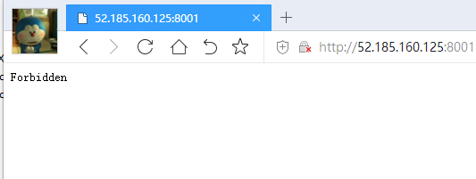
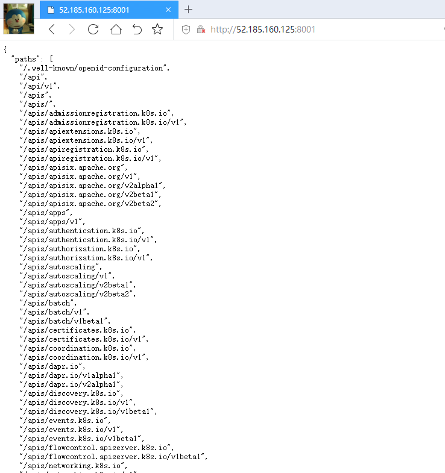
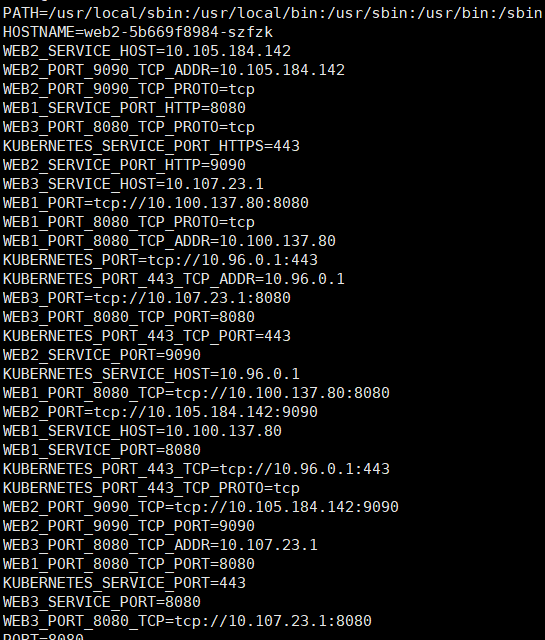

# 4.4 服务发现

服务发现、服务注册是微服务中必不可少的东西，Kubernetes 本身也提供了简单的服务发现，本章介绍如何通过 Service、DNS 等，对外暴露服务。

## proxy

### kubectl proxy

kubectl proxy 可以帮我们映射一个端口到节点中，主要用处是创建类似 Service NodePort 的访问服务。

例如  kubectl proxy 可在 localhost 和 Kubernetes API server 之间创建代理服务器或应用程序级网关，方便我们访问 API Server。

执行命令：

```
kubectl proxy
# 或指定访问端口，端口默认为 8001
kubectl proxy --port=8001
```

在本机上执行访问 `http://127.0.0.1:8001` 即可访问 API Server。

如果我们想在外网访问 API Server，可以使用 `--address`。

```
kubectl proxy --address=0.0.0.0 --port=8001
```

> 如果要在外网访问，需要添加头部认证信息，否则显示 “Forbidden 403”。这跟 API Server 有关，如果要映射别的服务，则不需要这样。




如果我们想允许所有 IP 访问，又不需要认证，则可以使用：

```
kubectl proxy --address='0.0.0.0'  --accept-hosts='^*$'
```

可以利用这种方式为 Api Server 暴露公网服务，然后使用 `kubeadm join` 通过公网 IP 将节点加入到集群中。




## 服务发现

### Service

利用常规的 Service、Endpoint ，也可以做服务发现，因为我们只需要知道一个 固定的 IP 即可，而不需要关心背后是谁在提供服务。通过创建 Service，可以获取一个单一的稳定的 IP，只要 Service 存在，其 IP 便不会变化，其背后的 Pod 可能增加或减少，但始终可以通过固定的 Service IP 进行访问。

一般，我们创建 Service，然后获得 Cluster IP，接着将 IP 写入程序的配置文件中。在下面这个 Service 中，我们能够获得其的 Cluster IP 和 暴露的 8080 端口。

```yaml
metadata:
  labels:
    app: web1
  name: web1
spec:
  clusterIP: 10.104.102.51
  ports:
    port: 8080
  selector:
    app: web1
```

但是这样有个缺点，需要提前将 IP 写到配置文件中。

在 [1.2章 的 容器化应用](../1.basic/2.containerized.md) 中，介绍了一个容器化应用应当遵从哪些设计原则，对于需要使用的远程服务，在配置文件中提前配置 IP ，不是一个好做法。如果 IP 通过配置文件记录，那么一旦打包好镜像，其配置文件无法再改变，除非更新版本，难道要为了一个配置项，更新程序版本？或者手动进入容器中修改配置文件，这样每个 Pod 都要手工进入容器，修改配置文件(这是一种极其愚蠢的做法，例如我上家公司)。

在 4.2 Endpoint 一章中，我们学会了如何解耦 Service 跟 Endpoint、Pod，在这里，我们将利用这个解耦，实现简单的服务发现。


### 通过环境变量发现 Service

我们有一个应用名为 my-app，需要访问 mysql 服务，那么我们该如何为 my-app 配置 mysql 服务的 IP 地址？

创建 Deployment，部署两个应用。

```bash
kubectl create deployment my-app --image=nginx:latest --replicas=1
kubectl create deployment mysql  --image=mysql:latest --replicas=1
```

创建 Service，为两个应用暴露端口：

```bash
kubectl expose deployment my-app --port=6666 --target-port=80
kubectl expose deployment mysql  --port=3306 --target-port=3306
```

获取 Service 列表：

```bash
root@instance-2:~# kubectl get services
NAME         TYPE        CLUSTER-IP       EXTERNAL-IP   PORT(S)          AGE
my-app       ClusterIP   10.109.136.115   <none>        6666/TCP         4m16s
mysql        ClusterIP   10.97.129.201    <none>        3306/TCP         7s
```

由于在创建 Service 之前，已经存在 Pod，这个 Pod 中不会有 Service 的环境变量，所以我们需要先删除这个旧的 Pod。

获取 Pod 列表，并删除由 my-app 创建的 Pod。

```bash
root@instance-2:~# kubectl get pods
NAME                     READY   STATUS    RESTARTS   AGE
my-app-d57587579-glh22   1/1     Running   0          37s

root@instance-2:~# kubectl delete pod my-app-d57587579-glh22
pod "my-app-d57587579-glh22" deleted
```

接着，ReplicaSet 会我我们重新创建一个 Pod，我们查看这个 Pod 的名称，然后进入 Pod 中的容器执行命令。

```bash
kubectl exec my-app-d57587579-rdsf7 my-app -- env
```

```
HOSTNAME=my-app-d57587579-wt5s8
MY_APP_SERVICE_HOST=10.109.136.115
MY_APP_SERVICE_PORT=6666

MYSQL_SERVICE_HOST=10.97.129.201
MYSQL_SERVICE_PORT=3306
```

> 所有环境变量名为大写字母，名称不支持特殊符号，例如 `my-app` 会被转为 `MY_APP`。

在 `*_SERVICE_HOST` 和 `*_SERVICE_PORT` 中，保存有 集群中所有 Service 的 IP，在 my-app 的 Pod 中，我们可以通过 `MYSQL_SERVICE_HOST` 环境变量获取 mysql 服务的 IP 地址，这便是一种服务发现。

在 Pod 中，可以使用 env 命令查看环境变量，里面有当前命名空间的 Service 信息。




### DNS/CoreDNS

在 kube-system 中，运行着一个 DNS 服务器，其名称为 coredns，在 Kubernetes 中，每个 Service 都会被赋予一个 DNS 名称(就像域名)，每当有新增的 Service 时，coredns 便会为此 Service 添加 DNS 记录。

```bash
kubectl get deployment  -n kube-system
```

```bash
NAME                      READY   UP-TO-DATE   AVAILABLE   AGE
calico-kube-controllers   1/1     1            1           13d
coredns                   2/2     2            2           13d
```

继续上一个小节中的内容，我们部署了 my-app 和 mysql，我们查看这两个 Service 的 DNS 名称：

```bash
nslookup my-app.default
nslookup mysql.default
```

> 。就像环境变量一样，每个 Pod 中的 `/etc/resolv.conf` 文件中，也会保存所有 Service 的 DNS 名称。
>
> 执行命令查询 DNS 列表：
>
> ```bash
> kubectl exec my-app-d57587579-rdsf7 my-app -- cat /etc/resolv.conf
> ```
>
> 不过，Pod 中的 `/etc/resolv.conf` 只能看到相同命名空间下的其它 Service。

按照官网文档，如果正常的话，查询结果类似：

```bash
Server:    10.0.0.10
Address 1: 10.0.0.10

Name:      kubernetes.default
Address 1: 10.0.0.1
```

如果输出跟笔者的一样，提示 `server can't find my-app.default: NXDOMAIN`，说明 coredns 有问题。

```bash
root@instance-2:~# nslookup my-app.default
Server:        127.0.0.53
Address:    127.0.0.53#53

** server can't find my-app.default: NXDOMAIN

root@instance-2:~# nslookup mysql.default
Server:        127.0.0.53
Address:    127.0.0.53#53

** server can't find mysql.default: NXDOMAIN
```

由于这个问题很麻烦，笔者暂时没能解决这个问题，因此这里就不再讲述了，读者可自行参考资料解决问题。

[https://github.com/kubernetes/dns/blob/master/docs/specification.md](https://github.com/kubernetes/dns/blob/master/docs/specification.md)

[https://kubernetes.io/zh/docs/tasks/administer-cluster/dns-debugging-resolution/](https://kubernetes.io/zh/docs/tasks/administer-cluster/dns-debugging-resolution/)

[https://github.com/aws/containers-roadmap/issues/1115](https://github.com/aws/containers-roadmap/issues/1115)

[https://github.com/coredns/deployment/blob/master/kubernetes/Upgrading_CoreDNS.md](https://github.com/coredns/deployment/blob/master/kubernetes/Upgrading_CoreDNS.md)

> 通过 Headless 发现服务，也是使用这种方式。
