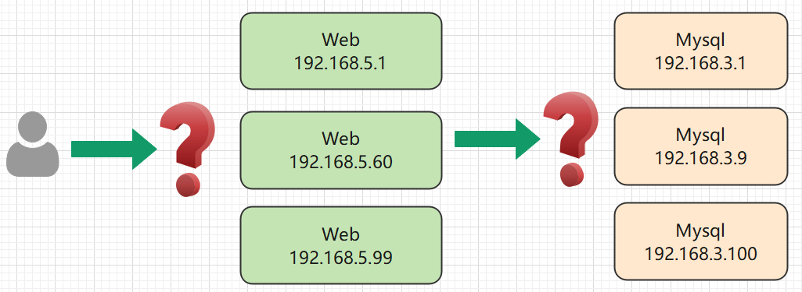

# 4.1 Service

### 导读

本章更加详细地深入了解 Service 。


## Service

Service 是将运行在一组 Pods 上的应用程序公开为网络服务的抽象方法。如果我们使用 Deployment 、Daemon 等部署 Pod，则可为此控制器创建 Service，Service 会监控此 Deployment 上增加或移除 Pod 的操作，自动为所有 Pod 提供网络服务。当然，Service 并不是指向 Deployment、Daemon 的，而是指向这些控制器上的 Pod，通过 Label 指向相关的 Pod。


### 没有 Service 时

假如有一组 Web Pod，如果 Web 动态伸缩副本数量或因为某些原因 IP/端口发生改变，那么我们很难追踪这种变化，我们如何在客户端访问这组 Web 服务？又假如 Web 服务、Mysql 分别部署在不同的 Pod 中，那么 Web 如何查找并跟踪要连接的 Mysql IP 地址？




可以使用 Service 解决这个问题。Kubernetes Service 定义了一种通常称为微服务的抽象，Service 为逻辑上的一组 Pod 提供可以访问它们的策略 。当使用 Service 为一组 Pod 创建服务时，无论我们创建了多少个 Pod 副本，这些 Pod 怎么变化，Pod A 不需要关心它们调用了哪个 Pod B 副本，而且不需要知道 Pod B 的状态也不需要跟踪 Pod B。因为Service 把 Pod 的这种关联抽象化，把它们解耦了。


### Service 的定义和创建

在之前的章节中，我们在 Deployment 对象上创建 Service，直接关联一个 Deployment 中的所有 Pod，并监控是否有新建或移除 Pod 。

如果我们通过 YAML 定义 Service，假如 Service 的网络类型是 `NodePort`，其模板如下：

```yaml
apiVersion: v1
kind: Service
metadata:
  name: my-service
spec:
  selector:
    app: MyApp
  ports:
    - protocol: TCP
      port: 6666
      targetPort: 80
  type: NodePort
```

跟以下命令是等效的：

```shell
kubectl create deployment nginx --image=nginx:latest --replicas=3
```

```shell
kubectl expose deployment nginx --type=NodePort --port=6666 --target-port=80
```

> 我们可以不设置 `targetPort`，默认情况下，`targetPort` 将被设置为与 `port` 字段相同的值。


自定义的 Service ，需要手动指定 `selector` 中的条件，Pod 的 Label 都会有 `app` 标签，表示此 Pod 的名称(一般是镜像名称)。 `targetPort` 为要映射的 Pod 的端口，port 为要提供给外界访问的端口，`6666:80`。


然后执行命令查看 Service：

```shell
kubectl get services
```

也就是说外部访问端口是 30424。

```text
NAME         TYPE        CLUSTER-IP      EXTERNAL-IP   PORT(S)          AGE
kubernetes   ClusterIP   10.96.0.1       <none>        443/TCP          7d7h
nginx        NodePort    10.100.66.200   <none>        6666:31672/TCP   14s
```

> 怎么访问这个 Service，请参考下一小节。


### Service 外部服务类型

Kubernetes 中可以将一个 Service 暴露到集群外部，外界可以通过 IP 访问这个 Service。Service 有个 ServiceType ，允许我们指定如何暴露服务。

Type 有四种类型，其取值说明如下：

* ClusterIP

  通过集群内部 IP 暴露服务，ClusterIP 是 ServiceType 的默认值。

* NodePort

  通过每个节点上的 IP 和静态端口（`NodePort`）暴露服务。由于其是节点上的 ，所以具有通过节点的公网 IP 访问这个服务。

* LoadBalancer

  使用负载均衡器向外部暴露服务。 外部负载均衡器可以将流量路由到自动创建的 `NodePort` 服务和 `ClusterIP` 服务上。需要云平台服务提供商的支持，分配公网 IP 才能使用。

* `ExternalName`

  通过返回 `CNAME` 和对应值，可以将服务映射到 `externalName` 字段的内容（例如，`foo.bar.example.com`）。

  > 需要使用 kube-dns 1.7 及以上版本或者 CoreDNS 0.0.8 及以上版本才能使用 `ExternalName` 类型。


ClusterIP、NodePort、LoadBalancer 三者是有关系的，前者是后者的基础。创建一个 NodePort 类型的 Service，必定带有一个 ClusterIP；创建一个 LoadBalancer，必定带有 ClusterIP、NodePort。


### 配置 ServiceType

我们删除之前 Deployment 部署 nginx 时，通过 expose 创建的 Service。

```shell
kubectl delete service nginx
```

然后重新创建 service。

```shell
kubectl expose deployment nginx --type=LoadBalancer --port=80 --target-port=6666
# 可以只填写 --port ，此时映射的端口跟 Pod 端口一致
```

查询 Service：

```text
NAME         TYPE           CLUSTER-IP     EXTERNAL-IP   PORT(S)        AGE
kubernetes   ClusterIP      10.96.0.1      <none>        443/TCP        29h
nginx        LoadBalancer   10.97.249.37   <pending>     80:31036/TCP   30s
```

```yaml
  ports:
  - nodePort: 31036
    port: 6666
    protocol: TCP
    targetPort: 80
  sessionAffinity: None
```

Service 不会直接直接把 Pod 暴露的 端口映射到公网，Service 会首先为 Deployment 创建一个 Cluster IP 端口，这个端口默认在 30000-32767 之间。

Service 是针对一个 Pod 或多个 Pod 起效，它为一组 Pod 暴露相同的端口。也就是说，同一个 Service 中的 Pod 不能分别设置不同的 端口。而且前面我们的一个 Service 中，是为一个 nginx 创建 Deployment ，并且设置副本集，所以他们的 端口是一致的。


当使用 LoadBalancer 暴露服务到集群外部网络时，云基础设施需要时间来创建负载均衡器并获取服务中的 IP 地址。如果使用的是 `minikube`、`kubeadm` 等创建的自定义 Kubernetes 集群，没有集成 LoadBalancer ，则会一直处于 `<Pending>` 状态。


### Service 如何选择 Pod

当我们通过外部网络访问时，Service 会自动提供其中一个 Pod 给我们。

```text
               ------------
               |         |
--- 访问  -->   |   pod1  |
               |   pod2  |
               |   pod3  |
               ------------
```

我们查看上一个小节创建的 Service 的 YAML 文件：

```YAML
  clusterIP: 10.100.66.200
  clusterIPs:
  - 10.100.66.200
... ...
  ports:
  - nodePort: 31672
    port: 6666
    protocol: TCP
    targetPort: 80
```

此 Service 的 IP 是 10.100.66.200，其类型是 ClusterIP，可以在集群内部所有节点上访问，如果集群没有安装网络插件，则 master 节点上是没法访问的。

由于我们使用的是 `NodePort` 网络类型，所以会生成一个 node 端口，此端口会映射到节点本地网络上。例如可以通过任意能够连接此节点的 IP 进行访问，例如 `127.0.0.1:31672`，或者访问此节点的内网 IP、公网 IP 。


现在知道外界怎么访问此 Service，我们再来看看，Service 怎么选择哪个 Pod 提供服务。


我们查看通过 Deployment 创建的 pod：

```shell
kubectl get pods -o wide
```

```text
NAME                        IP              NODE       NOMINATED NODE   READINESS GATES
nginx-55649fd747-9fzlr    192.168.56.56    instance-2   <none>           <none>
nginx-55649fd747-ckhrw    192.168.56.57    instance-2   <none>           <none>
nginx-55649fd747-ldzkf    192.168.23.58    instance-2   <none>           <none>
```


然后我们通过命令查看 iptables 配置：

```shell
iptables-save
```

t在终端控制台中查找 `random` 关键字：


你可以看到有三个 `default/nginx`， 第一个 pod 被访问的机会是 `0.33333...`。在剩下的 2/3 的概率中，有 0.5 的概率选择第二个 Pod，剩下的 1/3 概率选择第三个 Pod。这种随机选择的模式称为 iptables 代理模式。


### kube-proxy 三种代理模式

当我们使用命令创建一个 Service 时，可看到每个 Service 都有一个 IP 地址，这是由 kube-proxy 负责为 Service 实现的一种虚拟 IP ，即 `ClusterIP`。

kube-proxy 可以为多个 Pod 创建一个统一的代理，在访问 Service 时，自动选择一个 Pod 提供服务，至于如何选择 Pod，kube-proxy 有三种模式。

* userspace 代理模式

* iptables 代理模式(默认)

* IPVS 代理模式

在这些代理模式中，客户端可以在不了解 Kubernetes 服务或 Pod 的任何信息的情况下，将 Port 代理到适当的后端。


#### userspace 模式

userspace 模式下， kube-proxy 通过轮转算法选择后端。

对每个 Service，它会在本地 Node 上打开一个端口(端口号大于 30000)。 任何连接到此端口的请求，都会被代理到 Service 后端的某个 `Pod` 上。 使用哪个后端 Pod，是 kube-proxy 基于 YAML 的 `SessionAffinity` 终端来确定的。

最后，它配置 iptables 规则，捕获到达该 Service 的 `clusterIP` 和 `Port` 的请求，并重定向到代理端口，代理端口再代理请求到后端 Pod。

```
访问 -> clusterIP -> 代理 -> 任一 Pod
```


#### iptables 代理模式

kube-proxy 默认模式。iptables 代理模式的策略是，kube-proxy 在 iptables 模式下**随机选择一个 Pod**。

它会为每个 Service 配置 iptables 规则，捕获所有访问此 Service 的 `clusterIP`请求，进而将请求重定向到 Service 的一组后端中的某个 Pod 上面。 对于每个 Endpoints 对象，它也会配置 iptables 规则，这个规则会选择一个后端组合。


使用 iptables 处理流量具有较低的系统开销，因为流量由 Linux netfilter 处理， 而无需在用户空间和内核空间之间切换， 这种方法也可能更可靠。

如果 kube-proxy 在 iptables 模式下运行，如果随机所选的第一个 Pod 没有响应， 则连接会失败，在这种情况下，并会自动使用其他后端 Pod 重试 。


#### IPVS 代理模式

与其他代理模式相比，IPVS 模式还支持更高的网络流量吞吐量。与 iptables 模式下的 kube-proxy 相比，IPVS 模式下的 kube-proxy 重定向通信的延迟要短，并且在同步代理规则时具有更好的性能。 

IPVS 提供了更多选项来平衡后端 Pod 的流量。 这些是：

- `rr`：轮替（Round-Robin）
- `lc`：最少链接（Least Connection），即打开链接数量最少者优先
- `dh`：目标地址哈希（Destination Hashing）
- `sh`：源地址哈希（Source Hashing）
- `sed`：最短预期延迟（Shortest Expected Delay）
- `nq`：从不排队（Never Queue）


### Service 暴露多端口

如果要在 Service 中暴露多个端口，则每个端口都需要设置一个名字。

```yaml
    ports:
    - name: p1
      port: 2323
      protocol: TCP
      targetPort: 81
    - name: p2
      port: 6666
      protocol: TCP
      targetPort: 82
```


### 服务别名

前面已经介绍了 ClusterIP、NodePort 两种 Service 类型，在这些类型中，都是通过 IP 来访问应用，其实我们也可以给 Service 设置一个别名，通过别名直接访问 Service。

这种方法也是服务发现的一种方式，我们可以通过固定的 域名去访问需要的 Service，而不需要固定 Service IP。

创建一个 Deployment：

```shell
kubectl create service nginx deployment nginx
```

定义 Service：

```yaml
apiVersion: v1
kind: Service
metadata:
  name: nginx
spec:
  type: ExternalName
  externalName: 666.my.com
  ports:
  - port: 80
```

通过 `kubectl apply -f` 应用此 YAML 文件后，查看 Service 列表：

```
NAME         TYPE           CLUSTER-IP   EXTERNAL-IP   PORT(S)   AGE
kubernetes   ClusterIP      10.96.0.1    <none>        443/TCP   12d
nginx        ExternalName   <none>       666.my.com    80/TCP    23s
```

访问此服务别名：

```shell
$> curl 666.my.com
<html>
<head><title>404 Not Found</title></head>
<body>
<center><h1>404 Not Found</h1></center>
<hr><center>nginx</center>
</body>
</html>
```

> 在 Nginx 中，如果通过 IP 访问 80 端口，可以直接访问 Nginx；如果通过域名访问 Nginx，Nginx 没有查找到已配置的网站，会返回 404。实际上能够访问到 Nginx，说明我们的 Service 已经生效了。