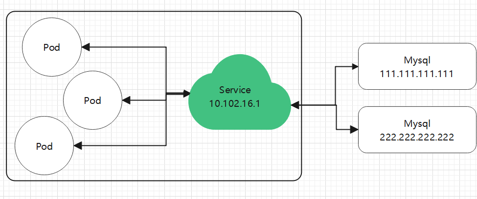

# 4.2 Endpoint

### 导读

当我们为一个 Deployment 等对象创建一个 Service 时，Service 会自动创建 Endpiont。

我们查看默认命名空间的 Endpoint：

```
kubectl get endpoints
```

```
NAME         ENDPOINTS                                            AGE
kubernetes   10.170.0.2:6443                                      3d7h
nginx        192.168.56.24:80,192.168.56.25:80,192.168.56.26:80   59m
```

```
nginx-55649fd747-67twm   1/1     Running     0          5d21h   192.168.56.24 
nginx-55649fd747-vntwb   1/1     Running     0          5d21h   192.168.56.25   
nginx-55649fd747-wmrlv   1/1     Running     0          5d21h   192.168.56.26
```

可以看到，Endpoint 中的多个 IP，对应了每一个 Pod 的 IP，其显示的端口，也正是我们需要暴露的端口。

Endpoint 可以暴露一组 Pod 的 IP 地址和端口列表，供 Service 等使用。

假如，公司创建了 A、B 两个开发小组，独立开发一个产品，其中 A 应用依赖 B 应用，需要通过远程访问获取 B 中的数据。由于两个小组都刚刚成立，各方面都还没有确定，我们如何在尽快为两个小组在远程调用上达成一些确定？使用 Consul 等服务注册和发现？这也太复杂了吧，而且 IP 也需要提前确定呀，也没有更简单的方法呢？

## 创建 Endpoint、Service

本节将介绍如何手动创建 Endpoint、Service。

### 创建 Service

编写 service.yaml 文件内容如下如下：

```yaml
apiVersion: v1
kind: Service
metadata:
  name: nginx
spec:
  ports:
    - protocol: TCP
      port: 6666
      targetPort: 80
```

> Service 跟 Endpoint 不能直接关联，两者通过 `metadata.name` 中定义相同的名称进行区配。

应用 YAML：

```
kubectl apply -f service.yaml
```

查看 Service ：

```bash
kubectl get services
```

```
NAME         TYPE        CLUSTER-IP      EXTERNAL-IP   PORT(S)    AGE
kubernetes   ClusterIP   10.96.0.1       <none>        443/TCP    12d
nginx        ClusterIP   10.96.204.132   <none>        6666/TCP   14s
```

由于此 Service 没有定义选择器，因此 Service 不会自动创建 Endpoint，另外此 Service 没有 Pod 可用，暂时不能提供可用的服务。

但是，此时已经能够确定一个名为 nginx 的 Service 的 IP 地址，实际上此 IP 已经可以确定。我们把各个环节解耦了，我们无需先确定具体的应用，A、B 两个开发组，可以创建一个空的 Service，确定了 IP 和端口，然后 A、B 组继续开发应用，待 B 组开发完成后，直接部署 Pod；而 A 组可以在 B 应用没有开发完成前，就可以确定要使用的 IP。在这里，我们假设 B 组的应用叫 nginx。

### 创建应用

现在 B 组开发出了应用的雏形，可以使用一部分功能了，那么要先部署到云端，让 A 组连接测试。

我们随便找台 Worker 或者 Master 节点，创建一个 nginx 容器：

```
docker run -itd -p 80:80 nginx:latest
```

为什么不用 Pod，直接创建容器？因为我们处于开发阶段，如果把 nginx 改成 mysql，我们要 Debug 呢？测试自己的数据库呢？要模拟数据呢？如果直接使用 Pod，调试会比较麻烦，我们在生产时再通过 Deployment 创建应用，但是此时我们可以使用 Docker 部署自己的数据库或者本地应用，Docker 调试比较容易，同时也很容易操作。

总之，我们创建了 Service，可以提供了抽象，至于怎么提供这个服务，我们可以使用 Pod ，也可以直接使用 Docker，也可以在服务器中直接使用命令启动程序而不使用容器。总之，我们目前把多个环节解耦了，A 组只需要关心通过 Service 中的 IP 和端口能够访问到 B 应用即可；对应 B 组，其开发的应用还处于迭代中，直接上 Kubernetes ，不是一个好选择，可以临时使用 Docker 快速部署。

在前面，Docker 已经部署完成了，接着查询这个容器的 ip，：

```
docker inspect {容器id} | grep IPAddress
```

笔者得到的是结果是`"IPAddress": "172.17.0.3"`，我们可以在当前服务器中使用 `curl 172.17.0.3` ，测试是否能够访问 nginx，如果没问题我们来进行下一步操作。

### 创建 Endpoint

现在，我们创建了 Service，能够给 A 组的应用提供一个 IP 和端口，同时 B 组也提供了一个临时测试的后端(什么形式都行)，但是现在 Service 还没有关联这个后端，暂时不能通过 Service 访问 B 应用，接下来我们将这两者关联起来。

创建一个 endpoint.yaml 文件，内容如下(注意替换ip为你容器访问ip)：

```yaml
apiVersion: v1
kind: Endpoints
metadata:
  name: nginx
subsets:
  - addresses:
      - ip: 172.17.0.3
    ports:
      - port: 80
```

> `metadata.name` 名称必须跟 Service 一致，否则不会相区配。

然后应用此 yaml：

```
kubectl apply -f endpoint.yaml
```

查看 Endpoint：

```
kubectl get endpoints
# 不能填写成 endpoint
```

```
NAME         ENDPOINTS         AGE
nginx        172.17.0.3:80     7s
```

然后访问 Service 中的 IP：

```
curl 10.96.204.132:6666
```


如果 Endpoint 需要跟踪多个 IP (多个 Pod 或者容器或者应用)，可以使用：

```
  - addresses:
      - ip: 172.17.0.2
      - ip: 172.17.0.3
      - ip: 172.17.0.4
      ... ...
```

我们定义好 Service 和 Ednpoint 后，后续 Debug 应用时，可以手动添加实例数量，让 B 应用一直能够快速迭代。如果 B 应用开发完毕，则应该使用 Pod 部署。

后续使用 Pod 时，修改其 `metadata`，加上选择器。

```yaml
metadata:
  annotations:
  labels:
    app: ngin
  name: nginx
  namespace: default
```

### 连接外部服务

假如，应用依赖于 Redis 、Mysql，但是考虑了自建 Mysql 的复杂性和宕机修复难度，决定使用云平台的 Mysql 服务。

好的，现在公司买了云平台的 多节点 Mysql 服务，其中有两个主 节点，对外提供服务，其 IP 分别为：

```
111.111.111.111
222.222.222.222
```

那么，我们怎么在 A 应用中访问 Mysql？写死 IP？但是现在有两个 Mysql IP，代码里面只能写一个呀，这样怎么做负载均衡？

此时，还是可以使用 Service、Endpoint 的。无非就是在 Endpoint 的 IP 列表中，使用公网 IP。

```yaml
  - addresses:
      - ip: 111.111.111.111
      - ip: 222.222.222.222
      ... ...
  - ports: 
      - port: 3306
```

这样，在集群中还是可以使用 Service 的 IP(内网)，A 应用不需要知道有多少个 Mysql 实例，也不需要知道 Mysql 的 IP 会不会变化或者某一天挂掉了，也不需要关心平衡访问 Mysql 的流量，我们只需要知道 Service 的 IP 即可。



在上一章中，我们也学习了 Service 的 别名模式，在需要的时候，我们也可以使用固定的域名(别名)模式，创建 Service，这样我们通过固定的域名(别名)访问其它服务即可，而无需担心使用了哪个 Service 服务，不需要担心 Service IP 有变化。
