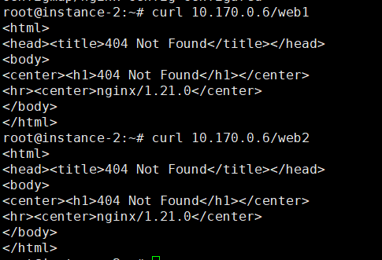
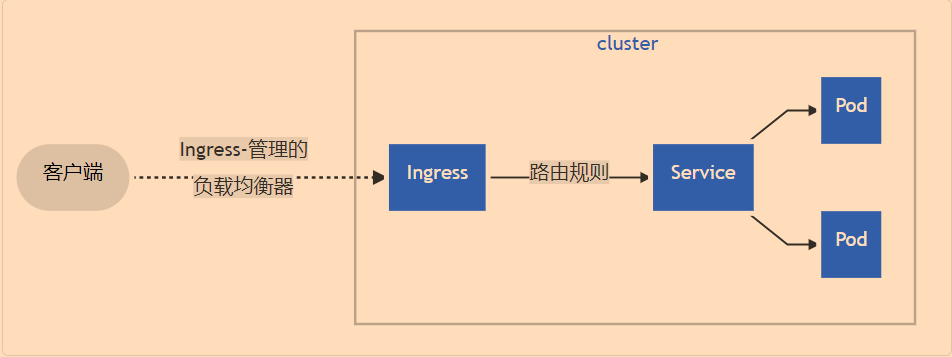
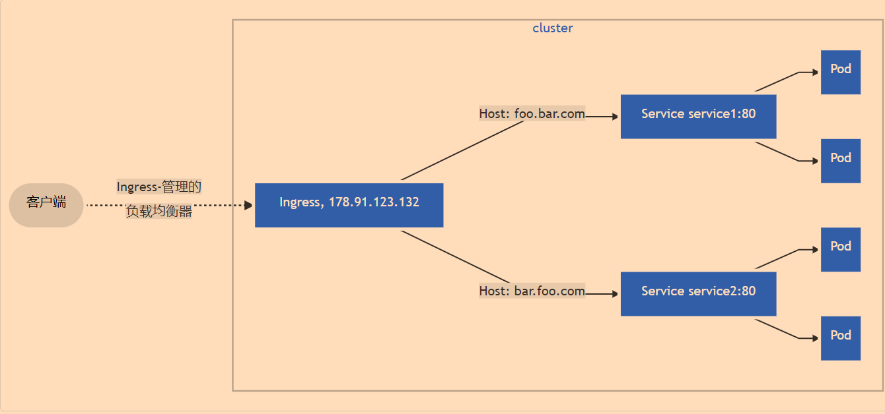

# 4.3 Ingress

### 导读

我们做网站时，使用 Nginx 做 Web 服务器，会使用一个子域名绑定一个网站，`a.xxx.com` 绑定 A 网站，`b.xxx.com` 绑定 B 网站，这样在一个域名的不同子域名可以访问不同的站点，对于现在的大多数互联网网站，依然会使用这种方法划分。


在微服务架构中，多个模块部署在不同的服务器上，则但是我们希望都通过 `xxx.com` 这个域名直接访问，就好像所有模块都在一起，让用户感觉只有一个网站。则可能会使用目录路径对模块进行划分，例如如果我们要实现 `xxx.com/a` 访问 A 模块，`xxx.com/b` 访问 B 模块，但对用户来说，一直在访问 `xxx.com` 这个域名。

这种需求，我们可以使用 nginx 进行反向代理，而在 Kubernetes 中，这种需求也是一模一样的。


首先，我们可以为 A、B、C 等应用，创建多个 Service，每个 Service 访问一个应用，然后使用 Ingress 配置路由规则，决定 URL 可以访问哪个 Service。


> Ingress 公开了从集群外部到集群内服务的 HTTP 和 HTTPS 路由，Ingress 资源上定义的规则控制了路由。


Ingress 可以让集群中的多个 Service 能够从集群外访问，Ingress 还提供负载均衡、SSL/TLS 和基于名称的虚拟服务器等，Ingress 可以配置边缘路由器或其他前端工具来帮助处理网络流量，但是一般都是通自己的负载均衡器来实现。


### Ingress 与 Service

在前面，我们已经学习到了 Service，通过 Service 我们可以暴露一个端口到外网中，通过这个端口可以访问应用。

其中，有两种方法可以暴露 Service，可以让其被集群外部访问：

* 使用 `Service.Type=LoadBalancer`
* 使用 `Service.Type=NodePort`


Service 的访问方式是 IP，每次要将服务公开给外界时，都必须创建一个新的 LoadBalancer 并向云服务商获取一个公网 IP 地址。或者使用 `NodePort`，但是只能在一台服务器上被访问，而且 Service 只能为一种 Pod 服务，暴露一个或多个端口，那么 N 个服务，就需要创建 N 个 Service。Service 虽然能够公开端口到外部网络中，但是无法将这些服务合并到一个 `example.com/{服务}` 中访问，Service 需要通过不同的端口访问。

如果你有一个 `example.com` 域名，你部署了多个 Web 服务，其中有两个子模块分别为课程(course)、考试(exam) 两个微服务，这些模块构成了一个培训网站。此时我们希望访问 `example.com/api/course` 能够访问课程学习模块，访问 `example.com/api/exam` 能够访问考试模块。显然，Service 是无法做到的。


使用 Ingress ，可以轻松设置路由规则，而且无需创建一堆 LoadBalancers/Nodes 公开每个服务，并且 Ingress 本身具有很多功能。

>Ingress 也需要 Service 。


## 安装 Ingress 控制器

Ingress 控制器有多种实现，其中 Kubernetes 官方有一个名为 Ingress-nginx 的实现，其它实现还有 Kong Ingress、Traefik、HAProxy Ingress 等，在本章中，我们只安装使用 Ingress-nginx ，其它控制器请参考官方文档： [https://kubernetes.github.io/ingress-nginx/deploy/\#provider-specific-steps](https://kubernetes.github.io/ingress-nginx/deploy/#provider-specific-steps)


### 安装

#### 普通安装方法

直接通过官方的 YAML 文件创建：

```shell
kubectl apply -f https://raw.githubusercontent.com/kubernetes/ingress-nginx/controller-v0.46.0/deploy/static/provider/cloud/deploy.yaml
```

> 此方法比较便利，推荐使用。


#### 使用 Helm

Helm 是一个 Kubernetes 上的打包工具，如果服务器中已经有 Helm，那么我们通过 Helm 工具安装 ingress-nginx：

```shell
helm repo add ingress-nginx https://kubernetes.github.io/ingress-nginx
helm repo update

helm install ingress-nginx ingress-nginx/ingress-nginx
```

检测安装的版本：

```shell
POD_NAME=$(kubectl get pods -l app.kubernetes.io/name=ingress-nginx -o jsonpath='{.items[0].metadata.name}')
kubectl exec -it $POD_NAME -- /nginx-ingress-controller --version
```


#### 检查

接下来我们检查是否有成功安装 ingress-nginx 控制器，安装 ingress 控制器完成后，在 kube-system 命名空间会有相关的 Pod 出现。

```shell
kubectl get services --all-namespaces
```

```
ingress-nginx-controller LoadBalancer   10.104.67.226    <pending>     80:31397/TCP,443:31021/TCP
```

找到名为 ingress-nginx-controller 的 Pod，查看其 IP 和端口，通过 HTTP 访问：

```text
root@instance-2:~# curl 10.104.67.226
<html>
<head><title>404 Not Found</title></head>
<body>
<center><h1>404 Not Found</h1></center>
<hr><center>nginx</center>
</body>
</html>
```

返回 404，说明 ingress 控制器已经部署上了，并且功能正常。


#### 快速实践

这里我们快速创建一个简单的 Ingress，练习一下。

创建 Pod：

```shell
kubectl create deployment nginx --image=nginx:latest --replicas=3
```


通过命令创建 Service：

```shell
kubectl expose deployment nginx --type=NodePort --port=8080 --target-port=80
```

或使用 YAML 创建：

```yaml
kind: Service
apiVersion: v1
metadata:
  name: nginx
spec:
  ports:
    - protocol: TCP
      port: 8080
      targetPort: 80
  selector:
    app: nginx
```


创建 Ingress 服务：

```yaml
apiVersion: networking.k8s.io/v1
kind: Ingress
metadata:
  name: test-ingress
spec:
  rules: 
  - host: my666.com
  defaultBackend:
    service:
      name: nginx
      port:
        number: 8080
```

> 如果执行 `kubectl apply -f` 时出现问题，请参考下一小节。


获取 ingress：

```
root@instance-2:~# kubectl get ingress
NAME           CLASS    HOSTS     ADDRESS   PORTS   AGE
test-ingress   <none>   my666.com            80      2m7s
```

由于其没有自动生成 `ADDRESS`，所以这里暂时不能访问，后面会提及如何解决这个问题。

>跟 Service 的 `Service.Type=LoadBalancer` 一样，需要云平台服务商支持，如果不使用 Kubernetes 支持的公有云平台，那么 ADDRESS 地址为空，但是我们可以手动加上一个可用的 IP。
>
>这个 IP 是一个公网 IP，云服务商提供一个 公网 IP 给我们后，我们可以把 my666.com 域名解析 A 记录到此 IP 中，然后访问 my666.com 时，就会访问到具体的服务。


#### 解决小问题

如果应用 YAML 文件创建 Ingress 时，出现下面的提示，我们需要做些修改才能成功创建 ingress。

```text
Error from server (InternalError): error when creating "ingress.yaml": Internal error occurred: failed calling webhook "validate.nginx.ingress.kubernetes.io": Post "https://ingress-nginx-controller-admission.ingress-nginx.svc:443/networking/v1beta1/ingresses?timeout=10s": dial tcp 10.98.246.133:443: i/o timeout
```


使用下面的命令查看 webhook

```shell
kubectl get validatingwebhookconfigurations
```

```text
NAME                      WEBHOOKS   AGE
ingress-nginx-admission   1          4h5m
```

删除 ingress-nginx-admission ：

```shell
kubectl delete -A ValidatingWebhookConfiguration ingress-nginx-admission
```

接着重新创建 Ingress 即可。


## 创建和使用 Ingress

接下来，我们将实际创建 Ingress，在本小节中，将使用 `hello-world.info` 域名，通过 `/web1` 访问一个网站，`web2` 访问另一个网站。


### 部署 web

使用 Kubernetes 官方的容器创建一个 Hello world 的网站应用。

```shell
kubectl create deployment web1 --image=nginx:latest --replicas=3
kubectl create deployment web2 --image=nginx:latest --replicas=3
```

创建 Service，暴露端口:

```shell
kubectl expose deployment web1 --type=NodePort --port=8080 --target-port=80
kubectl expose deployment web2 --type=NodePort --port=9090 --target-port=80
```

查看 Service 信息：

```text
NAME     TYPE      CLUSTER-IP      EXTERNAL-IP   PORT(S) 
web1   NodePort    10.99.210.118   <none>        8080:30322/TCP 
web2   NodePort    10.108.109.150  <none>        9090:32063/TCP
```


通过 ClusterIP 可以访问对于的 nginx 应用，其端口为 8080 或 9090。


### 创建 Ingress

这里我们为 Ingress 配置路由规则，访问 `/web1`、`/web2` 时，是在访问不同的应用，其中我们约定，要绑定的域名是 hello-world.info。

```yaml
apiVersion: networking.k8s.io/v1
kind: Ingress
metadata:
  name: test-ingress
  annotations:
    nginx.ingress.kubernetes.io/rewrite-target: /$1
spec:
  rules:
    - host: hello-world.info
      http:
        paths:
          - path: /web1
            pathType: Prefix
            backend:
              service:
                name: web1
                port:
                  number: 8080
          - path: /web2
            pathType: Prefix
            backend:
              service:
                name: web2
                port:
                  number: 9090
```


查看 Ingress：

```text
 kubectl get ingress
 kubectl describe ingress
```

```shell
root@instance-2:~# kubectl get  ingress 
NAME              CLASS    HOSTS              ADDRESS   PORTS   AGE
example-ingress   <none>   hello-world.info             80      6s
root@instance-2:~# kubectl describe  ingress 
Name:             test-ingress
Namespace:        default
Address:          
Default backend:  default-http-backend:80 (<error: endpoints "default-http-backend" not found>)
Rules:
  Host              Path  Backends
  ----              ----  --------
  hello-world.info  
                    /web1   web1:8080 (192.168.56.1:80,192.168.56.2:80,192.168.56.63:80)
                    /web2   web2:9090 (192.168.56.3:80,192.168.56.4:80,192.168.56.5:80)
Annotations:        nginx.ingress.kubernetes.io/rewrite-target: /$1
Events:
  Type    Reason  Age   From                      Message
  ----    ------  ----  ----                      -------
  Normal  Sync    11m   nginx-ingress-controller  Scheduled for sync

```


由于我们没有使用到支持 Kubernetes 服务的公有云服务器，因此这里不会生成 ADDRESS，但是我们可以自己配置。

查询你的 服务器的 IP：

```shell
hostname -i
# 或
kubectl get nodes -o wide
```


创建 ingress-config.yaml 文件，填写下列内容(请替换 `10.17.0.4` 为你的 IP)：

```yaml
kind: ConfigMap
apiVersion: v1
metadata:
  name: nginx-config
  namespace: ingress-nginx
data:
  proxy-connect-timeout: "10s"
  proxy-read-timeout: "10s"
  client-max-body-size: "2m"
  external-status-address: "10.170.0.6"
```


然后通过`10.170.0.6/web1`、 `10.170.0.6/web2` 可以访问到你的应用。



由于我们没有为 Ingress 提供可以访问的公网 IP ，因此没办法绑定域名，但是我们可以修改内网的 DNS，使得在内网可以通过域名访问。

打开 `/etc/hosts ` 文件，添加一行：

```shell
10.170.0.6 hello-world.info
```

之后直接访问 `curl http://hello-world.info/web1` 、`curl http://hello-world.info/web2` ，便可以访问到具体的 nginx 服务。


## Ingress

在前面，我们使用一个 Ingress 关联了多个 Service，其简化 YAML 如下：

```yaml
  rules:
		... ...
            backend:
              service:
                name: web1
            backend:
              service:
                name: web2
```


可以看到，这个 Ingress 关联了 Service，不过，Ingress 并不是通过 Service 转发流量。

我们通过 `kubectl describe ingress` 可以看到：

```shell
Rules:
  Host              Path  Backends
  ----              ----  --------
  hello-world.info  
                    /web1   web1:8080 (192.168.56.1:80,192.168.56.2:80,192.168.56.63:80)
                    /web2   web2:9090 (192.168.56.3:80,192.168.56.4:80,192.168.56.5:80)
```

当用户访问 `hello-world.info/web1` 时，Ingress 并不会将用户请求转发给 Service web1，而是通过 Service web1 选择一个 Pod，这个 Pod 列表和 Pod 的 IP 列表，是 Endpoint 提供的。


当用户请求时 `hello-world.info` 时，会首先进行 DNS 查找，获取实际请求的 IP，然后请求会发送到 ingress-nginx 这个 Ingress 控制器，接着 Ingress 控制器根据请求的 HOST/URL 确定要访问哪个 Service，最后根据 Service 关联的 Endpoint 对象，查看 Pod 的 IP，最后，Ingress 控制器将请求转发给其中一个 Pod。


### Ingress 结构

Ingress 由 Ingress Controller、Ingress API 两部分组成，为了让 Ingress 资源工作，集群必须有一个正在运行的 Ingress 控制器，在前面，我们使用了 ingress-nginx 控制器。 Ingress 控制器 负责满足 Ingress 中所设置的规则，即路由规则，例如 nginx，我们脱离 Kubernetes，单独部署使用 nginx 也可以完成这个需求。


由于 CKAD 认证中，只要求掌握 Ingress 控制器，而且很多书中都不会深入 ingress，所以这里笔者不再深入讲解，读者可以自行参考官方文档。

我们还可以使用其它 ingress 控制器，例如经常提及到的 Istio，详细可以参考官方完整名单：

[https://kubernetes.io/zh/docs/concepts/services-networking/ingress-controllers/\#其他控制器](https://kubernetes.io/zh/docs/concepts/services-networking/ingress-controllers/#其他控制器)

[https://kubernetes.github.io/ingress-nginx/user-guide/nginx-configuration/configmap/](https://kubernetes.github.io/ingress-nginx/user-guide/nginx-configuration/configmap/)


### Ingress 类型

在深入 Ingress 之前，我们来了解一下 Ingress 的类型/架构，这也称为调度方式，这可以帮助我们了解如何设计 Ingress。


#### 默认后端

在 Ingress 中，当用户请求的 URL 没有任何区配的 Service 可用时，会返回 404，但是我们可以指定一个默认后端(Service)，当请求的 URL 不存在时对应路由规则时，此请求会被路由到默认的后端(Service)中。

```yaml
spec:
  defaultBackend:
    resource:
      apiGroup: k8s.example.com
      kind: StorageBucket
      name: static-assets
  rules:
    - http:
        paths:
          - path: /icons
            pathType: ImplementationSpecific
            backend:
            ... ...
```


#### 单个 Service

这种 Ingress 只有一个 后端，即一个 Service ，Ingress 会将所有流量都发送到同一 Service 的简单 Ingress。

由于其只需要一个 Service，我们可以直接使用 `DefaultBackend` 指定一个 Service 即可，如 `快速实践` 一小节中的 Ingress 模板。

```yaml
spec:
  defaultBackend:
    service:
      name: nginx
      port:
        number: 8080
```

```YAML
spec:
  defaultBackend:
    resource:
      apiGroup: my666.com
      kind: StorageBucket
      name: static-assets
```




#### 简单扇出

一个扇出配置(带`rule`)根据请求的 HTTP URL， 将来自同一 IP 地址的流量路由到多个 Service中，这种方式也称为 URL 映射，即我们在前面创建的多 Service 。


> 如果用户请求的 URL，没有 `hosts` 或 `paths` 与 Ingress 对象中的 HTTP 请求匹配，则流量将路由到默认后端。


#### 基于名称的虚拟托管

即域名模式，Ingrss 根据域名的不同，将请求转发到不同的 Pod 中，一般会使用不同的子域名访问不同的 Service。




#### TLS

Ingress 也支持 HTTPS，通过 SSL 证书为 HTTPS 提供安全保障。

当我们在云服务商的域名处，为域名分配 SSL 证书后，获取 `.key`、`.crt` 两个证书文件， TLS Secret 必须包含名为 `tls.crt` 和 `tls.key` ，然后使用命令将证书保存到 Kubernetes 的 Secret 对象中。

```shell
kubectl create secret tls {secret名称} --key {证书名称}.key --cert {证书名称}.crt
```

然后在 Ingress 对象的 YAML 文件中，加上 TLS 证书：

```yaml
spec:
  tls:
  - hosts:
    - mywebsite.com
    secretName: {secret名称}
  rules:
  - http:
  ... ...
```

> TLS 连接终止于 Ingress 端，客户端跟 Ingress 之间通过 HTTPS 传输，然后 Ingress 将流量转发到 Pod 中，此时以 HTTP 传输，Pod 中的 Web 应用不需要支持 HTTPS。


我们也可以不使用 secret，TLS 证书直接附加到 Ingress YAML 中，如：

```yaml
apiVersion: v1
kind: Secret
metadata:
  name: testsecret-tls
  namespace: default
data:
  tls.crt: base64 编码的 cert
  tls.key: base64 编码的 key
type: kubernetes.io/tls
```


