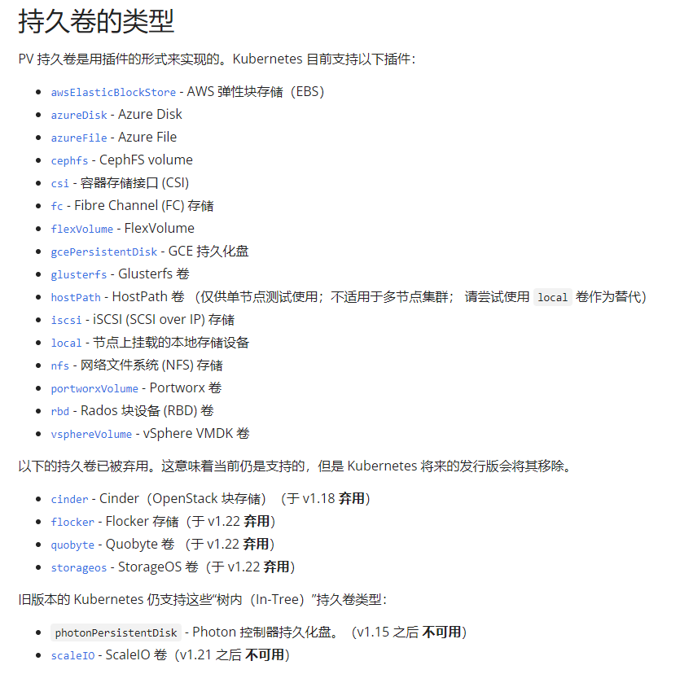

# 5.3 持久卷

开门见山，PV、PVC 将存储卷分为实际卷和声明卷两部分，面向对象语言中将抽象部分写成接口，将实现部分写成类。大概过程是这样的，运维人员可以将实际存储空间创建为卷，即 PV，每个卷都有其空间容量、访问权限，这些卷创建后会提交给 Kubernetes ，并记录下来。开发人员可以在程序中使用卷，但是开发人员不知道、也不能指定哪个卷可以使用，部署应用时，编写 PVC，定义了此程序需要多少容量的卷，接着会向 Kubernetes 发出请求要使用卷，例如需要 2GB 的存储空间，然后 Kubernetes 查找符合要求的 PV，并将 PVC 和 PV 绑定起来。PV 和 PVC 两个称为 持久卷和持久卷声明。


在本章中，需要根据上一章安装好的 NFS Server 和 Client 来做实验，请读者提前搭建好环境。


## 持久卷和持久卷声明

如果 Pod 本身没有什么存储要求，那么 Pod 做成无状态是很容易的，但是实际上 Pod 需要使用 Redis、Mysql 等存储数据，这是日常开发中必不可少的，如果有 N 个节点，1 个 Mysql 实例不够用了，需要部署 M 个 Mysql 服务，此时这 M 个 Mysql 实例，必须保证数据完全一致，否则短时间请求 Mysql 服务得到的数据可能不一样。不过问题也不大，因为 Pod 们使用了同一个 Mysql 集群，只要解决 Mysql 多节点的 一致性问题，对 Pod 来说就可以保持一致性。

但是对于存储来说，如果没有方法像 Mysql 一样存储 Pod 的文件，那么 Pod 只能在节点的存储器中读写文件内容，而每个节点的文件系统和磁盘是不能共用，它们存储的内容不会自动合在一起，那么每个 Pod 就会产生差异性。例如用户上传文件到应用中，如果直接存储到本地时，这个文件在其他节点不存在，如果用户取文件时，访问的 Pod 不是上次上传文件的 Pod，那么便取不到文件。当然，可以用对象存储解决这个问题，也可以使用 NFS 或者各大云厂商的云硬盘产品。


持久卷的类型很多，这里笔者就不一一举例了，笔者从官方文档中截图如下：




本章将介绍如果使用 NFS 搭建自己的分布式存储系统。


### 创建远程存储空间

这一步目的是创建云硬盘，能够为所有节点提供存储服务，即是分布式存储，所有节点所有 Pod 挂载同一个存储服务，所有 Pod 向同一个存储空间写入文件，与此同时读取的是最新的文件内容。

在上一章中的  NFS Server 服务器，创建一个 `/data/volumns` 目录，这些目录存储空间由于创建卷。

创建 5 个共享目录：

```bash
mkdir /data
mkdir /data/volumns
mkdir /data/volumns/1
mkdir /data/volumns/2
mkdir /data/volumns/3
mkdir /data/volumns/4
mkdir /data/volumns/5
```

```bash
echo "/data/volumns/1 *(rw,no_root_squash,sync)" >> /etc/exports
echo "/data/volumns/2 *(rw,no_root_squash,sync)" >> /etc/exports
echo "/data/volumns/3 *(rw,no_root_squash,sync)" >> /etc/exports
echo "/data/volumns/4 *(rw,no_root_squash,sync)" >> /etc/exports
echo "/data/volumns/5 *(rw,no_root_squash,sync)" >> /etc/exports
```
刷新 NFS 服务器共享目录信息：

```bash
exportfs -r
```

查看共享目录：

```bash
root@master:~# exportfs
/nfs-share    	<world>
/data/volumns/1
		<world>
/data/volumns/2
		<world>
/data/volumns/3
		<world>
/data/volumns/4
		<world>
/data/volumns/5
		<world>

```


### 创建卷

这一步将会创建持久卷 PersistentVolume (PV)，其 YAML 示例如下：

```yaml
apiVersion: v1
kind: PersistentVolume
metadata:
  name: pv0001
spec:
  capacity:
    storage: 1Gi
  volumeMode: Filesystem
  accessModes:
    - ReadWriteOnce
  persistentVolumeReclaimPolicy: Recycle
  mountOptions:
    - hard
    - nfsvers=4.1
  nfs:
    path: /data/volumns/1
    server: 10.0.0.4
---
apiVersion: v1
kind: PersistentVolume
metadata:
  name: pv0002
spec:
  capacity:
    storage: 2Gi
  volumeMode: Filesystem
  accessModes:
    - ReadWriteOnce
  persistentVolumeReclaimPolicy: Recycle
  mountOptions:
    - hard
    - nfsvers=4.1
  nfs:
    path: /data/volumns/2
    server: 10.0.0.4
---
apiVersion: v1
kind: PersistentVolume
metadata:
  name: pv0003
spec:
  capacity:
    storage: 4Gi
  volumeMode: Filesystem
  accessModes:
    - ReadWriteOnce
  persistentVolumeReclaimPolicy: Recycle
  mountOptions:
    - hard
    - nfsvers=4.1
  nfs:
    path: /data/volumns/3
    server: 10.0.0.4
---
apiVersion: v1
kind: PersistentVolume
metadata:
  name: pv0004
spec:
  capacity:
    storage: 5Gi
  volumeMode: Filesystem
  accessModes:
    - ReadWriteOnce
  persistentVolumeReclaimPolicy: Recycle
  mountOptions:
    - hard
    - nfsvers=4.1
  nfs:
    path: /data/volumns/4
    server: 10.0.0.4
```

> 执行 `hostname -i` 命令获取 NFS Server 服务器的 IP。这里暂时不创建 pv 5。

创建 PV：

```bash
root@master:~# kubectl apply -f pv.yaml 
persistentvolume/pv0001 created
persistentvolume/pv0002 created
persistentvolume/pv0003 created
persistentvolume/pv0004 created
```

查看 PV：

```bash
root@master:~# kubectl get pv
NAME     CAPACITY   ACCESS MODES   RECLAIM POLICY   STATUS      CLAIM   STORAGECLASS   REASON   AGE
pv0001   1Gi        RWO            Recycle          Available                                   42s
pv0002   2Gi        RWO            Recycle          Available                                   42s
pv0003   4Gi        RWO            Recycle          Available                                   42s
pv0004   5Gi        RWO            Recycle          Available                                   42s
```

每个 PV 可以设定三种 ACCESS MODES，即访问模式：

- `ReadWriteOnce`，RWO

  卷可以被一个节点以读写方式挂载，即只允许被一个节点挂载。

- `ReadOnlyMany`，ROX

  卷可以被多个节点以只读方式挂载。

- `ReadWriteMany`，RWX

  卷可以被多个节点以读写方式挂载。

- `ReadWriteOncePod`，RWOP

  卷可以被单个 Pod 以读写方式挂载。即只能有一个节点一个 Pod 挂载访问。


### 创建 PVC

PVC 的 YAML 示例如下：

```yaml
apiVersion: v1
kind: PersistentVolumeClaim
metadata:
  name: pvc3
spec:
  accessModes:
    - ReadWriteOnce
  resources:
    requests:
      storage: 3Gi
```

创建并查看 PVC 状态：

```bash
root@master:~# kubectl apply -f pvc1.yaml 
persistentvolumeclaim/pvc3 created
root@master:~# kubectl get pvc
NAME   STATUS    VOLUME   CAPACITY   ACCESS MODES   STORAGECLASS   AGE
pvc3   Pending                                      manual         1s
```

```bash
root@master:~# kubectl get pvc
NAME   STATUS   VOLUME   CAPACITY   ACCESS MODES   STORAGECLASS   AGE
pvc3   Bound    pv0003   4Gi        RWO                           5s
```

在刚创建 PVC 时，尚未绑定到 PV，此时 PVC 处于 Pending 状态，一旦找到符合要求的 PV，则 PVC 变成 Bound 状态。


刚开始我们创建 PVC 时，要求使用的是 3GB 存储空间，如果查找发现 PV 中没有刚好的容量，则会使用稍大的 PV 卷。


此时我们再查看 PV ：

```bash
root@master:~# kubectl get pv pv0003
NAME     CAPACITY   ACCESS MODES   RECLAIM POLICY   STATUS      CLAIM          STORAGECLASS   REASON   AGE
pv0003   4Gi        RWO            Recycle          Bound       default/pvc3                           5m46s
```

可以看到，它正在被 pvc3 使用。

PV 有以下四种状态：

- Available（可用）尚未绑定到任何 PVC；
- Bound（已绑定）已被某 PVC 绑定；
- Released（已释放）PVC 已被删除，但 PV 还没有被回收；
- Failed（失败）卷的自动回收操作失败。


### 在 Pod 中使用卷

例如要在 Nginx Pod 中使用卷存储静态页面，将 pvc3 映射到 Pod 中，YAML 文件示例如下：

```yaml
apiVersion: v1
kind: Pod
metadata:
  name: pvcpod
spec:
  containers:
    - name: pvctest
      image: nginx
      volumeMounts:
      - mountPath: "/usr/share/nginx/html"
        name: mypd
  volumes:
    - name: mypd
      persistentVolumeClaim:
        claimName: pvc3
```

> 笔者测试发现笔者使用的 Nginx 镜像默认文件位置是 `/usr/share/nginx/html`，有的可能是 `/var/www/html` 。
>
> 读者部署 Pod 后，可以使用 `kubectl exec pvcpod -- cat /etc/nginx/conf.d/default.conf` 命令查看静态文件放在哪个位置。

创建 Pod 后，打开 NFS Server 的 `/data/volumns/3` 目录，生成一个 index.html 文件：

```bash
echo '<h1 style="color:blue">痴者工良</h1>' > index.html
```

查看 Pod 的 IP：

```bash
root@master:/data/volumns/3# kubectl get pod -o wide
NAME                       READY   STATUS             RESTARTS          AGE     IP           NODE     NOMINATED NODE   READINESS
pvcpod                     1/1     Running            0                 3m11s   10.32.0.21   slave1   <none>           <none>
```

查看 Pod 中的文件：

```bash
root@master:/data/volumns/3# kubectl exec pvcpod -- ls /var/www/html
index.html
root@master:/data/volumns/3# kubectl exec pvcpod -- cat /var/www/html/index.html
<h1 style=color:blue>痴者工良</h1>
```


访问此 Pod：

```bash
root@master:~# curl 10.32.0.21
<h1 style=color:blue>痴者工良</h1>
```


### StorageClass

PV 和 PVC 都是可以分类的，只有具有相同名称的 storageClassName 字段，PV 和 PVC 才能绑定起来。具有   storageClassName 字段的 PV 和 PVC 示例如下：

```yaml
apiVersion: v1
kind: PersistentVolume
metadata:
  name: pv0004
spec:
  capacity:
    storage: 5Gi
  volumeMode: Filesystem
  accessModes:
    - ReadWriteOnce
  persistentVolumeReclaimPolicy: Recycle
  storageClassName: shop
  mountOptions:
    - hard
    - nfsvers=4.1
  nfs:
    path: /data/volumns/4
    server: 10.0.0.4
```

```yaml
apiVersion: v1
kind: PersistentVolumeClaim
metadata:
  name: pvc5
spec:
  storageClassName: shop
  accessModes:
    - ReadWriteOnce
  resources:
    requests:
      storage: 5Gi
```

```bash
root@master:~# kubectl get pv
NAME     CAPACITY   ACCESS MODES   RECLAIM POLICY   STATUS      CLAIM   STORAGECLASS   REASON   AGE
pv0004   5Gi        RWO            Recycle          Available           slow                    42s
```


当 PVC 设置了 storageClassName 时，如果没有相同 storageClassName 名称的 PV，那么 PVC 会一直处于 Pending 状态，其实早已失败：

```
Events:
  Type     Reason              Age                   From                         Message
  ----     ------              ----                  ----                         -------
  Warning  ProvisioningFailed  4m37s (x42 over 14m)  persistentvolume-controller  storageclass.storage.k8s.io "manual" not found
```


在 PV 的 persistentVolumeReclaimPolicy 字段可以设置当 PVC 被删除后，PV 如何处理，persistentVolumeReclaimPolicy 可以设置  Retaine(保留)、Recycle(回收)或 Delete(删除)三种类型。如果使用了 Recycle 类型，那么当 PVC 被删除后，此 PV 马上可被别的 PVC 使用。如果是 Retaine 类型，PV 会被保留下来，但是不能被 PVC 绑定，此对象已经不可用，可以手动删除 PV 对象，当然，存储空间文件会保留。如果使用了 Delete 模式，则要尤其注意，因为删除了 PVC，PV 会被自动删除，并且，还可能会删除存储空间的文件，会不会删除存储空间的文件，要看 PV 的存储空间是什么类型的。


使用 `kubectl edit pv pv0003` 修改上面的 PV3 的 YAML 文件：

```yaml
  nfs:
    path: /data/volumns/3
    server: 10.0.0.4
  persistentVolumeReclaimPolicy: Delete
  volumeMode: Filesystem
```

删除 PVC：

```
root@master:~# kubectl delete pvc pvc3
persistentvolumeclaim "pvc3" deleted
```

查看 PV、PVC：

```
root@master:~# kubectl get pvc
NAME   STATUS        VOLUME   CAPACITY   ACCESS MODES   STORAGECLASS   AGE
pvc3   Terminating   pv0003   4Gi        RWO                           43m

root@master:~# kubectl get pv
NAME     CAPACITY   ACCESS MODES   RECLAIM POLICY   STATUS      CLAIM          STORAGECLASS   REASON   AGE
pv0001   1Gi        RWO            Recycle          Available                                          43m
pv0002   2Gi        RWO            Recycle          Available                                          43m
pv0003   4Gi        RWO            Delete           Bound       default/pvc3                           43m

```


