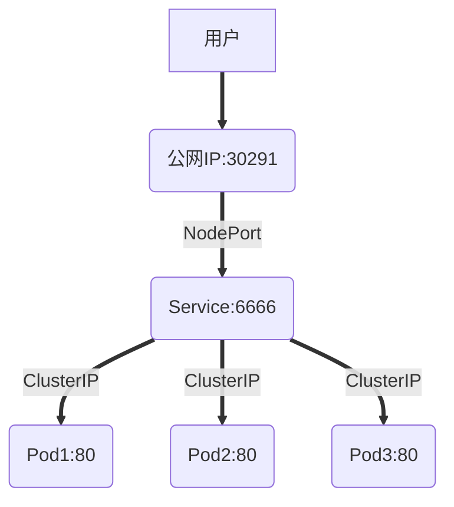
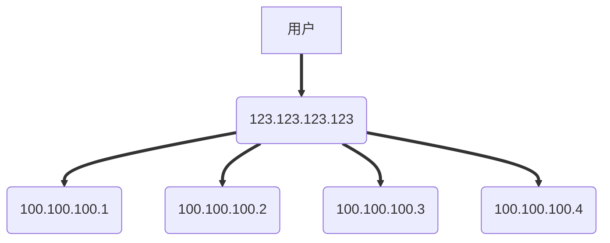

# 4.1 Kubernetes 网络

### 导读

本章内容主要讲解 Kubernetes  中的网络和 Service 对象，作为 Kubernetes 的核心内容， Kubernetes 网络涉及到了很多东西，计算机网络原理、Linux 网络、分布式网络理论等，限于个人水平和篇幅，将不会深入讲解这些细节。


## Kubernetes 网络

### Kubernetes 网络模型

首先，我们要知道 Kubernetes 中的网络可以解决什么问题，在 Kuberbnetes 官方文档中，清晰地列举了 Kubernetes 网络的功能：

1. 高度耦合的容器间通信：这个已经被 Pods 和 `localhost` 通信解决了。
2. Pod 间通信；
3. Pod 和服务间通信；
4. 外部和服务间通信；

> 这里的服务，指的是 Service 对象。


而 Kubernetes 本身的网络服务自带了这些功能：

- NAT: 网络地址转换
- Source NAT: 替换数据包的源 IP, 通常为节点的 IP
- Destination NAT: 替换数据包的目的 IP, 通常为 Pod 的 IP
- VIP: 一个虚拟 IP, 例如分配给每个 Kubernetes Service 的 IP
- Kube-proxy: 一个网络守护程序，在每个节点上协调 Service VIP 管理

> 可参考 https://kubernetes.io/zh/docs/tutorials/services/source-ip/


#### Pod IP 从哪里来

还记得在 [1.3 章 Docker 网络](../1.basic/3.docker_network.md) 中介绍的 container 网络么？多个容器共享一个容器的网络接口，实现多个容器共享网络、同一个 IP、同一个 hostname。 Pod 内多容器共享网络就是这样创建的，**Pod 的 IP 是 Docker 创建和分配的容器 IP**，**这个 IP 是带虚拟网卡的**，因此**这个 IP 是可以被 ping 的**，与此同时，**这个 IP 只能在当前节点中被访问**。

首先创建 Pod 时，Pod 会启动一个 pause 容器，这个容器创建了一个虚拟网卡，并被 Docker 分配 IP，接着 Pod 的容器会使用 container 网络模式连接到这个 pause 容器中，pause 容器的生命周期跟 Pod 的生命周期一致。可以在工作节点上使用 `docker ps -a | grep pause` 命令查看 pause 容器：


不过，Docker 中的容器 IP 是 172.17.0.0 地址段，而 Pod IP 的地址段却不是这样的，一般是 10.x.x.x 网络，其中用户自定义 Pod 是 10.32.0.0 地址段。


既然 Pod 的 IP 是 Docker 分配的，为什么其地址不是 172.17.0.0 地址段？

还记得我们在部署 Kubernetes 集群时，部署的 网络插件吗？2.2 章中介绍的 weave 网络插件。


首先，在部署了 Docker 的机器上，都会有一个 docker0 的东西，这个东西叫网桥。

```bash
root@slave1:~# ifconfig
docker0: flags=4099<UP,BROADCAST,MULTICAST>  mtu 1500
        inet 172.17.0.1  netmask 255.255.0.0  broadcast 172.17.255.255
        ether 02:42:fa:3e:f5:80  txqueuelen 0  (Ethernet)
        RX packets 0  bytes 0 (0.0 B)
        RX errors 0  dropped 0  overruns 0  frame 0
        TX packets 0  bytes 0 (0.0 B)
        TX errors 0  dropped 0 overruns 0  carrier 0  collisions 0
```

docker 的默认网桥叫 docker0，这个网桥的 IP 是 172.17.0.1，基于这个网桥创建的容器的虚拟网卡自然是 172.17.0.0 地址段。

而如果我们使用 weava 网络插件部署集群，那么使用 ifconfig 命令，可以找到一个 weava 的自定义网桥：

```bash
weave: flags=4163<UP,BROADCAST,RUNNING,MULTICAST>  mtu 1376
        inet 10.32.0.1  netmask 255.240.0.0  broadcast 10.47.255.255
        inet6 fe80::ac45:ebff:fe0a:31ae  prefixlen 64  scopeid 0x20<link>
        ether ae:45:eb:0a:31:ae  txqueuelen 1000  (Ethernet)
        RX packets 2905588  bytes 391313728 (391.3 MB)
        RX errors 0  dropped 0  overruns 0  frame 0
        TX packets 3179102  bytes 640814125 (640.8 MB)
        TX errors 0  dropped 0 overruns 0  carrier 0  collisions 0
```

看，这不就对了，通过 Kubernetes 创建的自定义 Pod，会使用这个网桥创建 IP，其 IP 地址跟 网络插件创建的网桥有关。

> **[Info] 提示**
>
> 读者如果想了解更多的 Docker 网络知识，请访问 https://docs.docker.com/network/bridge/


#### 跨节点访问 Pod

既然 Pod 的 IP 是 Docker 创建的，而 Docker 创建的 IP 只能在本地服务器上访问，那么怎么才能在别的节点上访问这个 Pod IP？当然是网络插件啦，就是在部署 Kubernetes 时一起部署的 weave 。

当然，除了 weave ，还有很多网络插件可以使用，如  calico、flannel。因为 Kubernetes 网络模型中有个叫 CNI 的标准接口，只要实现了这个接口，用啥网络插件都没问题，使用者不需要关心插件是怎么实现的。

CNI 的功能大概是以下几点：

- 节点上的 Pod 可以不通过 NAT 和其他任何节点上的 Pod 通信(称为扁平化网络)，即节点间 Pod 的互相访问；
- 节点上的代理（比如：系统守护进程、kubelet）可以和节点上的所有 Pod 通信，即系统组件访问 Pod；


## Service

Service 是一种 Kubernetes 的对象，它跟网络有关， Service 不是服务提供者，也不是应用程序接口。

Service 是将运行在一组 Pods 上的应用程序公开为网络服务的抽象方法。如果我们使用 Deployment 、Daemon 等部署 Pod，则可为此控制器创建 Service，Service 会监控此 Deployment 上增加或移除 Pod 的操作，自动为所有 Pod 提供网络服务。当然，Service 并不是指向 Deployment、Daemon 的，而是指向这些控制器上的 Pod，通过 Label 指向相关的 Pod。


### 没有 Service 时

假如有一组 Web Pod，如果 Web 动态伸缩副本数量或因为某些原因 IP/端口发生改变，那么我们很难追踪这种变化，我们如何在客户端访问这组 Web 服务？又假如 Web 服务、Mysql 分别部署在不同的 Pod 中，那么 Web 如何查找并跟踪要连接的 Mysql IP 地址？


Service 可以 解决这个问题。Kubernetes Service 定义了一种通常称为微服务的抽象，Service 为逻辑上的一组 Pod 提供可以访问它们的策略 。当使用 Service 为一组 Pod 创建服务时，无论我们创建了多少个 Pod 副本，这些 Pod 怎么变化，Pod A 不需要关心它们调用了哪个 Pod B 副本，而且不需要知道 Pod B 的状态也不需要跟踪 Pod B。因为Service 把 Pod 的这种关联抽象化，把它们解耦了。


### Service 的定义和创建

我们创建一个 Deployment 对象，包含三个 Pod 实例。

```bash
kubectl create deployment nginx --image=nginx:latest --replicas=3
```

接着，为这些 Pod 创建一个 Service。

```
kubectl expose deployment nginx --type=ClusterIP --port=6666 --target-port=80
```

查看创建的 Service：

```bash
root@master:~# kubectl get service -o wide
NAME           TYPE        CLUSTER-IP       EXTERNAL-IP   PORT(S)                               AGE     SELECTOR
kubernetes     ClusterIP   10.96.0.1        <none>        443/TCP                               3d12h   <none>
mygoapp-dapr   ClusterIP   None             <none>        80/TCP,50001/TCP,50002/TCP,9090/TCP   17h     app=mygoapp
nginx          ClusterIP   10.107.200.232   <none>        6666/TCP   
```

可以看到，Service 会生成一个随机 IP  `10.107.200.232`，我们为 Pod 映射了一个新的端口为 6666，此端口映射到了 Pod 的 80 端口中，我们可以测试这个 IP 和 端口是否可用：

```
curl 10.107.200.232:6666
```

> 在部署了 Pod 的机器上才能使用此 IP 和端口访问 Pod。


假如有 master、slave 两个节点，Pod 都被部署到 slave 节点上，而 master 节点没有部署此 Pod 的话，master 是访问不了此 Service的。

为了验证这样情况，我们可以消去 master 的污点，使其能够被部署用户自定义的 Pod。

> 此时使用 DaemonSet 部署可能更加合适。

````bash
kubectl taint node instance-1 node-role.kubernetes.io/master:NoSchedule-
````
然后重新部署 Deployment，但是不需要重新部署 Service。
```bash
kubectl delete deployyment nginx
kubectl create deployment nginx --image=nginx:latest --replicas=3
```

查看这些 Pod 都被部署到哪里：

```
root@master:~# kubectl get pods -o wide
NAME                       READY   STATUS           RESTARTS        AGE   IP           NODE     NOMINATED NODE   READINESS GATES
nginx-55649fd747-26f5q     1/1     Running            0             11s   10.44.0.3    master   <none>           <none>
nginx-55649fd747-5znfc     1/1     Running            0             11s   10.44.0.4    master   <none>           <none>
nginx-55649fd747-77k8m     1/1     Running            0             11s   10.32.0.3    slave1   <none>           <none>
```

看来 master、slave 都部署了 Pod，那么我们在 master 节点上访问此 Service：


在 Deployment 对象上创建 Service，会直接关联一个 Deployment 中的所有 Pod，并监控是否有新建或移除 Pod ，这样无论 Pod 的数量有多少，Service 都可以代理这些 Pod。


如果我们通过 YAML 定义 Service，其模板如下：

```yaml
apiVersion: v1
kind: Service
metadata:
  name: my-service
spec:
  selector:
    app: MyApp
  ports:
    - protocol: TCP
      port: 6666
      targetPort: 80
  type: ClusterIP
```


> **[Error] 提示**
>
> 由于 Service 的 IP 是虚拟的，因此此 IP 是无法 Ping 通的。


### Service 外部服务类型

虽然创建了 Service 后，所有的 Pod 可以被一个 IP 地址访问，但是这个 IP 只能在被部署了 Pod 的节点中访问，并且这个 IP 不能被集群外访问，这是因为我们创建 Service 的时候，使用了 ClusterIP 类型，如果是 NodePort 类型，则可以被外界访问到。


Kubernetes Service 有个 ServiceType ，允许我们指定如何暴露服务，可以将一个 Service 暴露到集群外部，外界可以通过 IP 访问这个 Service。

Type 有四种类型，其取值说明如下：

*   ClusterIP

    通过集群内部 IP 暴露服务，ClusterIP 是 ServiceType 的默认值。
*   NodePort

    通过每个节点上的 IP 和静态端口（`NodePort`）暴露服务。由于其是节点上的 ，所以具有通过节点的公网 IP 访问这个服务。
*   LoadBalancer

    使用负载均衡器向外部暴露服务。 外部负载均衡器可以将流量路由到自动创建的 `NodePort` 服务和 `ClusterIP` 服务上。需要云平台服务提供商的支持，分配公网 IP 才能使用。
*   `ExternalName`

    通过返回 `CNAME` 和对应值，可以将服务映射到 `externalName` 字段的内容（例如，`foo.bar.example.com`）。

    > 需要使用 kube-dns 1.7 及以上版本或者 CoreDNS 0.0.8 及以上版本才能使用 `ExternalName` 类型。

ClusterIP、NodePort、LoadBalancer 三者是有关系的，前者是后者的基础。创建一个 NodePort 类型的 Service，必定带有一个 ClusterIP；创建一个 LoadBalancer，必定带有 ClusterIP、NodePort。


### 配置 ServiceType 公开 Service

我们使用 `kubectl edit service nginx` 将前面创建的 Service 修改为 NodePort 类型，然后查看 Service 列表：

```bash
root@master:~# kubectl get services -o wide
NAME           TYPE        CLUSTER-IP       EXTERNAL-IP   PORT(S)                               AGE     SELECTOR
kubernetes     ClusterIP   10.96.0.1        <none>        443/TCP                               3d13h   <none>
nginx          NodePort    10.107.200.232   <none>        6666:30291/TCP                        27m     app=nginx
```

此时 Service 会创建一个 随机端口，这个端口映射到每个部署了  Pod 的节点上，例如笔者的是 30291，此时外界可以通过使用节点 IP 访问此 Service。

每个节点上可以使用 127.0.0.1:30291 访问，也可以使用公网 IP 访问。


用户发起请求后，请求转发至 Pod 的过程如下： 




### LoadBalancer

当我们使用公网 IP  访问 Pod 时，也出现了一个问题，Pod 是负载均衡了，但是总不能只访问一个节点吧？节点的网络也需要负载均衡呀，而且节点 IP 这么多，用户总不能记住这么多 IP 吧？就算使用域名，域名也不能绑定这么多 IP 呀，此时 LoadBalancer 可以帮到你。


当使用 LoadBalancer 暴露服务到集群外部网络时，云基础设施需要时间来创建负载均衡器并获取服务中的 IP 地址。如果使用的是 `minikube`、`kubeadm` 等创建的自定义 Kubernetes 集群，没有集成 LoadBalancer ，则会一直处于 `<Pending>` 状态。




我们删除之前 Deployment 部署 nginx 时，通过 expose 创建的 Service。

```bash
kubectl delete service nginx
```

然后重新创建 service。

```bash
kubectl expose deployment nginx --type=LoadBalancer --port=80 --target-port=6666
# 可以只填写 --port ，此时映射的端口跟 Pod 端口一致
```

查询 Service：

```
NAME         TYPE           CLUSTER-IP     EXTERNAL-IP   PORT(S)        AGE
kubernetes   ClusterIP      10.96.0.1      <none>        443/TCP        29h
nginx        LoadBalancer   10.97.249.37   <pending>     80:31036/TCP   30s
```

```yaml
  ports:
  - nodePort: 31036
    port: 6666
    protocol: TCP
    targetPort: 80
  sessionAffinity: None
```

LoadBalancer 需要云服务商支持，而且收费，这里就不做其他实验了，读者知道就行。


前面提到的 LoadBalancer 便是负载均衡器，在 Kubernetes 上创建 LoadBalancer 需要云平台的支持，读者可参考腾讯云的 CLB。


### Service 如何选择 Pod

当我们通过外部网络访问时，Service 会自动提供其中一个 Pod 给我们。

```
               ------------
               |         |
--- 访问  -->   |   pod1  |
               |   pod2  |
               |   pod3  |
               ------------
```

我们查看上一个小节创建的 Service 的 YAML 文件：

```yaml
  clusterIP: 10.100.66.200
  clusterIPs:
  - 10.100.66.200
... ...
  ports:
  - nodePort: 31672
    port: 6666
    protocol: TCP
    targetPort: 80
```

此 Service 的 IP 是 10.100.66.200，其类型是 ClusterIP，可以在集群内部所有节点上访问，如果集群没有安装网络插件，则 master 节点上是没法访问的。

由于我们使用的是 `NodePort` 网络类型，所以会生成一个 node 端口，此端口会映射到节点本地网络上。例如可以通过任意能够连接此节点的 IP 进行访问，例如 `127.0.0.1:31672`，或者访问此节点的内网 IP、公网 IP 。

现在知道外界怎么访问此 Service，我们再来看看，Service 怎么选择哪个 Pod 提供服务。

我们查看通过 Deployment 创建的 pod：

```bash
kubectl get pods -o wide
```

```bash
NAME                        IP              NODE       NOMINATED NODE   READINESS GATES
nginx-55649fd747-9fzlr    192.168.56.56    instance-2   <none>           <none>
nginx-55649fd747-ckhrw    192.168.56.57    instance-2   <none>           <none>
nginx-55649fd747-ldzkf    192.168.23.58    instance-2   <none>           <none>
```

然后我们通过命令查看 iptables 配置：

```bash
iptables-save
```

在终端控制台中查找 `random` 关键字：


你可以看到有三个 `default/nginx`， 第一个 pod 被访问的机会是 `0.33333...`。在剩下的 2/3 的概率中，有 0.5 的概率选择第二个 Pod，剩下的 1/3 概率选择第三个 Pod。这种随机选择的模式称为 iptables 代理模式。


### kube-proxy 三种代理模式

本节内容了解简单了解即可。

当我们使用命令创建一个 Service 时，可看到每个 Service 都有一个 IP 地址，这是由 kube-proxy 负责为 Service 实现的一种虚拟 IP ，即 `ClusterIP`。

kube-proxy 可以为多个 Pod 创建一个统一的代理，在访问 Service 时，自动选择一个 Pod 提供服务，至于如何选择 Pod，kube-proxy 有三种模式。

* userspace 代理模式
* iptables 代理模式(默认)
* IPVS 代理模式（Kubernetes v1.11 [stable]，如果要使用 IPVS，需要修改配置激活）

在这些代理模式中，客户端可以在不了解 Kubernetes 服务或 Pod 的任何信息的情况下，将 Port 代理到适当的后端。


#### userspace 模式

userspace 模式下， kube-proxy 通过轮转算法选择后端。

对每个 Service，它会在本地 Node 上打开一个端口(端口号大于 30000)。 任何连接到此端口的请求，都会被代理到 Service 后端的某个 `Pod` 上。 使用哪个后端 Pod，是 kube-proxy 基于 YAML 的 `SessionAffinity` 终端来确定的。

最后，它配置 iptables 规则，捕获到达该 Service 的 `clusterIP` 和 `Port` 的请求，并重定向到代理端口，代理端口再代理请求到后端 Pod。

```
访问 -> clusterIP -> 代理 -> 任一 Pod
```


#### iptables 代理模式

kube-proxy 默认模式。iptables 代理模式的策略是，kube-proxy 在 iptables 模式下**随机选择一个 Pod**。

它会为每个 Service 配置 iptables 规则，捕获所有访问此 Service 的 `clusterIP`请求，进而将请求重定向到 Service 的一组后端中的某个 Pod 上面。 对于每个 Endpoints 对象，它也会配置 iptables 规则，这个规则会选择一个后端组合。

使用 iptables 处理流量具有较低的系统开销，因为流量由 Linux netfilter 处理， 而无需在用户空间和内核空间之间切换， 这种方法也可能更可靠。

如果 kube-proxy 在 iptables 模式下运行，如果随机所选的第一个 Pod 没有响应， 则连接会失败，在这种情况下，会自动使用其他后端 Pod 重试 。


#### IPVS 代理模式

与其他代理模式相比，IPVS 模式还支持更高的网络流量吞吐量。与 iptables 模式下的 kube-proxy 相比，IPVS 模式下的 kube-proxy 重定向通信的延迟要短，并且在同步代理规则时具有更好的性能。

IPVS 提供了更多选项来平衡后端 Pod 的流量。 这些是：

* `rr`：轮替（Round-Robin）
* `lc`：最少链接（Least Connection），即打开链接数量最少者优先
* `dh`：目标地址哈希（Destination Hashing）
* `sh`：源地址哈希（Source Hashing）
* `sed`：最短预期延迟（Shortest Expected Delay）
* `nq`：从不排队（Never Queue）


### Service 暴露多端口

如果要在 Service 中暴露多个端口，则每个端口都需要设置一个名字。

```yaml
    ports:
    - name: p1
      port: 2323
      protocol: TCP
      targetPort: 81
    - name: p2
      port: 6666
      protocol: TCP
      targetPort: 82
```

